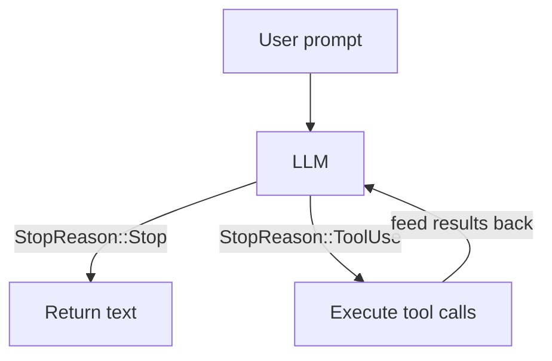
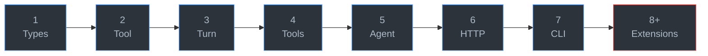

<p align="center">
  
</p>

<h1 align="center">Mini Claw Code</h1>

<p align="center">
  <strong>Build your own coding agent from scratch in Rust or Python.</strong>
</p>

<p align="center">
  <a href="https://odysa.github.io/mini-claw-code/">Read the Book</a> &middot;
  <a href="#quick-start">Quick Start</a> &middot;
  <a href="#chapter-roadmap">Chapters</a>
</p>

<p align="center">
  English | <a href="README.zh.md">中文</a>
</p>

---

You use coding agents every day. Ever wonder how they actually work?

<p align="center">
  
</p>

It's simpler than you think. Strip away the UI, the streaming, the model routing — and every coding agent is just this loop:

```
loop:
    response = llm(messages, tools)
    if response.done:
        break
    for call in response.tool_calls:
        result = execute(call)
        messages.append(result)
```

The LLM never touches your filesystem. It *asks* your code to run tools — read a file, execute a command, edit code — and your code *does*. That loop is the entire idea.

This tutorial builds that loop from scratch. **15 chapters. Test-driven. No magic.**

There are now two parallel learning tracks in this repo:

- **Rust track**: the original project, starter, and book
- **Python track**: a full port for teams who prefer Python


## What you'll build

A working coding agent that can:

- **Run shell commands** — `ls`, `grep`, `git`, anything
- **Read and write files** — full filesystem access
- **Edit code** — surgical find-and-replace
- **Talk to real LLMs** — via OpenRouter (free tier available, no credit card)
- **Stream responses** — SSE parsing, token-by-token output
- **Ask clarifying questions** — interactive user input mid-task
- **Plan before acting** — read-only planning with approval gating

All test-driven. No API key needed until Chapter 6 — and even then, the default model is free.

## The core loop

Every coding agent — yours included — runs on this:



Match on `StopReason`. Follow instructions. That's the architecture.

## Chapter roadmap

**Part I — Build it yourself** (hands-on, test-driven)

| Ch | You build | What clicks |
|----|-----------|-------------|
| 1 | `MockProvider` | The protocol: messages in, tool calls out |
| 2 | `ReadTool` | The `Tool` trait — every tool is this pattern |
| 3 | `single_turn()` | Match on `StopReason` — the LLM tells you what to do |
| 4 | Bash, Write, Edit | Repetition locks it in |
| 5 | `SimpleAgent` | The loop — single_turn generalized into a real agent |
| 6 | `OpenRouterProvider` | HTTP to a real LLM (OpenAI-compatible API) |
| 7 | CLI chat app | Wire it all together in ~15 lines |

**Part II — The Singularity** (your agent codes itself now)

| Ch | Topic | What it adds |
|----|-------|--------------|
| 8 | The Singularity | Your agent can edit its own source code |
| 9 | A Better TUI | Markdown rendering, spinners, collapsed tool calls |
| 10 | Streaming | `StreamingAgent` with SSE parsing and `AgentEvent`s |
| 11 | User Input | `AskTool` — let the LLM ask *you* questions |
| 12 | Plan Mode | Read-only planning with approval gating |
| 13 | Subagents | Spawn child agents for subtasks via `SubagentTool` |
| 14 | MCP | *coming soon* |
| 15 | Safety Rails | *coming soon* |



## Safety warning

This agent has **unrestricted shell access**. The `BashTool` passes LLM-generated commands directly to `bash -c` with no sandboxing, filtering, or timeout. The `ReadTool` and `WriteTool` can access any file your user account can. This is intentional for a learning project, but:

- **Do not run this agent on untrusted prompts or files** (prompt injection via file contents can execute arbitrary commands).
- **Do not run this on a machine with sensitive data** without understanding the risks.
- See Chapter 15 (coming soon) for how to add safety rails.

## Quick start

```bash
git clone https://github.com/dzungtri/mini-claw-code.git
cd mini-claw-code
```

## Choose your track

### Python

Best if your team is comfortable with Python and wants the same agent concepts
without Rust-specific language features.

```bash
cd mini-claw-code-py
python -m venv .venv
.venv/bin/pip install -e ".[dev]"
PYTHONPATH=src .venv/bin/python -m pytest -q
```

Run the reference CLI:

```bash
cd mini-claw-code-py
PYTHONPATH=src .venv/bin/python examples/chat.py
```

Work through the hands-on tutorial starter:

```bash
cd mini-claw-code-starter-py
PYTHONPATH=src python -m pytest tests/test_ch1.py
```

Python book source:

```text
mini-claw-code-book-py/
```

### Rust

Best if you want the original version and the most complete parity with the
existing public book.

```bash
cargo build
```

Start the Rust tutorial book:

```bash
cargo install mdbook mdbook-mermaid   # one-time
cargo x book                          # opens at localhost:3000
```

Or read it online at **[odysa.github.io/mini-claw-code](https://odysa.github.io/mini-claw-code/)**.

## The workflow

Every chapter follows the same rhythm:

1. **Read** the chapter
2. **Open** the matching file in the starter project
3. **Replace** `unimplemented!()` with your code
4. **Run** the chapter tests

Green tests = you got it.

## Project structure

```
mini-claw-code-starter/     <- Rust starter project
mini-claw-code/             <- Rust reference implementation
mini-claw-code-book/        <- Rust tutorial book source
mini-claw-code-xtask/       <- Rust helper commands (cargo x ...)
mini-claw-code-starter-py/  <- Python starter project
mini-claw-code-py/          <- Python reference implementation
mini-claw-code-book-py/     <- Python tutorial book source
```

## Prerequisites

- **Python track**: Python 3.11+
- **Rust track**: Rust 1.85+ — [rustup.rs](https://rustup.rs)
- No API key until the HTTP provider chapter

## Commands

Python:

```bash
cd mini-claw-code-py
python -m venv .venv
.venv/bin/pip install -e ".[dev]"
PYTHONPATH=src .venv/bin/python -m pytest -q
```

Python starter:

```bash
cd mini-claw-code-starter-py
PYTHONPATH=src python -m pytest tests/test_ch1.py
```

Rust:

```bash
cargo test -p mini-claw-code-starter ch1    # test one chapter
cargo test -p mini-claw-code-starter        # test everything
cargo x check                               # fmt + clippy + tests
cargo x book                                # serve the tutorial
```

## License

MIT
