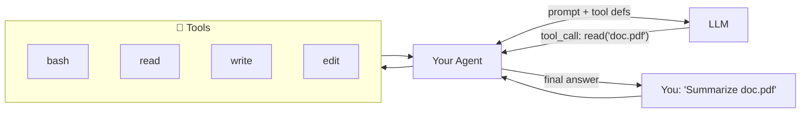
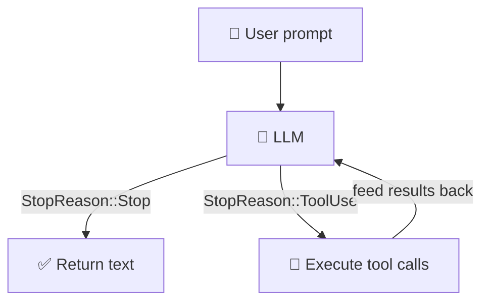
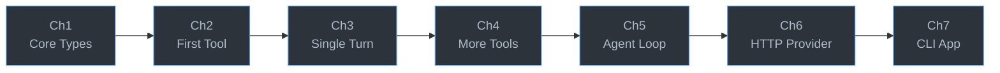

# Build Your Own Mini Coding Agent in Rust

You use Claude Code every day. Ever curious how it actually works?

It's simpler than you think. Underneath the magic, a coding agent is just a loop:

```
loop:
    response = llm(messages, tools)
    if response.done:
        break
    for call in response.tool_calls:
        result = execute(call)
        messages.append(result)
```

The LLM never touches your filesystem. It *asks* your code to run tools — read a file, execute a command, edit code — and your code *does*. That loop is the entire idea.

This tutorial walks you through building one from scratch. **~300 lines of Rust. 7 chapters. No magic.**



## What you'll build

By the end, you'll have a working agent that can:

- Run shell commands (`ls`, `grep`, `git`, anything)
- Read and write files
- Edit code with find-and-replace
- Talk to a real LLM via OpenRouter API
- Chain multiple tool calls in a loop until the task is done

All driven by the same pattern Claude Code, Cursor, and OpenCode use under the hood.

## The agent loop

This is the core of every coding agent — yours included:



The LLM tells you what to do next. You just match on `StopReason` and follow instructions.

## How it works

Each chapter builds one piece. Tests verify your work — no API key needed until Chapter 6.

| Chapter | You build | What you learn |
|---------|-----------|----------------|
| **1** | `MockProvider` | The core protocol: messages, tool calls, stop reasons |
| **2** | `ReadTool` | The `Tool` trait — every tool follows this pattern |
| **3** | `single_turn()` | Matching on `StopReason` — the LLM tells you what to do |
| **4** | Bash, Write, Edit tools | Repetition to lock in the pattern |
| **5** | `SimpleAgent` | The loop — generalize single_turn into a full agent |
| **6** | `OpenRouterProvider` | HTTP to a real LLM (OpenAI-compatible API) |
| **7** | CLI chat app | Wire it all together in ~15 lines |



## Quick start

```bash
git clone https://github.com/odysa/mini-code.git
cd mini-code
cargo build
```

Start the tutorial:

```bash
cargo install mdbook mdbook-mermaid   # one-time setup
cargo x book                          # opens at localhost:3000
```

Or read the book online at [odysa.github.io/mini-code](https://odysa.github.io/mini-code/).

## The workflow

Every chapter follows the same rhythm:

1. Read the chapter
2. Open the matching file in `mini-code-starter/src/`
3. Replace `unimplemented!()` with your code
4. Run `cargo test -p mini-code-starter chN`

Green tests = you got it.

## Project structure

```
mini-code-starter/     ← YOUR code (fill in the stubs)
mini-code/             ← Reference solution (no peeking!)
mini-code-book/        ← The tutorial book (7 chapters)
mini-code-xtask/       ← Helper commands (cargo x ...)
```

## Prerequisites

- **Rust 1.85+** — install from [rustup.rs](https://rustup.rs)
- Basic Rust (ownership, enums, `Result`/`Option`)
- No API key until Chapter 6

## Commands

```bash
cargo test -p mini-code-starter ch1    # test one chapter
cargo test -p mini-code-starter        # test everything
cargo x check                          # fmt + clippy + tests
cargo x book                           # serve the tutorial
```

## License

MIT
