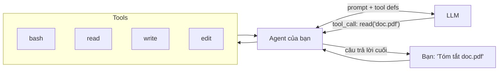
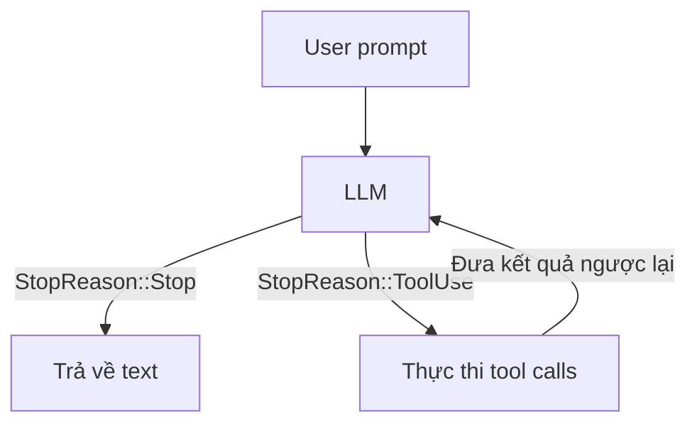

<p align="center">
  
</p>

<h1 align="center">Mini Claw Code</h1>

<p align="center">
  <strong>Tự xây dựng coding agent của riêng bạn bằng Rust, TypeScript hoặc Python.</strong>
</p>

<p align="center">
  <a href="https://dzungtri.github.io/mini-claw-code/">Đọc sách</a> &middot;
  <a href="#bat-dau-nhanh">Bắt đầu nhanh</a> &middot;
  <a href="#lo-trinh-cac-chuong">Lộ trình các chương</a>
</p>

<p align="center">
  <a href="README.md">English</a> | Tiếng Việt | <a href="README.zh.md">中文</a>
</p>

---

Bạn dùng coding agent mỗi ngày. Nhưng bạn có từng tự hỏi nó thực sự hoạt động như thế nào không?

<p align="center">
  
</p>

Thật ra nó đơn giản hơn nhiều người nghĩ. Bỏ qua UI, streaming, model routing, thì lõi của mọi coding agent chỉ là vòng lặp này:

```
loop:
    response = llm(messages, tools)
    if response.done:
        break
    for call in response.tool_calls:
        result = execute(call)
        messages.append(result)
```

LLM không bao giờ trực tiếp chạm vào filesystem. Nó *yêu cầu* code của bạn chạy tool, đọc file, chạy lệnh, sửa code, còn code của bạn mới là thứ *thực thi*. Vòng lặp đó chính là toàn bộ ý tưởng.

Tutorial này xây vòng lặp đó từ đầu. **Nhiều track ngôn ngữ. Test-driven. Không có ma thuật.**

Hiện tại repo có ba track học song song:

- **Rust track**: dự án gốc, starter, và book
- **TypeScript track**: bản Bun + TypeScript cho các team đang làm việc trong stack JS/TS hiện đại
- **Python track**: bản port đầy đủ cho các team quen Python



## Bạn sẽ xây gì

Một coding agent thực sự có thể:

- **Chạy shell command** như `ls`, `grep`, `git`
- **Đọc và ghi file** với quyền truy cập filesystem đầy đủ
- **Sửa code** bằng find-and-replace có kiểm soát
- **Kết nối LLM thật** qua OpenRouter hoặc endpoint tương thích OpenAI
- **Streaming response** theo từng token
- **Hỏi lại người dùng** khi cần làm rõ
- **Lập kế hoạch trước khi hành động** với approval gating

Tất cả theo cách test-driven. Bạn chưa cần API key cho tới chương về HTTP provider.

## Vòng lặp cốt lõi

Mọi coding agent, bao gồm cả agent bạn sắp xây, đều chạy trên vòng lặp này:



Kiểm tra `StopReason`, làm theo chỉ dẫn, rồi lặp lại. Đó là toàn bộ kiến trúc.

## Lộ trình các chương

**Phần I — Tự tay xây dựng** (thực hành, test-driven)

| Chương | Bạn xây gì | Điều cốt lõi |
|--------|------------|--------------|
| 1 | `MockProvider` | Giao thức: messages vào, tool calls ra |
| 2 | `ReadTool` | Mẫu `Tool` — mọi tool đều theo pattern này |
| 3 | `single_turn()` | `match` trên `StopReason` — LLM nói bạn phải làm gì |
| 4 | Bash, Write, Edit | Lặp lại để khoá chặt pattern |
| 5 | `SimpleAgent` | Vòng lặp — biến single turn thành agent thật |
| 6 | `OpenRouterProvider` | HTTP tới một LLM thật |
| 7 | CLI chat app | Nối mọi thứ lại thành một chương trình dùng được |

**Phần II — Mở rộng**

| Chương | Chủ đề | Thêm gì |
|--------|--------|---------|
| 8 | The Singularity | Agent có thể sửa source của chính nó |
| 9 | A Better TUI | Markdown, spinner, collapsed tool calls |
| 10 | Streaming | `StreamingAgent` với SSE parsing và event |
| 11 | User Input | `AskTool` — cho phép LLM hỏi lại bạn |
| 12 | Plan Mode | Lập kế hoạch chỉ đọc rồi mới thực thi |
| 13 | Subagents | Spawn child agents cho subtasks |
| 14 | MCP | *coming soon* |
| 15 | Safety Rails | *coming soon* |

## Cảnh báo an toàn

Agent này có **quyền shell không bị giới hạn**. `BashTool` chuyển lệnh do LLM tạo trực tiếp vào `bash -c`, không có sandbox, filter, hay timeout. `ReadTool` và `WriteTool` có thể truy cập bất kỳ file nào tài khoản của bạn có quyền.

- **Không chạy agent này với prompt hoặc file không tin cậy**
- **Không chạy trên máy có dữ liệu nhạy cảm** nếu bạn chưa hiểu rủi ro
- Xem các chương về safety rails để bổ sung bảo vệ

## Bắt đầu nhanh

```bash
git clone https://github.com/dzungtri/mini-claw-code.git
cd mini-claw-code
make help
```

## Chọn track

### TypeScript

Phù hợp nếu team của bạn đang dùng Bun + TypeScript và muốn học cùng kiến trúc agent trong một stack gần với product engineering hiện đại.

```bash
bun install
bun run typecheck
bun run test
```

Chạy CLI tham chiếu:

```bash
make chat-ts
```

Mở book TypeScript:

```bash
make book-ts
```

Book TypeScript tiếng Việt:

```bash
make book-ts-vi
```

Mã nguồn book:

```text
mini-claw-code-book-ts/
```

### Python

Phù hợp nếu team của bạn quen với Python và muốn cùng ý tưởng agent mà không cần những chi tiết riêng của Rust.

```bash
cd mini-claw-code-py
python -m venv .venv
.venv/bin/pip install -e ".[dev]"
PYTHONPATH=src .venv/bin/python -m pytest -q
```

Chạy CLI tham chiếu:

```bash
make chat-py
```

Mở book Python:

```bash
make book-py
```

### Rust

Phù hợp nếu bạn muốn bản gốc và track đầy đủ nhất.

```bash
cargo build
```

Mở Rust book:

```bash
cargo install mdbook mdbook-mermaid   # one-time
make book
```

Hoặc đọc online tại **[dzungtri.github.io/mini-claw-code](https://dzungtri.github.io/mini-claw-code/)**.

## Workflow học

Mỗi chương đi theo cùng một nhịp:

1. Đọc chương
2. Mở file tương ứng trong starter project
3. Thay phần TODO / `unimplemented!()` bằng code của bạn
4. Chạy test của chương

Test xanh tức là bạn đã hiểu đúng.

## Cấu trúc dự án

```text
mini-claw-code-starter/     <- Rust starter project
mini-claw-code/             <- Rust reference implementation
mini-claw-code-book/        <- Rust tutorial book source
mini-claw-code-xtask/       <- Rust helper commands
mini-claw-code-starter-ts/  <- TypeScript starter project
mini-claw-code-ts/          <- TypeScript reference implementation
mini-claw-code-book-ts/     <- TypeScript tutorial book source
mini-claw-code-starter-py/  <- Python starter project
mini-claw-code-py/          <- Python reference implementation
mini-claw-code-book-py/     <- Python tutorial book source
```

## Yêu cầu

- **TypeScript track**: Bun 1.3+
- **Python track**: Python 3.11+
- **Rust track**: Rust 1.85+ — [rustup.rs](https://rustup.rs)
- Không cần API key cho tới chương về HTTP provider

## Lệnh hay dùng

TypeScript:

```bash
bun install
bun run typecheck
bun run test
make chat-ts
make tui-ts
make book-ts
make book-ts-vi
```

TypeScript starter:

```bash
make test-ts-starter
```

Python:

```bash
make install-py
make test-py
make chat-py
make book-py
```

Rust:

```bash
cargo test -p mini-claw-code-starter ch1
cargo test -p mini-claw-code-starter
cargo x check
make book
make book-vi
make book-zh
```

Tiện ích ở root:

```bash
make help
make test-ts
make test-py
make book-py
```

## License

MIT
