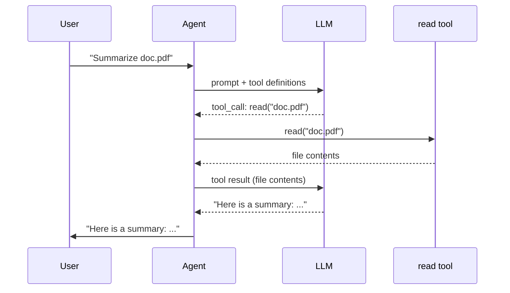
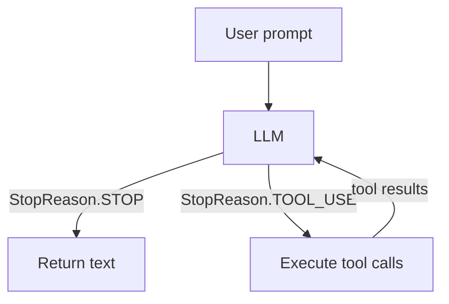

# Overview

Welcome to *Build Your Own Mini Coding Agent in Python*. Over the next seven
chapters you will implement a mini coding agent from scratch: a small version
of tools like Claude Code or OpenCode. It takes a prompt, talks to a
large-language model (LLM), and uses **tools** to interact with the real
world. After that, the extension chapters add streaming, a better terminal UI,
user input, plan mode, and subagents.

By the end of the hands-on part you will have an agent that can run shell
commands, read and write files, and edit code, all driven by an LLM. No API
key is required until Chapter 6. When you do get there, the Python provider can
talk to either OpenRouter or OpenAI-compatible endpoints.

## What is an AI agent?

An LLM on its own is just a function: text in, text out. Ask it to summarize
`doc.pdf` and it will either refuse or hallucinate. It has no way to open the
file.

An **agent** solves that by giving the LLM **tools**. A tool is just a function
your code can run: read a file, execute a shell command, call an API, ask the
user a question. The agent sits in a loop:

1. Send the user's prompt to the LLM.
2. The LLM decides it needs a tool and emits a tool call.
3. Your code executes the tool and sends the result back.
4. The LLM continues with that new information in context.

The LLM never touches your filesystem directly. It just *asks*, and your code
*does*.

## How does an LLM use a tool?

The LLM cannot execute Python. So "calling a tool" really means: it emits a
structured request, and your code handles the rest.

When your program calls the model API, it includes **tool definitions** along
with the conversation. A tool definition is:

- a name
- a description
- a JSON schema for the arguments

For a `read` tool, that looks like:

```json
{
  "name": "read",
  "description": "Read the contents of a file.",
  "parameters": {
    "type": "object",
    "properties": {
      "path": { "type": "string" }
    },
    "required": ["path"]
  }
}
```

The model reads that definition as part of the input. If it decides it should
read a file, it emits something like:

```json
{ "name": "read", "arguments": { "path": "doc.pdf" } }
```

Your code parses that request, executes the real Python function, and sends the
result back as a new message.

## Example: summarize a PDF



That is the entire idea.

## A minimal agent in pseudocode

```text
tools = [read_file]
messages = ["Summarize doc.pdf"]

loop:
    response = llm(messages, tools)

    if response.done:
        print(response.text)
        break

    for call in response.tool_calls:
        result = execute(call.name, call.args)
        messages.append(result)
```

Everything else in this book is implementation detail: the message types, the
tool definitions, the provider, and the loop that ties them together.

## The tool-calling loop



1. The user sends a prompt.
2. The LLM either answers directly or requests tools.
3. Your code runs those tools.
4. The results go back into the message history.
5. Repeat until the model returns final text.

That is the full architecture.

## What we will build

We will build a simple agent framework consisting of:

**4 tools**

| Tool | What it does |
|------|--------------|
| `read` | Read the contents of a file |
| `write` | Write content to a file, creating directories as needed |
| `edit` | Replace an exact string in a file |
| `bash` | Run a shell command and capture its output |

**1 provider**

| Provider | Purpose |
|----------|---------|
| `OpenRouterProvider` | Talks to a real LLM over HTTP using an OpenAI-compatible API |

Tests use a `MockProvider`, so chapters 1 through 5 run fully locally without
network access.

## Project structure

The Python track is split into three directories:

```text
mini-claw-code-py/          # reference solution
mini-claw-code-starter-py/  # your working version
mini-claw-code-book-py/     # this tutorial
```

- **`mini-claw-code-py`** contains the complete Python implementation.
- **`mini-claw-code-starter-py`** is the learner project. It contains method
  signatures, hints, and `NotImplementedError` placeholders.
- **`mini-claw-code-book-py`** is this mdBook source.

## Python concepts used in this book

The Python version avoids Rust-specific mechanics like ownership, `async_trait`,
and trait objects. Instead it uses:

- `dataclasses` for protocol values like `AssistantTurn`
- `Enum` for stop reasons
- `Protocol` for provider and input-handler interfaces
- `async def` for tools and providers
- `asyncio` for process execution, queues, and terminal loops
- `collections.deque` for FIFO test providers

If you are comfortable with ordinary Python classes and basic async Python, you
are ready.

## Setup

Create an environment for the starter project:

```bash
cd mini-claw-code-starter-py
uv venv
source .venv/bin/activate
uv pip install -e ".[dev]"
```

Then verify the Chapter 1 test harness runs:

```bash
PYTHONPATH=src uv run python -m pytest tests/test_ch1.py
```

The tests should fail at first. That is expected. Your job is to make them
pass.

## Chapter roadmap

| Chapter | Topic | What you build |
|---------|-------|----------------|
| 1 | Core Types | `MockProvider` and the protocol model |
| 2 | Your First Tool | `ReadTool` |
| 3 | Single Turn | `single_turn()` |
| 4 | More Tools | `BashTool`, `WriteTool`, `EditTool` |
| 5 | Your First Agent SDK! | `SimpleAgent` |
| 6 | The OpenRouter Provider | `OpenRouterProvider` |
| 7 | A Simple CLI | A working interactive chat program |
| 8 | The Singularity | Your agent can now extend itself |

Chapters 1 through 7 are hands-on. Starting at Chapter 8, the book becomes a
walkthrough of the reference implementation for more advanced features.

Every hands-on chapter follows the same rhythm:

1. Read the chapter.
2. Open the matching file in `mini-claw-code-starter-py/src/`.
3. Replace the `NotImplementedError` with real code.
4. Run the chapter test file.

## What's next

Head to [Chapter 1: Core Types](./ch01-core-types.md) to understand the
foundational protocol and implement `MockProvider`, the test helper you will
use throughout the early chapters.
