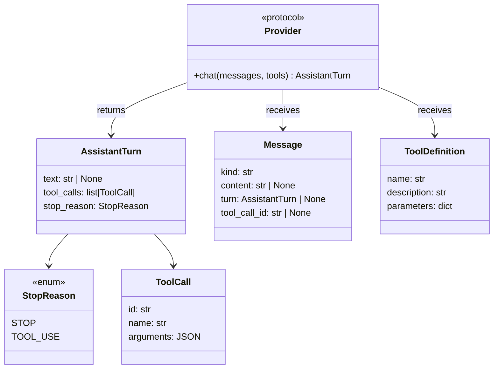
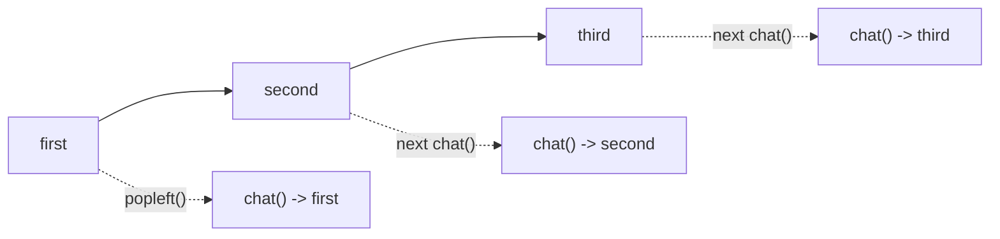

# Chapter 1: Core Types

In this chapter you will understand the types that make up the agent protocol:
`StopReason`, `AssistantTurn`, `Message`, `ToolDefinition`, and the `Provider`
interface. These are the building blocks everything else is built on.

To verify your understanding, you will implement a small test helper:
`MockProvider`, a class that returns pre-configured responses so you can test
future chapters without an API key.

## Goal

Implement `MockProvider` so that:

1. you create it with a `deque[AssistantTurn]` of canned responses
2. each call to `chat()` returns the next response in sequence
3. if all responses have been consumed, it raises an error

## The core types

Open `mini-claw-code-starter-py/src/mini_claw_code_starter_py/types.py`.

Here is how the main types relate to each other:



### `ToolDefinition`

```python
@dataclass(slots=True)
class ToolDefinition:
    name: str
    description: str
    parameters: dict[str, Any]
```

Each tool declares a `ToolDefinition` so the model knows:

- what the tool is called
- what the tool does
- what arguments it expects

To avoid hand-writing JSON every time, `ToolDefinition` has a builder API:

```python
ToolDefinition.new("read", "Read the contents of a file.").param(
    "path", "string", "The file path to read", True
)
```

You will use that builder in every tool chapter.

### `StopReason` and `AssistantTurn`

```python
class StopReason(str, Enum):
    STOP = "stop"
    TOOL_USE = "tool_use"
```

```python
@dataclass(slots=True)
class AssistantTurn:
    text: str | None
    tool_calls: list[ToolCall]
    stop_reason: StopReason
```

Every response from the model tells you **why** it stopped:

- `StopReason.STOP` means the model is done
- `StopReason.TOOL_USE` means the model wants one or more tool calls executed

This is the raw protocol. In Chapter 3 you will explicitly branch on
`stop_reason`. In Chapter 5 you will wrap that branch in a loop.

### `ToolCall`

```python
@dataclass(slots=True)
class ToolCall:
    id: str
    name: str
    arguments: JSONValue
```

Each tool call has:

- an `id` so results can be matched back to the original request
- a `name` so you know which tool to run
- an `arguments` payload, usually a dictionary

### `Message`

The conversation history is stored as `Message` objects:

```python
Message.system("You are a coding agent.")
Message.user("Read README.md")
Message.assistant(turn)
Message.tool_result("call_1", "file contents here")
```

These helper constructors keep the agent code readable while still storing a
uniform underlying message type.

### `Provider`

The provider interface is a Python `Protocol`:

```python
class Provider(Protocol):
    async def chat(
        self,
        messages: Sequence[Message],
        tools: Sequence[ToolDefinition],
    ) -> AssistantTurn:
        ...
```

That means any class with a compatible `chat()` method counts as a provider.
Python does not need a special macro or inheritance tree here.

### `ToolSet`

`ToolSet` is a named collection of tools backed by a dictionary. The important
idea is O(1) lookup by tool name:

```python
tools = ToolSet().with_tool(ReadTool.new())
tool = tools.get("read")
```

You do not need to implement `ToolSet`. It is already provided in `types.py`.

## Implementing `MockProvider`

Now that you understand the protocol types, implement the first concrete
provider.

Open `mini-claw-code-starter-py/src/mini_claw_code_starter_py/mock.py`.

### Why `deque`?

The mock provider should return responses in **FIFO order**:



`collections.deque` is perfect for that because `popleft()` is fast and
expresses the queue behavior directly.

### Step 1: Implement `new()`

`new()` should simply wrap the provided deque in a `MockProvider` instance and
return it.

### Step 2: Implement `chat()`

The mock provider ignores the `messages` and `tools` arguments. It does not
care what the user said; it only returns the next canned response.

The logic is:

1. if the deque is non-empty, return `popleft()`
2. otherwise raise an error

## Running the tests

Run the Chapter 1 tests:

```bash
cd mini-claw-code-starter-py
PYTHONPATH=src uv run python -m pytest tests/test_ch1.py
```

### What the tests verify

- `test_ch1_returns_text`: the provider returns a plain text turn
- `test_ch1_returns_tool_calls`: the provider returns a tool-using turn
- `test_ch1_steps_through_sequence`: responses come back in FIFO order
- `test_ch1_empty_responses_exhausted`: the provider raises once it runs out

## Recap

You have now learned the protocol types that define the whole agent:

- `StopReason` tells you whether the model is done or wants tools
- `AssistantTurn` holds one model response
- `Message` is the conversation history
- `Provider` is the model backend interface

You also built `MockProvider`, which will power the next several chapters.

## What's next

In [Chapter 2: Your First Tool](./ch02-first-tool.md) you will implement
`ReadTool`, the simplest useful tool in the agent.
