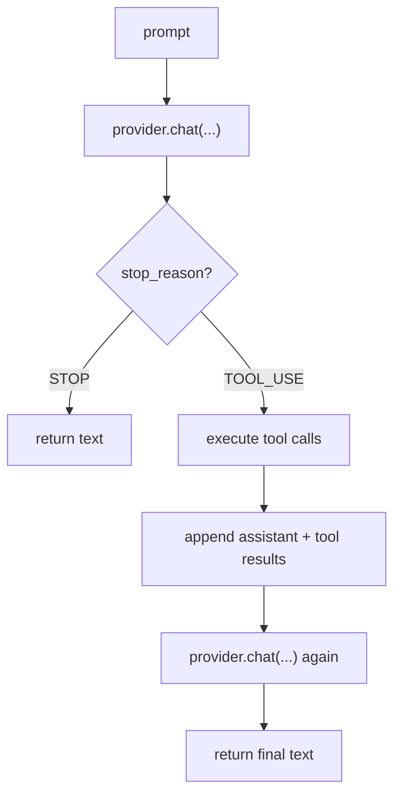
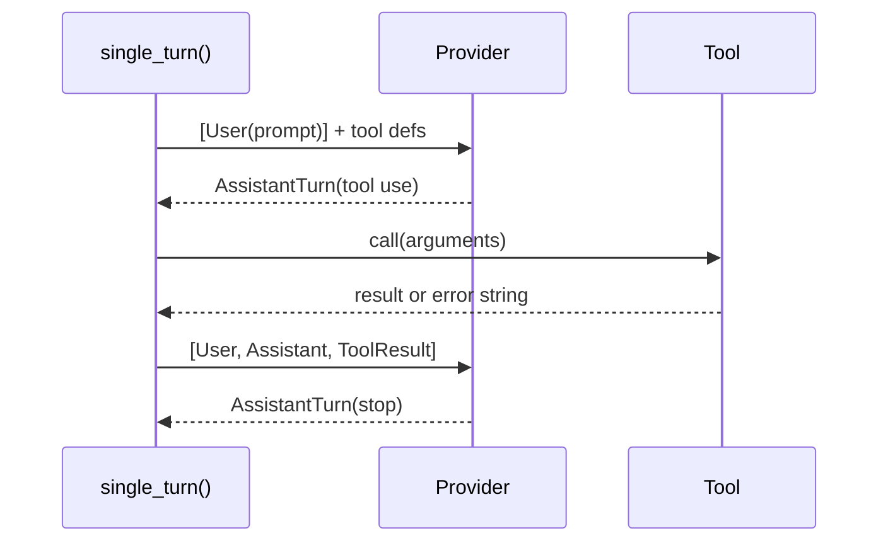

# Chapter 3: Single Turn

You now have a provider and a tool. Before building the full agent loop, it is
worth seeing the raw protocol directly.

In this chapter you will write `single_turn()`: a function that handles exactly
one prompt with at most one round of tool calls.

## Goal

Implement `single_turn()` so that:

1. it sends a prompt to the provider
2. it checks `stop_reason`
3. if the model is done, it returns the text
4. if the model requests tools, it executes them
5. it sends the tool results back and returns the final text

No loop yet. Just one round.

## The protocol in one picture



This is the same protocol the full agent will use later. The only difference
is that `single_turn()` stops after one tool round.

## `ToolSet`

The function takes a `ToolSet` rather than a list of tools:

```python
async def single_turn(provider: Provider, tools: ToolSet, prompt: str) -> str:
    ...
```

That matters because tool execution is by **name lookup**:

```python
tool = tools.get(call.name)
```

The model requests `"read"` or `"bash"`, and `ToolSet` maps that name to the
actual tool object.

## The key branch: `stop_reason`

Do not infer behavior from whether `tool_calls` is empty. Use the explicit
protocol signal:

```python
if turn.stop_reason is StopReason.STOP:
    return turn.text or ""
```

Otherwise the model wants tools.

## Error handling rule

The tool loop should not crash just because a tool fails. Tool failures are
normal: files can be missing, commands can fail, arguments can be wrong.

Instead, catch those exceptions and turn them into strings:

```python
try:
    content = await tool.call(call.arguments)
except Exception as exc:
    content = f"error: {exc}"
```

That string goes back to the model as a tool result. The model can then decide
what to do next.

## The message sequence



The assistant turn itself is part of the history. That way the model can see
what it asked for and what happened.

## The implementation

Open `mini-claw-code-starter-py/src/mini_claw_code_starter_py/agent.py`.

### Step 1: Collect tool definitions

```python
defs = tools.definitions()
```

### Step 2: Create the initial history

```python
messages = [Message.user(prompt)]
```

### Step 3: Call the provider

```python
turn = await provider.chat(messages, defs)
```

### Step 4: Branch on `stop_reason`

If the turn is `STOP`, return `turn.text or ""`.

If the turn is `TOOL_USE`:

1. iterate through `turn.tool_calls`
2. find each tool by name
3. execute it or produce an `"error: ..."` string
4. collect `(call_id, content)` pairs
5. append `Message.assistant(turn)`
6. append `Message.tool_result(...)` for each result
7. call the provider one more time

## Running the tests

Run the Chapter 3 tests:

```bash
cd mini-claw-code-starter-py
PYTHONPATH=src uv run python -m pytest tests/test_ch3.py
```

### What the tests verify

- direct text responses
- one successful tool call
- unknown tool handling
- tool-result feedback into the second provider call

## Recap

You have now handled the raw protocol directly:

- one provider call
- optional tool execution
- one final provider call

That is the foundation for the full loop.

## What's next

In [Chapter 4: More Tools](./ch04-more-tools.md) you will build the rest of the
toolset: `bash`, `write`, and `edit`.
