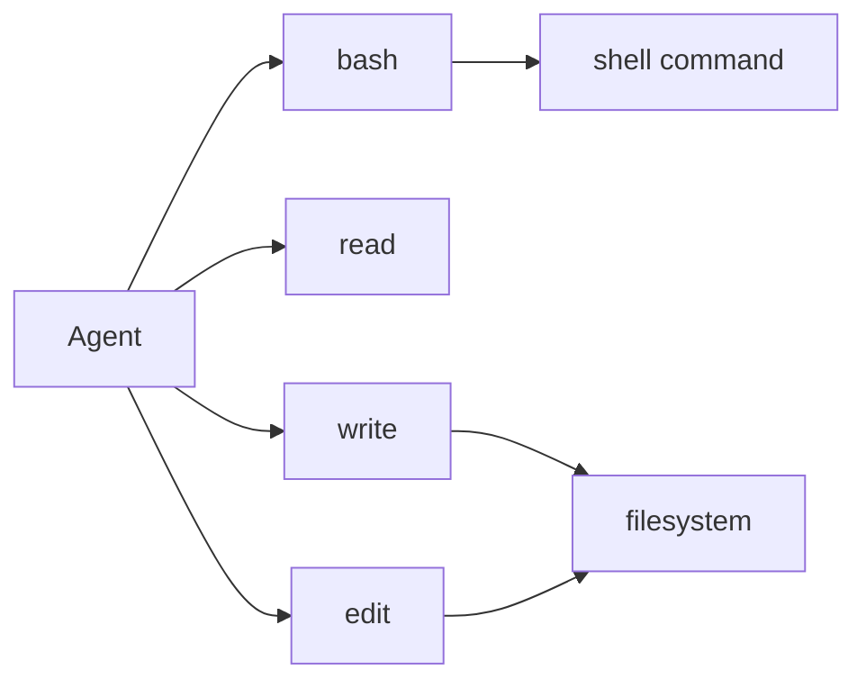
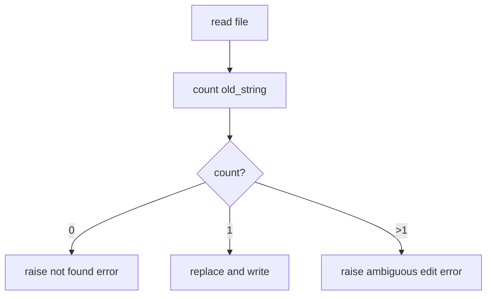

# Chapter 4: More Tools

You have already implemented `ReadTool` and understand the basic tool pattern.
Now you will implement three more tools:

- `BashTool`
- `WriteTool`
- `EditTool`

Each one follows the same structure as `ReadTool`, so this chapter reinforces
the pattern through repetition.

## Goal

Implement:

1. `BashTool` — run a shell command and return its output
2. `WriteTool` — write content to a file, creating directories as needed
3. `EditTool` — replace an exact string in a file, but only if it appears once



## Tool 1: `BashTool`

Open `mini-claw-code-starter-py/src/mini_claw_code_starter_py/tools/bash.py`.

### Schema

The tool needs one required string parameter:

```python
ToolDefinition.new(
    "bash",
    "Run a bash command and return its output.",
).param("command", "string", "The bash command to run", True)
```

### Execution

Use `asyncio.create_subprocess_exec()`:

```python
process = await asyncio.create_subprocess_exec(
    "bash",
    "-lc",
    command,
    stdout=asyncio.subprocess.PIPE,
    stderr=asyncio.subprocess.PIPE,
)
stdout_bytes, stderr_bytes = await process.communicate()
```

Then decode stdout and stderr, combine them, and return:

- stdout first
- stderr prefixed with `stderr: `
- `(no output)` if both are empty

## Tool 2: `WriteTool`

Open `mini-claw-code-starter-py/src/mini_claw_code_starter_py/tools/write.py`.

### Schema

`WriteTool` needs two required string parameters:

- `path`
- `content`

### Directory creation

Before writing, make sure the parent directories exist:

```python
await asyncio.to_thread(path_obj.parent.mkdir, parents=True, exist_ok=True)
```

Then write the file:

```python
await asyncio.to_thread(path_obj.write_text, content)
```

Return a confirmation string such as:

```python
return f"wrote {path}"
```

## Tool 3: `EditTool`

Open `mini-claw-code-starter-py/src/mini_claw_code_starter_py/tools/edit.py`.

### Schema

`EditTool` requires:

- `path`
- `old_string`
- `new_string`

### Exact-match editing

The key rule is that `old_string` must appear **exactly once**.



That prevents accidental edits in the wrong place.

The implementation steps are:

1. read the file
2. count `content.count(old)`
3. reject `0`
4. reject more than `1`
5. replace once with `content.replace(old, new, 1)`
6. write the updated file back

## Running the tests

Run the Chapter 4 tests:

```bash
cd mini-claw-code-starter-py
PYTHONPATH=src uv run python -m pytest tests/test_ch4.py
```

### What the tests verify

For `BashTool`:

- command execution
- stderr capture
- empty output handling

For `WriteTool`:

- file creation
- directory creation

For `EditTool`:

- exact replacement
- not-found errors
- non-unique-match errors

## Recap

You now have the full core toolset:

- `read`
- `bash`
- `write`
- `edit`

That is enough to build a real coding agent in the next chapter.

## What's next

In [Chapter 5: Your First Agent SDK!](./ch05-agent-loop.md) you will wrap the
single-turn protocol in a loop and build `SimpleAgent`.
