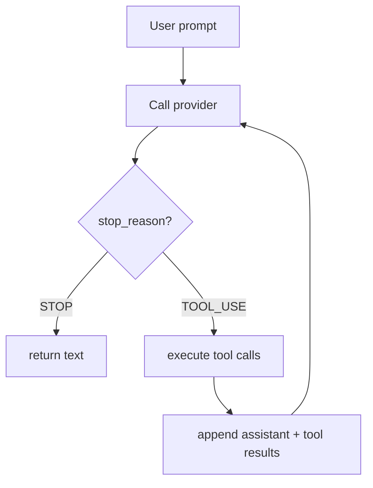

# Chapter 5: Your First Agent SDK!

This is the chapter where everything comes together. You now have:

- a provider that returns `AssistantTurn`
- four working tools
- a one-turn orchestration function

Now you will build `SimpleAgent`: the loop that connects them.

This is the "aha" moment of the tutorial. The loop is short, but it is the
engine that turns an LLM into an agent.

## What is an agent loop?

In Chapter 3 you built `single_turn()`: one prompt, one tool round, one final
answer. That is enough for very small tasks.

But real work is messier:

> "Find the bug in this project and fix it."

The model may need to:

1. read several files
2. run the tests
3. edit a file
4. run the tests again
5. explain the result

It cannot know all of that upfront, because each step depends on the previous
tool results. It needs a **loop**.



That is the architecture of every coding agent. The details vary, but the
core loop is always the same.

## Goal

Implement `SimpleAgent` so that:

1. it stores a provider and a `ToolSet`
2. it lets callers register tools with a builder pattern
3. `run()` loops until the provider returns `StopReason.STOP`

## Key Python concepts

### Regular classes instead of generics

The Rust version uses generics. Python does not need that here. Any object with
an async `chat()` method matching the provider protocol is good enough.

```python
class SimpleAgent:
    def __init__(self, provider: Provider) -> None:
        self.provider = provider
        self.tools = ToolSet()
```

### Heterogeneous tools

Python dictionaries can naturally store different tool objects behind one
interface. That makes the `ToolSet` implementation much simpler than the Rust
version:

```python
self._tools[tool.definition.name] = tool
```

### Fluent builders

The tool registration method still returns `self`, so the setup stays neat:

```python
agent = (
    SimpleAgent.new(provider)
    .tool(ReadTool.new())
    .tool(BashTool.new())
    .tool(WriteTool.new())
    .tool(EditTool.new())
)
```

## The implementation

Open `mini-claw-code-starter-py/src/mini_claw_code_starter_py/agent.py`.

### Step 1: Implement `new()`

Store the provider and initialize an empty `ToolSet`.

### Step 2: Implement `tool()`

Push the tool into `self.tools` and return `self`.

### Step 3: Implement `run()`

This is the core loop:

1. collect the tool definitions
2. create the initial message history with the user prompt
3. call the provider
4. branch on `stop_reason`
5. if needed, execute tools and append results
6. repeat

The rough shape is:

```python
defs = self.tools.definitions()
messages = [Message.user(prompt)]

while True:
    turn = await self.provider.chat(messages, defs)
    if turn.stop_reason is StopReason.STOP:
        return turn.text or ""
    ...
```

### Tool execution

For each tool call:

```python
tool = self.tools.get(call.name)
if tool is None:
    content = f"error: unknown tool `{call.name}`"
else:
    try:
        content = await tool.call(call.arguments)
    except Exception as exc:
        content = f"error: {exc}"
```

As in Chapter 3, tool errors become strings rather than crashing the loop.

### Appending history

After tool execution, append:

1. `Message.assistant(turn)`
2. one `Message.tool_result(...)` per tool call

That order matters because the model should see both what it requested and what
happened.

## Running the tests

Run the Chapter 5 tests:

```bash
cd mini-claw-code-starter-py
PYTHONPATH=src uv run python -m pytest tests/test_ch5.py
```

### What the tests verify

- direct responses with no tools
- a successful tool-using loop
- message accumulation across iterations

## Recap

You now have a real agent loop:

- prompt
- provider call
- tool execution
- message accumulation
- repeat until done

That is the foundation for the rest of the system.

## What's next

In [Chapter 6: The OpenRouter Provider](./ch06-http-provider.md) you will swap
the mock backend for a real HTTP provider and talk to an actual model.
