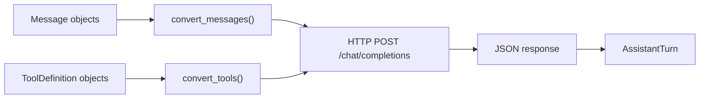

# Chapter 6: The OpenRouter Provider

Up to now, everything has run locally with `MockProvider`. In this chapter you
will implement `OpenRouterProvider`: a provider that talks to a real LLM over
HTTP using the OpenAI-compatible chat completions API.

This is the chapter that makes your agent real.

## Goal

Implement `OpenRouterProvider` so that:

1. it can be created with an API key and model name
2. it converts internal `Message` and `ToolDefinition` values into API JSON
3. it sends HTTP POST requests to `/chat/completions`
4. it parses the response back into `AssistantTurn`



## Why this provider matters

The first five chapters taught you the architecture without network complexity.
This chapter connects that architecture to a real model API.

The good news: the protocol does not change. The provider still takes
`messages` and `tools` and returns `AssistantTurn`.

## Key Python concepts

### `httpx.AsyncClient`

The Python implementation uses `httpx.AsyncClient`:

```python
response = await client.post(
    url,
    headers={"Authorization": f"Bearer {api_key}"},
    json=body,
)
response.raise_for_status()
payload = response.json()
```

This is the same pattern you will use for both OpenRouter and OpenAI-compatible
backends.

### Environment handling

The reference provider supports:

- `OPENROUTER_API_KEY`
- `OPENAI_API_KEY`

That means the same code can work against OpenRouter or the OpenAI API by
changing environment variables.

### JSON encoding and decoding

Tool call arguments are dictionaries internally, but the API represents them as
JSON strings inside tool-call payloads. So the provider must convert in both
directions:

```python
json.dumps(call.arguments)
json.loads(raw_arguments)
```

## The API data model

The provider works with OpenAI-compatible chat completions.

### Request fields

- `model`
- `messages`
- `tools`
- `stream`

### Response fields

- `choices`
- `message`
- `finish_reason`

The important piece is `finish_reason`:

- `"tool_calls"` -> `StopReason.TOOL_USE`
- anything else -> `StopReason.STOP`

## The implementation

Open `mini-claw-code-starter-py/src/mini_claw_code_starter_py/providers/openrouter.py`.

### Step 1: Implement `new()`

Store:

- the API key
- the model name
- the default base URL

### Step 2: Implement `with_base_url()`

This is a simple builder that lets tests or advanced users swap the endpoint:

```python
provider = OpenRouterProvider.new("key", "model").with_base_url("http://localhost:1234")
```

### Step 3: Implement `from_env_with_model()`

Read the key from the environment and build the provider.

### Step 4: Implement `from_env()`

Call `from_env_with_model()` with the default model.

### Step 5: Implement `convert_messages()`

Map each internal message to an API message:

- `Message.system(...)` -> role `"system"`
- `Message.user(...)` -> role `"user"`
- `Message.assistant(turn)` -> role `"assistant"`
- `Message.tool_result(...)` -> role `"tool"`

For assistant tool calls, serialize the arguments dictionary with `json.dumps`.

### Step 6: Implement `convert_tools()`

Map each `ToolDefinition` into the API's `{"type": "function", ...}` format.

### Step 7: Implement `chat()`

This is the main method:

1. build the request body
2. send the POST request
3. parse the JSON response
4. extract the first choice
5. convert any tool calls back into internal `ToolCall` values
6. map `finish_reason` to `StopReason`

The trickiest part is decoding tool arguments:

```python
arguments = json.loads(raw_arguments)
```

If parsing fails, return `None` or another safe fallback rather than crashing.

## Running the tests

Run the Chapter 6 tests:

```bash
cd mini-claw-code-starter-py
PYTHONPATH=src uv run python -m pytest tests/test_ch6.py
```

### What the tests verify

- provider construction
- message conversion
- tool conversion
- HTTP request/response parsing

## Recap

You now have a real model backend. The agent can leave the fully mocked world
and talk to a live API.

## What's next

In [Chapter 7: A Simple CLI](./ch07-putting-together.md) you will wire the
provider and tools into a real interactive chat program.
