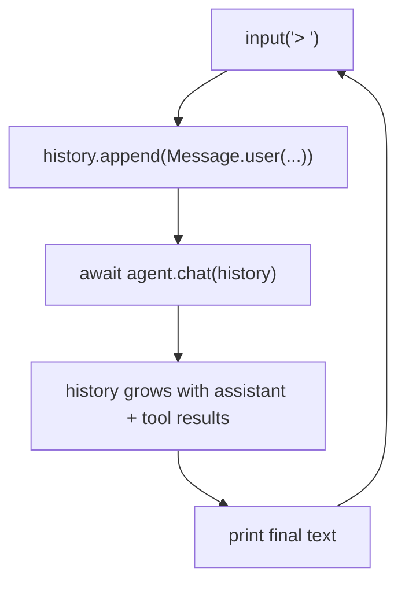

# Chapter 7: A Simple CLI

You have now built every major component:

- a mock provider for testing
- four core tools
- the agent loop
- a real HTTP provider

Now it is time to wire them into a working CLI.

## Goal

Add a `chat()` method to `SimpleAgent` and write `examples/chat.py` so that:

1. the agent remembers the conversation
2. it prints `> ` and reads a line from stdin
3. it shows a `thinking...` indicator
4. it prints the result and keeps going until EOF

## Why a `chat()` method?

`run()` creates a fresh history every time:

```python
result = await agent.run("Read README.md")
```

That is useful for one-off prompts, but it means the model forgets everything
between turns.

A real CLI should keep context across the session, so the model can say things
like:

- "I already read that file"
- "As I mentioned earlier"
- "The test output from the previous step shows..."

That is what `chat()` solves:

```python
async def chat(self, messages: list[Message]) -> str:
    ...
```

The caller owns the history, pushes the user message before each turn, and
`chat()` appends the assistant turns and tool results.

## The history flow



## Implementing `chat()`

Open `mini-claw-code-starter-py/src/mini_claw_code_starter_py/agent.py`.

The loop body should be the same as `run()`. The difference is only where the
history comes from.

The steps are:

1. collect tool definitions
2. repeatedly call the provider with the supplied history
3. if `STOP`, append `Message.assistant(turn)` and return the text
4. if `TOOL_USE`, execute tools and append tool results

That is it. `chat()` is just the persistent-history version of `run()`.

## The CLI

Open `mini-claw-code-starter-py/examples/chat.py`.

### Step 1: Create the provider and agent

```python
provider = OpenRouterProvider.from_env()
agent = (
    SimpleAgent.new(provider)
    .tool(BashTool.new())
    .tool(ReadTool.new())
    .tool(WriteTool.new())
    .tool(EditTool.new())
)
```

### Step 2: Build the initial history

Start with a system prompt:

```python
history = [
    Message.system(
        f"You are a coding agent. Help with software engineering tasks.\n\n"
        f"Working directory: {Path.cwd()}"
    )
]
```

Two things matter here:

1. the system prompt describes **behavior**
2. it includes the current working directory

Real coding agents do the same thing. The model needs to know where it is.

### Step 3: Build the REPL loop

The minimal flow is:

```python
while True:
    prompt = input("> ").strip()
    if not prompt:
        continue
    history.append(Message.user(prompt))
    text = await agent.chat(history)
    print(text)
```

The real version should also:

- handle EOF cleanly
- show `thinking...`
- keep running if one request fails

### Step 4: Handle EOF and errors

Use `try/except EOFError` around `input()`, and catch agent errors so the CLI
does not exit after a single bad turn.

## Running the full test suite

Run the starter tests:

```bash
cd mini-claw-code-starter-py
PYTHONPATH=src uv run python -m pytest
```

That covers all hands-on chapters from 1 through 7.

## Running the reference CLI

To try the finished Python CLI with a real model:

```bash
cd ../mini-claw-code-py
uv venv
source .venv/bin/activate
uv pip install -e ".[dev]"
export OPENAI_API_KEY="your-key-here"   # or OPENROUTER_API_KEY
PYTHONPATH=src uv run python examples/chat.py
```

You can then try prompts like:

```text
> List the files in the current directory
> Read the README and summarize the project
> Create a small Python script called hello.py that prints hello
```

## Recap

You now have a complete mini coding agent in Python:

- tools
- a provider
- an agent loop
- a working CLI

That is the end of the hands-on core build.

## What's next

In [Chapter 8: The Singularity](./ch08-singularity.md) the tutorial shifts into
extension mode. From there, you will study and extend the reference
implementation with streaming, user input, plan mode, and more.
