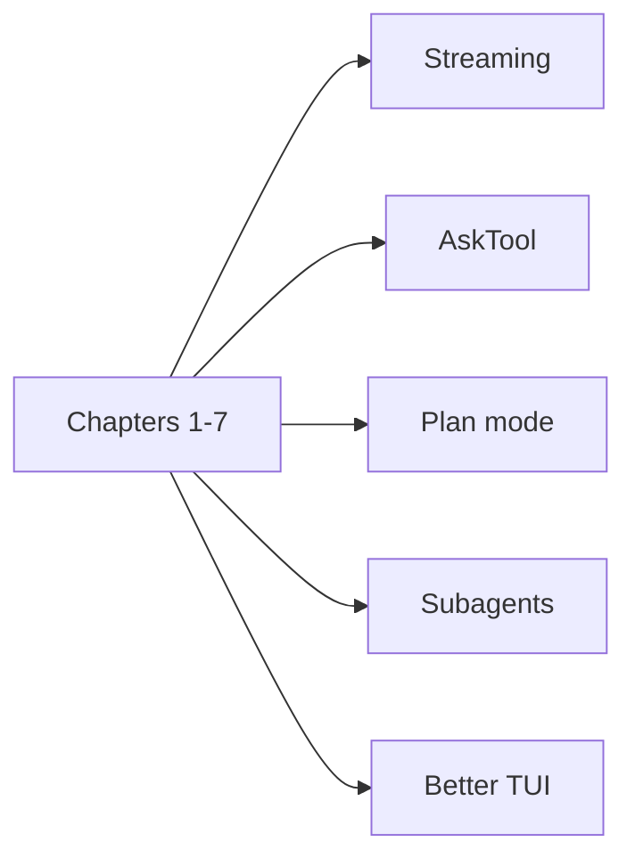

# Chapter 8: The Singularity

At this point your Python agent can inspect files, run commands, write code,
and continue a multi-turn conversation.

The remaining chapters are read-only extension walkthroughs built on the
reference implementation in `mini-claw-code-py`.

## Mental model

Extensions covered next:

- a better terminal UI
- streaming token output
- user clarification via `ask_user`
- plan mode
- subagents

Suggested experiments after finishing the book:

- add concurrency for independent tool calls
- add token accounting and message truncation
- add a web search or HTTP request tool
- add structured approvals for risky shell commands
