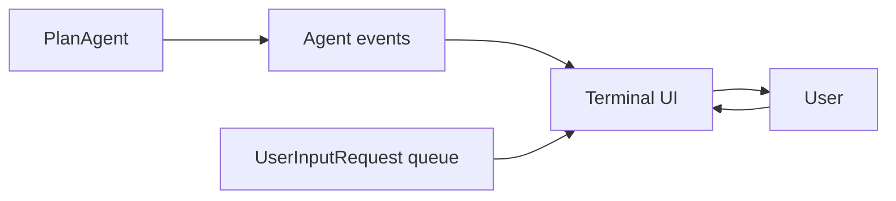
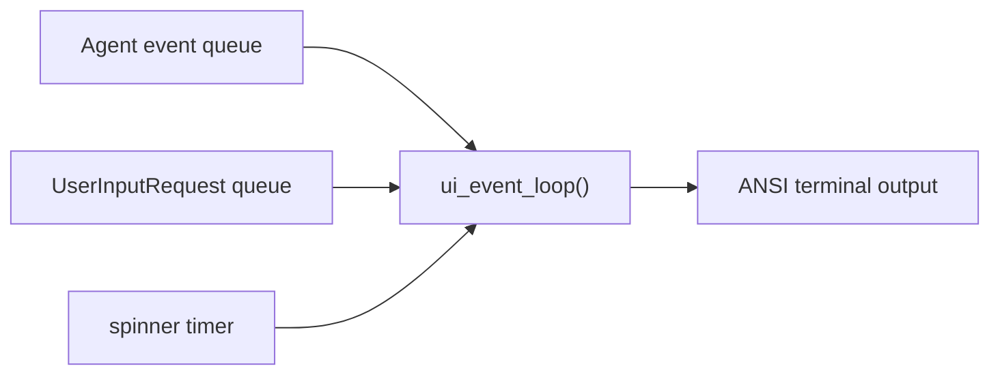

# Chapter 9: A Better TUI

The basic CLI works, but it prints raw text and every tool call directly.

The Rust version goes further: spinner animation, colored prompts, collapsed
tool-call output, and better interaction around user input. The Python port now
borrows the same ideas while still staying small enough to read in one file.

The Python example at `mini-claw-code-py/examples/tui.py` is now a real
terminal UI around `PlanAgent`, not just a raw event printer.

## Mental model

## What it demonstrates

- streaming text to the terminal as it arrives
- animated spinner while the agent thinks
- showing tool-call summaries separately from normal text
- collapsing long runs of tool calls after a small threshold
- colored prompts for normal mode and plan mode
- handling `ask_user` requests through an `asyncio.Queue`
- toggling a plan-first workflow with `/plan`

## Mental model of the event loop

The Rust TUI multiplexes three things at once:

1. agent events
2. user-input requests
3. timer ticks for the spinner

The updated Python version now does the same with `asyncio.wait(...)`.

The UI loop keeps one small piece of state:

- current spinner frame
- whether text is actively streaming
- how many tool calls have been shown so far

That is enough to reproduce most of the nicer UX from the Rust example without
pulling in heavier Python TUI frameworks.

## Why this is still tutorial-friendly

The Python version is still deliberately smaller than the Rust `crossterm`
implementation:

- it uses ANSI escape sequences directly instead of a full terminal crate
- option prompts are still simple numbered selections instead of arrow-key menus
- it does not try to render markdown or manage a full-screen layout

But it now has the high-value behavior people actually notice:

- a visible thinking state
- cleaner separation between streamed answer text and tool activity
- less noisy output when many tool calls happen
- better prompts during plan mode and execution mode

If you want a richer interface, the natural next step is integrating:

- `rich` for rendering
- `textual` for a full TUI app
- arrow-key option selection for `ask_user`
- markdown rendering for final agent answers
