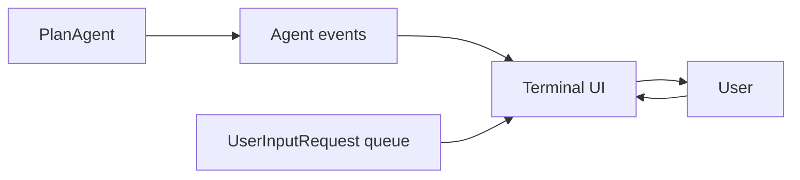

# Chapter 9: A Better TUI

The basic CLI works, but it prints raw text and every tool call directly.

The Python port includes `mini-claw-code-py/examples/tui.py`, which shows a
simple terminal UI around `PlanAgent`.

## Mental model

## What it demonstrates

- streaming text to the terminal as it arrives
- showing tool-call summaries separately from normal text
- handling `ask_user` requests through an `asyncio.Queue`
- toggling a plan-first workflow with `/plan`

The Python version is intentionally simpler than the Rust `crossterm` TUI. It
uses only the standard library so the tutorial stays lightweight.

If you want a richer interface, the natural next step is integrating:

- `rich` for rendering
- `textual` for a full TUI app
- arrow-key option selection for `ask_user`
