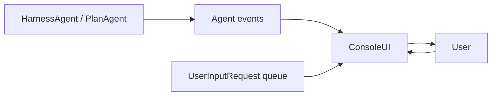
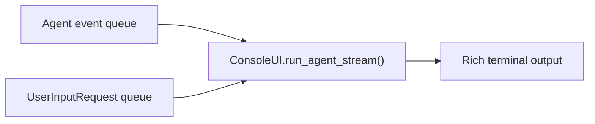

# Chapter 9: A Better TUI

The basic CLI works, but it prints raw text and every tool call directly.

That is fine for proving the agent loop works.

But it is not a good terminal experience.

The Rust version goes further: spinner animation, colored prompts, collapsed
tool-call output, and better interaction around user input. The Python port
now borrows the same ideas while keeping the design lightweight.

There are now two useful layers in the Python project:

- `examples/tui.py`
  - the earlier small teaching example around `PlanAgent`
- `src/mini_claw_code_py/tui/`
  - the richer terminal UI package used by `examples/cli.py`

That is the right split.

The small example still teaches the evented agent loop clearly.

The reusable `tui` package owns the nicer terminal UX.

## Mental model

## What it demonstrates

- streaming text to the terminal as it arrives
- animated spinner while the agent thinks
- showing tool-call summaries separately from normal text
- collapsing long runs of tool calls after a small threshold
- cleaner prompts for normal mode, plan mode, and approval prompts
- handling `ask_user` requests through an `asyncio.Queue`
- toggling a plan-first workflow with `/plan`
- rendering status, audit, and session information in simple terminal panels
- listing sessions with direct selection so `/sessions` can resume a run

## Mental model of the event loop

The terminal UI multiplexes three things at once:

1. agent events
2. user-input requests
3. spinner state while work is active

The updated Python version now does the same with `asyncio.wait(...)` and a
small Rich-based status layer.

The UI loop keeps only a small amount of state:

- whether text is actively streaming
- how many tool calls have been shown so far
- whether tool-call output has already been collapsed
- the last structured status message so duplicate notices stay suppressed

That is enough to produce a much better CLI without jumping all the way to a
full-screen TUI framework.

## Why the UI moved into a package

Once the harness CLI started growing, one file stopped being the right shape.

The better design is:

- `examples/cli.py`
  - startup only
- `tui/app.py`
  - command loop, session actions, plan/execute orchestration
- `tui/console.py`
  - terminal rendering, input prompts, session selection, spinner
- `tui/theme.py`
  - semantic style constants

That follows the same rule as the rest of the book:

- keep examples thin
- move reusable runtime behavior into modules

This is an important design lesson.

Good terminal UX is not just decoration.

It is part of the runtime surface.

## Why this is still tutorial-friendly

The Python version is still deliberately smaller than a full `textual`
application:

- it uses `rich` panels, tables, and spinners instead of a custom full-screen
  layout engine
- option prompts are still simple numbered selections instead of arrow-key menus
- it does not try to render markdown or manage a full-screen layout

But it now has the high-value behavior people actually notice:

- a visible thinking state
- cleaner separation between streamed answer text and tool activity
- less noisy output when many tool calls happen
- better prompts during plan mode and execution mode
- direct session selection from `/sessions`
- readable status panels for runtime, audit log, and session metadata

If you want a richer interface, the natural next step is integrating:

- richer markdown rendering for final agent answers
- arrow-key menus for interactive selection
- `textual` for a full-screen app
- arrow-key option selection for `ask_user`
- multi-pane history and tool activity views
