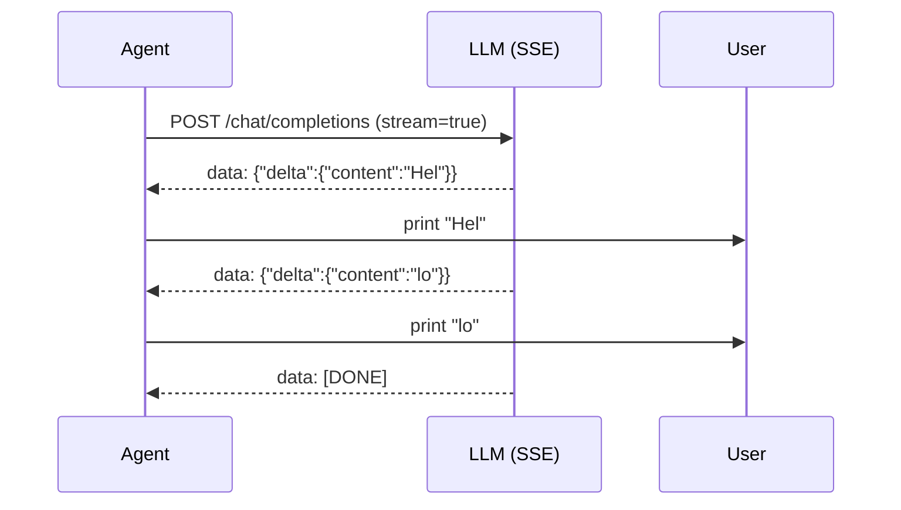
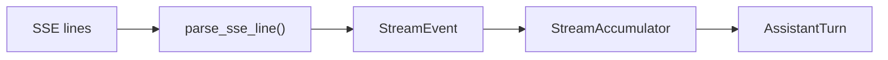
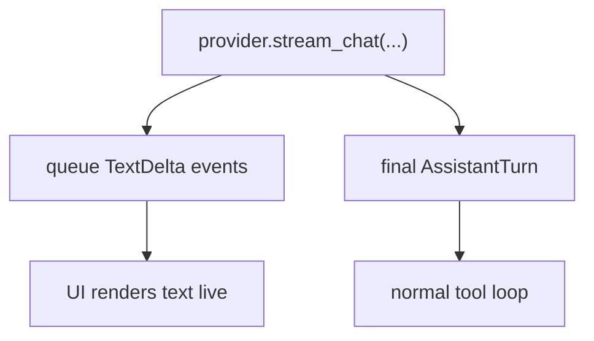

# Chapter 10: Streaming

In Chapter 6 you built `OpenRouterProvider.chat()`, which waits for the full
response before returning. That works, but the user stares at a blank screen
until every token has been generated.

Real coding agents stream tokens as they arrive.

This chapter adds streaming support and introduces `StreamingAgent`, the
streaming counterpart to `SimpleAgent`.

## What you will build

1. `StreamEvent` dataclasses for real-time deltas
2. `StreamAccumulator` to rebuild a final `AssistantTurn`
3. `parse_sse_line()` to parse raw SSE lines
4. a `StreamProvider` protocol
5. `OpenRouterProvider.stream_chat()`
6. `MockStreamProvider` for tests
7. `StreamingAgent`

None of this changes `Provider` or `SimpleAgent`. Streaming is layered on top.

## Why streaming?

Without streaming, a long response feels frozen. Streaming fixes three things:

- **immediate feedback**: the first token appears quickly
- **progress visibility**: the user can see the model is working
- **better UX**: the CLI feels alive instead of blocked

## How SSE works

OpenAI-compatible APIs expose streaming with **Server-Sent Events (SSE)**.
Instead of one big JSON response, the server sends a sequence of lines:

```text
data: {"choices":[{"delta":{"content":"Hello"},"finish_reason":null}]}

data: {"choices":[{"delta":{"content":" world"},"finish_reason":null}]}

data: [DONE]
```

Each line begins with `data: `. The payload is either:

- a JSON chunk containing partial text or tool-call data
- the special sentinel `[DONE]`



Tool calls stream the same way, except the `delta` contains tool-call fragments
instead of assistant text.

## `StreamEvent`

Open `mini-claw-code-py/src/mini_claw_code_py/streaming.py`.

The Python version uses small dataclasses:

```python
TextDelta("Hel")
ToolCallStart(index=0, id="call_1", name="read")
ToolCallDelta(index=0, arguments='{"path": "README.md"}')
StreamDone()
```

These events are the interface between:

- the SSE parser
- the accumulator
- the user interface

## `StreamAccumulator`

The accumulator keeps:

- a text buffer
- a list of partial tool calls



The logic is:

- `TextDelta` appends to `self.text`
- `ToolCallStart` initializes or extends the tool-call list
- `ToolCallDelta` appends raw argument text
- `StreamDone` marks the logical end of the stream

At the end, `finish()` converts the accumulated state into an `AssistantTurn`.

The important detail is that tool arguments are accumulated as raw strings and
only parsed as JSON at the end. That is necessary because the API may stream
fragments like:

```text
{"pa
th": "f.txt"}
```

Those fragments are not valid JSON until concatenated.

## Parsing SSE lines

`parse_sse_line()` does three things:

1. rejects lines that do not start with `data: `
2. converts `data: [DONE]` into `StreamDone()`
3. parses JSON chunks into one or more stream events

For tool calls, the first chunk may include:

- the tool-call `id`
- the function name

Later chunks may contain only more argument text.

## `StreamProvider`

Streaming uses a separate protocol:

```python
class StreamProvider(Protocol):
    async def stream_chat(
        self,
        messages: Sequence[Message],
        tools: Sequence[ToolDefinition],
        queue: asyncio.Queue[StreamEvent],
    ) -> AssistantTurn:
        ...
```

This keeps the original `Provider` contract untouched.

The streaming method does two jobs:

1. emit `StreamEvent` values as they arrive
2. return the final reconstructed `AssistantTurn`

## Implementing `stream_chat()` for `OpenRouterProvider`

The provider implementation:

1. builds the normal request body with `stream=True`
2. opens an HTTP streaming response
3. reads lines with `aiter_lines()`
4. parses each line into stream events
5. feeds those events into the accumulator
6. pushes the same events into the UI queue
7. returns `accumulator.finish()`

## `MockStreamProvider`

Tests should not depend on live HTTP. `MockStreamProvider` wraps
`MockProvider` and synthesizes streaming events from a complete canned turn.

That lets you test:

- accumulator logic
- SSE-independent streaming UI behavior
- streaming agent orchestration

## `StreamingAgent`

`StreamingAgent` is the streaming equivalent of `SimpleAgent`.

The main difference is that it forwards text deltas to an event queue while the
provider is still generating:



The tool loop itself stays the same.

## Running the tests

The reference project contains streaming tests:

```bash
cd mini-claw-code-py
PYTHONPATH=src uv run python -m pytest tests/test_ch10.py
```

These cover:

- text accumulation
- streamed tool calls
- SSE parsing
- streaming-agent integration

## Recap

Streaming adds better UX without changing the core architecture:

- the provider still returns `AssistantTurn`
- the agent loop still executes tools the same way
- the only addition is a real-time event channel for partial output

## What's next

In [Chapter 11: User Input](./ch11-user-input.md) you will let the agent pause
and ask the user clarifying questions mid-task.
