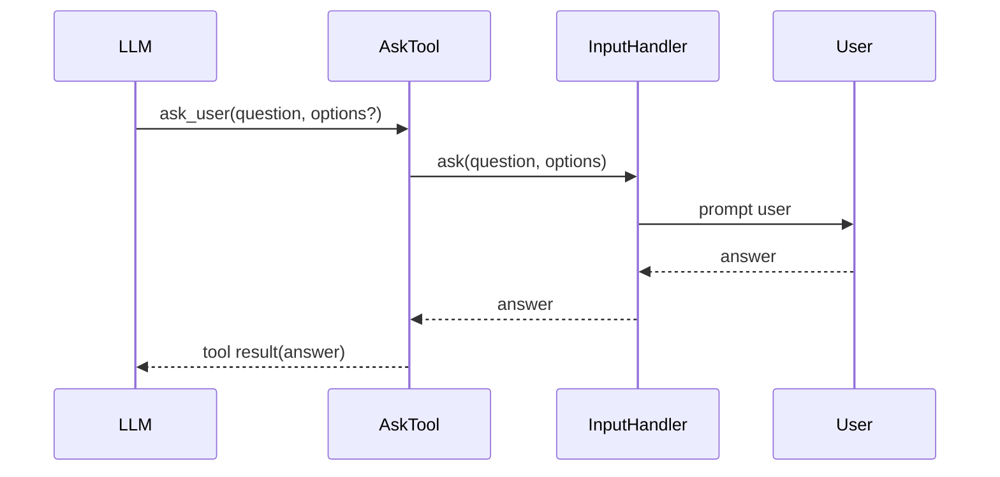

# Chapter 11: User Input

Your agent can read files, run commands, and write code, but so far it cannot
ask *you* a question. If it is unsure which file to edit, which option to pick,
or whether to proceed with a risky step, it just guesses.

Real coding agents solve that with an **ask tool**. The model calls a special
tool, the agent pauses, the user answers, and the answer goes back as a tool
result.

In this chapter you will study the Python implementation of that pattern.

## What you will build

1. an `InputHandler` protocol
2. an `AskTool`
3. three handler implementations:
   - `CliInputHandler`
   - `ChannelInputHandler`
   - `MockInputHandler`

## Why an input abstraction?

Different UIs collect input differently:

- a CLI prints a prompt and reads from stdin
- a TUI sends a request into an event loop
- tests need canned answers without any I/O

The point of `InputHandler` is that `AskTool` should not care which UI is in
use.

```python
class InputHandler(Protocol):
    async def ask(self, question: str, options: Sequence[str]) -> str:
        ...
```

## The `ask_user` flow



The model does not read from stdin directly. It just emits a tool call and
waits for your code to produce a result.

## `AskTool`

`AskTool` stores:

- a `ToolDefinition`
- an `InputHandler`

The tool definition exposes:

- `question` — required string
- `options` — optional array of strings

That means the model can either:

- ask an open-ended question
- present a list of choices

## `param_raw()`

The Python reference adds `param_raw()` to `ToolDefinition` so tools can define
non-scalar JSON schema fields like arrays.

That is needed for `options`, because `param()` alone only handles simple types
like `"string"`.

## `AskTool.call()`

The implementation does three things:

1. extract `question`
2. parse `options`
3. delegate to the handler

The options parser is intentionally forgiving. If `options` is missing or not a
list, it falls back to `[]`, which means free-text input.

## Three handlers

### `CliInputHandler`

This is the simplest version. It:

1. prints the question
2. prints numbered choices if present
3. reads input from the user
4. resolves `"1"` / `"2"` / `"3"` into the matching option when appropriate

Because `input()` is blocking, the handler runs that work in a thread using
`asyncio.to_thread()`.

### `ChannelInputHandler`

For TUIs, the tool itself should not take over the terminal. Instead it creates
a `UserInputRequest` object and pushes it into an `asyncio.Queue`.

The event loop then decides how to render that request and how to collect the
answer.

### `MockInputHandler`

Tests use a `deque` of canned answers so they can exercise the flow without any
real terminal input.

## Why this matters

Without an ask tool, the model must guess whenever it lacks information.

With an ask tool, it can:

- request clarification
- ask permission before risky work
- present concrete options to the user

That makes the agent more robust and more trustworthy.

## Running the tests

The reference implementation includes tests for:

- schema correctness
- question-only prompts
- option handling
- channel-based input requests

Run them with:

```bash
cd mini-claw-code-py
PYTHONPATH=src uv run python -m pytest tests/test_ch11.py
```

## Recap

`AskTool` extends the agent in an important direction: the user is no longer
just the first prompt. The user can become part of the loop itself.

## What's next

In [Chapter 12: Plan Mode](./ch12-plan-mode.md) you will use that idea in a
more structured way by splitting the workflow into planning and execution
phases.
