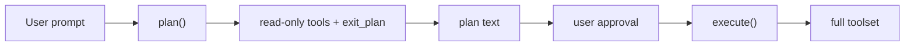

# Chapter 12: Plan Mode

Real coding agents can be dangerous. Give an LLM access to `write`, `edit`, and
`bash` and it might change the wrong file, run a destructive command, or take
an approach you did not want, all before you had a chance to review it.

**Plan mode** solves that with a two-phase workflow:

1. **Plan**: the agent explores the codebase with read-only tools and produces a plan
2. **Execute**: after user approval, the agent runs again with the full toolset

This chapter explains the Python implementation of that workflow.

## What you will build

1. a `PlanAgent`
2. a planning-mode system prompt
3. an `exit_plan` tool
4. definition filtering and execution guards
5. a caller-driven approval loop

## Why plan mode?

Consider this scenario:

```text
User: "Refactor auth.py to use JWT instead of sessions"

Agent without plan mode:
  -> immediately edits auth.py
  -> rewrites half the flow
  -> uses an approach you did not want
```

With plan mode:

```text
User: "Refactor auth.py to use JWT instead of sessions"

Agent in plan mode:
  -> reads auth.py
  -> searches related files
  -> asks a clarifying question if needed
  -> submits a concrete plan

User approves

Agent in execute mode:
  -> writes and edits with the approved direction
```

The key idea is that the same agent loop can power both phases. The only
difference is which tools are visible and allowed.

## The architecture



## `PlanAgent`

The Python reference stores:

- the streaming provider
- the registered tools
- a set of read-only tool names
- a planning-mode system prompt
- an `exit_plan` tool definition

It exposes two public methods:

- `plan(messages, events)`
- `execute(messages, events)`

Both delegate to a shared private loop.

## The builder

The Python builder mirrors the rest of the project:

```python
agent = (
    PlanAgent(provider)
    .tool(BashTool())
    .tool(ReadTool())
    .tool(WriteTool())
    .tool(EditTool())
    .tool(AskTool(handler))
)
```

The default read-only set is:

- `bash`
- `read`
- `ask_user`

That gives the model enough power to inspect the repository and ask clarifying
questions without mutating anything.

Later harness chapters add one small extension to this idea:

- `write_todos` may also be allowed in planning mode because it updates only
  internal runtime state, not user files

## The planning prompt

The model needs to know it is in planning mode. Otherwise it will treat the
task like any other request and try to finish it immediately.

So `plan()` injects a special system prompt unless the history already starts
with one.

That prompt tells the model:

- you are in planning mode
- you may inspect and ask questions
- you must not write or edit files
- when the plan is ready, call `exit_plan`

## The `exit_plan` tool

Without `exit_plan`, the planning phase could only end when the model produced
normal final text. That is ambiguous: did it finish planning, or did it just
stop talking?

`exit_plan` gives the model an explicit way to say:

> "My plan is ready for review."

The Python implementation keeps `exit_plan` as a standalone `ToolDefinition`
rather than a normal registered tool:

- included during `plan()`
- omitted during `execute()`

That means the model can only see it in the planning phase.

## Double defense

Plan mode uses two layers of protection.

### Layer 1: definition filtering

During planning, the model only receives read-only tool definitions plus
`exit_plan`.

### Layer 2: execution guard

Even if the model somehow requests a blocked tool anyway, the loop refuses to
execute it and sends back an error string instead.

That matters. The model is not a trusted policy engine.

## The shared loop

The private loop does the same high-level work as `StreamingAgent`:

1. call `stream_chat()`
2. forward text deltas to the UI
3. branch on `stop_reason`
4. execute tools if needed
5. append the results to history

The extra planning logic is:

- include or exclude tools depending on mode
- watch for `exit_plan`
- return plan text early when the plan is submitted

## Running the flow

The example TUI in `mini-claw-code-py/examples/tui.py` demonstrates the full
interaction:

1. the user toggles `/plan`
2. the agent runs `plan()`
3. the user reviews the plan
4. the user either approves or requests revision
5. on approval, the agent runs `execute()`

## Running the tests

The reference project includes plan-mode tests:

```bash
cd mini-claw-code-py
PYTHONPATH=src uv run python -m pytest tests/test_ch12.py
```

These cover:

- text-only plans
- read-only planning
- blocked write attempts during planning

## Recap

Plan mode makes the agent safer and more predictable without inventing a second
architecture. It is still the same model/tool loop, just with a controlled set
of tools and an approval checkpoint.

## What's next

In [Chapter 13: Subagents](./ch13-subagents.md) you will decompose large tasks
by spawning child agents as tools.
