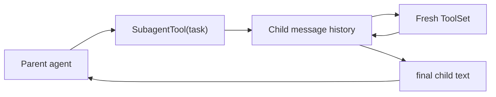

# Chapter 13: Subagents

Complex tasks are hard. Even strong models struggle when one prompt asks them
to research a codebase, design a change, write code, and verify the result all
inside one giant conversation. The context window fills up, the model loses
focus, and quality drops.

**Subagents** solve that by decomposition. The parent agent delegates a focused
subtask to a child agent. The child has its own message history and tools, runs
to completion, and returns a short summary.

This chapter explains the Python implementation of that pattern.

## What you will build

1. a `SubagentTool`
2. a tool-factory callback for fresh child toolsets
3. a child agent loop with a turn limit
4. a clean parent/child separation model

## Why subagents?

Consider this scenario:

```text
User: "Add better error handling across all API endpoints"

Without subagents:
  -> one conversation reads many files
  -> the context grows large
  -> the model loses track of earlier findings

With subagents:
  -> parent spawns a child for users.py
  -> child reads, edits, verifies, returns a summary
  -> parent spawns another child for posts.py
  -> parent coordinates only the summaries
```

The key insight is that a subagent is just another tool:

```python
SubagentTool(provider, lambda: ToolSet().with_tool(ReadTool()))
```

The parent does not need a special execution path. It just calls a tool and
receives a string result.

## Parent/child flow



## Provider sharing

Unlike the Rust version, the Python provider does not need a special `Arc`
wrapper or blanket implementation. Python objects are already reference types,
so the parent and child can share the same provider instance directly.

That means the Python version is simpler here:

- the parent creates one provider
- the same provider object is passed into `SubagentTool`
- each child uses it for its own turn loop

## Why a tool factory?

Each child needs a fresh toolset. The simplest way to ensure that is a callback:

```python
lambda: ToolSet().with_tool(ReadTool()).with_tool(WriteTool())
```

That avoids problems with shared mutable tool state and makes each child spawn
independent.

## `SubagentTool`

The Python implementation stores:

- the shared provider
- a `tools_factory` callback
- an optional child system prompt
- a `max_turns` limit
- a normal `ToolDefinition`

The tool schema exposes a single required argument:

- `task`

That task string is the entire child brief.

## The child loop

Inside `call()`, the subagent:

1. creates a fresh toolset
2. builds a fresh message history
3. optionally inserts a child-specific system prompt
4. appends the task as a user message
5. runs the same provider/tool loop as `SimpleAgent`

The main differences from the parent loop are:

- no terminal printing
- local child-only history
- a hard maximum number of turns

## Why a turn limit?

Without a turn limit, a confused child could loop forever. The Python version
defaults to a fixed `max_turns` value and returns an error string when it is
exceeded.

That makes the failure visible to the parent model without crashing the whole
agent.

## What the parent sees

The parent never sees the child's internal conversation. It only sees the final
string returned by the subagent tool.

That is the whole point:

- the child handles the messy details
- the parent keeps a smaller, cleaner context

## Running the tests

The reference project includes subagent tests:

```bash
cd mini-claw-code-py
PYTHONPATH=src uv run python -m pytest tests/test_ch13.py
```

These cover:

- child responses with no tool calls
- child tool usage
- multi-turn child behavior

## Recap

Subagents let the parent agent delegate focused work without polluting its own
context window. In the Python version, the implementation is especially clean
because a subagent is literally just a tool with its own internal loop.
