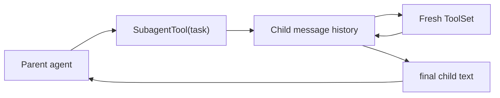

# Chapter 13: Subagents

Complex tasks are hard. Even strong models struggle when one prompt asks them
to research a codebase, design a change, write code, and verify the result all
inside one giant conversation. The context window fills up, the model loses
focus, and quality drops.

**Subagents** solve that by decomposition. The parent agent delegates a focused
subtask to a child agent. The child has its own message history and tools, runs
to completion, and returns a short summary.

This chapter explains the Python implementation of that pattern.

## What you will build

1. a `SubagentTool`
2. a tool-factory callback for fresh child toolsets
3. a child agent loop with a turn limit
4. a clean parent/child separation model

## Why subagents?

Consider this scenario:

```text
User: "Add better error handling across all API endpoints"

Without subagents:
  -> one conversation reads many files
  -> the context grows large
  -> the model loses track of earlier findings

With subagents:
  -> parent spawns a child for users.py
  -> child reads, edits, verifies, returns a summary
  -> parent spawns another child for posts.py
  -> parent coordinates only the summaries
```

The key insight is that a subagent is just another tool:

```python
SubagentTool(provider, lambda: ToolSet().with_tool(ReadTool()))
```

The parent does not need a special execution path. It just calls a tool and
receives a string result.

That simplicity is important. The Python version does **not** need background
workers, queues, or a second orchestration framework for this chapter. The
child runs inline inside the tool call.

## Parent/child flow



## Provider sharing

Unlike the Rust version, the Python provider does not need a special `Arc`
wrapper or blanket implementation. Python objects are already reference types,
so the parent and child can share the same provider instance directly.

That means the Python version is simpler here:

- the parent creates one provider
- the same provider object is passed into `SubagentTool`
- each child uses it for its own turn loop

## Why a tool factory?

Each child needs a fresh toolset. The simplest way to ensure that is a callback:

```python
lambda: ToolSet().with_tool(ReadTool()).with_tool(WriteTool())
```

That avoids problems with shared mutable tool state and makes each child spawn
independent.

It also gives you one important safety control: the child only gets the tools
you put in that factory.

In real products, subagents often have a narrower tool set than the parent. For
example, Deer Flow explicitly prevents subagents from recursively spawning more
subagents. In this tutorial project, the simplest equivalent is:

- only include the tools the child actually needs
- do **not** put `SubagentTool` back into the child's `ToolSet` unless you
  really want nested delegation

## `SubagentTool`

The Python implementation stores:

- the shared provider
- a `tools_factory` callback
- a child system prompt
- a `max_turns` limit
- a normal `ToolDefinition`

The tool schema exposes a single required argument:

- `task`

That task string is the entire child brief.

## A good child brief

The biggest practical lesson from production systems is that subagents only
work well when the parent gives them a clear task.

Bad delegated task:

```text
Look into this.
```

Better delegated task:

```text
Review auth.py for error-handling gaps. Read the file, identify missing checks,
and return a concise summary with the exact functions that need changes.
```

A good subagent task usually includes:

1. the goal
2. the scope
3. any important constraints
4. the expected output

That is why the Python tool schema describes `task` as a full delegated brief,
not just a label.

One important clarification:

the user should not need to say "use a subagent".

In stronger harnesses, the parent decides that for itself.

That means the parent should proactively choose delegation when it sees a
bounded multi-step task or a large context-heavy branch that would be cleaner
to isolate.

## Default child behavior

The Python reference now gives subagents a default system prompt. It tells the
child agent to:

- stay scoped to the delegated task
- use the available tools autonomously
- avoid asking the user for clarification
- return a concise result for the parent

That matches real product behavior more closely. In a production tool like Deer
Flow, subagents are expected to work from the delegated brief and return a
clean summary instead of restarting the whole parent conversation.

You can still override that prompt with:

```python
SubagentTool(provider, tools_factory).system_prompt("You are a security auditor.")
```

## The child loop

Inside `call()`, the subagent:

1. creates a fresh toolset
2. builds a fresh message history
3. inserts the child system prompt
4. appends the task as a user message
5. runs the same provider/tool loop as `SimpleAgent`

The main differences from the parent loop are:

- no terminal printing
- local child-only history
- a hard maximum number of turns
- tool failures become child-visible error strings
- provider failures still propagate as real exceptions

That last distinction matters:

- if the child calls an unknown tool, the child can still recover and answer
- if the provider itself fails, the parent should know the infrastructure broke

## Why a turn limit?

Without a turn limit, a confused child could loop forever. The Python version
defaults to a fixed `max_turns` value and returns an error string when it is
exceeded.

That makes the failure visible to the parent model without crashing the whole
agent.

The builder also rejects invalid values like `max_turns(0)` early.

## When to use subagents

Borrowing the production mindset from Deer Flow, subagents are most useful
when the task is:

- multi-step
- self-contained
- likely to create lots of local context
- independent enough that the parent only needs the summary
- large enough that isolating one whole branch is better than keeping it in the
  parent thread

Good uses:

- "Review `auth.py` for security issues and summarize the findings."
- "Read both migration files and explain the schema change."
- "Write the fixture file, then report where you saved it."

Bad uses:

- "Read one file."
- "Ask the user which option they want."
- "Do this tiny edit."

If the parent can do the work directly in one or two steps, a subagent usually
just adds overhead.

DeepAgents and DeerFlow both push this further than the Chapter 13 primitive:

- the parent should use subagents proactively, not only on explicit request
- subagents are useful for context isolation, not only parallelism
- even one subagent can be the right choice for a single large branch of work

That stronger orchestration model becomes the focus in Chapter 22.

## What the parent sees

The parent never sees the child's internal conversation. It only sees the final
string returned by the subagent tool.

That is the whole point:

- the child handles the messy details
- the parent keeps a smaller, cleaner context

The reference tests now verify this explicitly by checking that the parent's
history contains only:

1. the parent user message
2. the parent assistant message with the `subagent` tool call
3. the tool result from the child
4. the parent's final assistant answer

The child's internal turns never leak into that history.

## One real example prompt

If you want to see subagents in action manually, this is a good prompt to try
once the parent agent is wired with `SubagentTool` plus `ReadTool` and
`WriteTool`:

```text
Use a subagent to inspect pyproject.toml, summarize the package metadata, and
tell me which version is currently configured.
```

Why this works well:

- the child has a clear scope
- the task is self-contained
- the parent only needs the summary
- the child can use `read` without polluting the parent's history with file
  contents

## Running the tests

The reference project includes subagent tests:

```bash
cd mini-claw-code-py
PYTHONPATH=src uv run python -m pytest tests/test_ch13.py
```

These cover:

- child responses with no tool calls
- child tool usage
- multi-turn child behavior
- max-turn failures
- missing task errors
- provider error propagation
- unknown child tools
- custom system prompts
- parent continuation after child completion
- child-history isolation from the parent

## Recap

Subagents let the parent agent delegate focused work without polluting its own
context window.

The Python version stays tutorial-friendly:

- one inline child loop
- one delegated task string
- one fresh child toolset
- one final summary returned to the parent

But it also now reflects the better real-world pattern:

- children get a scoped default prompt
- parent and child histories stay isolated
- subagents are for focused multi-step work, not trivial tool wrappers
