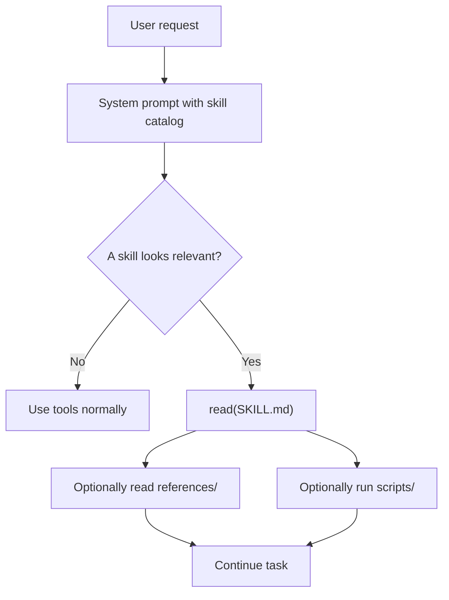
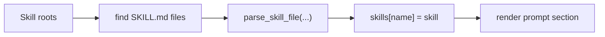

# Chapter 14: Skills

Tools give your agent raw abilities. A `read` tool can open files. A `bash`
tool can run commands. An `edit` tool can patch code.

That is necessary, but it is not enough.

When the model faces a recurring task like "package a Python release", "review a
bugfix", or "prepare a changelog", it still has to rediscover the workflow from
scratch. That makes the agent slower, less consistent, and harder to steer.

**Skills** solve that problem. A skill is a small directory with a `SKILL.md`
file that teaches the agent one reusable workflow.

In this chapter, you will add a minimal skills system to the Python port.

## What you will build

1. a `Skill` dataclass
2. a parser for `SKILL.md` frontmatter
3. a `SkillRegistry` that discovers skills from disk
4. a prompt section that tells the model which skills exist
5. a sample `python-packaging` skill

## Mental model

The key idea is **progressive disclosure**:

- the agent always sees a short catalog of skill names and descriptions
- the agent only reads a skill's full `SKILL.md` when it becomes relevant
- the agent only reads `references/` files or runs `scripts/` when needed



This keeps the default prompt small while still letting the agent load richer
instructions on demand.

## What a skill looks like

Each skill is just a directory:

```text
.agents/skills/python-packaging/
├── SKILL.md
└── references/
    └── release-checklist.md
```

The `SKILL.md` file starts with YAML frontmatter:

```markdown
---
name: python-packaging
description: Help with Python packaging, release prep, version bumps, and publishing workflows.
compatibility: Requires uv and pyproject.toml
---

# Python Packaging

Use this skill when the user asks about packaging, releasing, or publishing a
Python project.
```

The tutorial code understands these frontmatter fields directly:

- `name`
- `description`
- `compatibility`
- `metadata`

For the first version, only `name` and `description` are required.

The parser is intentionally tolerant of additional frontmatter keys such as
`license`, `author`, or `version`. That keeps the tutorial implementation
compatible with real-world skills instead of crashing on metadata it does not
need yet.

## Why not load every skill at startup?

Because the context window is limited.

If you have ten skills and each one is a long markdown file, injecting all of
them into every request wastes tokens and hurts reliability.

So the agent should only receive:

- the skill name
- the short description
- the path to the `SKILL.md` file

That is enough for the model to decide whether it should open the skill.

## `Skill`

The Python implementation starts with a simple dataclass:

```python
@dataclass(slots=True)
class Skill:
    name: str
    description: str
    path: Path
    instructions: str
    compatibility: object | None = None
    metadata: dict[str, object] | None = None
```

The important design choice is that `path` points to the actual `SKILL.md`
file, not just the directory. That makes the prompt section easy to generate,
because the model can call the existing `read` tool directly on that path.

## Parsing `SKILL.md`

The parser does three small jobs:

1. split the YAML frontmatter from the markdown body
2. validate the required fields
3. return a `Skill`

Unlike the earlier chapters, this is a good place to use a small dependency:
`yaml.safe_load()` from `PyYAML`.

Why?

- skills already use YAML by convention
- a real YAML parser is less fragile than hand-written string splitting
- the code stays short and easy to explain

The parser should fail fast on malformed skills. That way a broken `SKILL.md`
is obvious during development instead of silently being ignored.

## `SkillRegistry`

Next, we need discovery.

The registry is responsible for:

- scanning skill roots for `SKILL.md`
- parsing each skill
- handling override order
- rendering the prompt catalog

For this tutorial, the default search order is:

1. `~/.agents/skills/`
2. every `.agents/skills/` directory from the filesystem root down to the
   current working directory

That means:

- user-wide skills are available everywhere
- project-local skills override user-wide skills with the same name
- a deeper project directory overrides a higher-level one

This gives us predictable behavior without introducing a larger configuration
system yet.

## Registry flow



The override rule is simple: later roots win. That is why the discovery order
matters.

## Rendering the prompt section

Once we have a registry, we can expose it to the model through the system
prompt.

The prompt section should teach the model a small workflow:

1. if a task matches a skill description, immediately read the skill file
2. understand the workflow before acting
3. load extra files only when needed
4. follow the skill instructions closely

That section might look like this:

```text
<skill_system>
You have access to reusable skills stored in local SKILL.md files.
Each skill contains an optimized workflow, best practices, and optional references.

Progressive loading pattern:
1. When a task clearly matches a skill, immediately use the `read` tool on that skill's SKILL.md file.
2. Read and understand the workflow before acting.
3. Load `references/` files only when the skill points you to them or you need more detail.
4. Run `scripts/` only when they help you follow the skill reliably.
5. Follow the skill instructions closely once you have loaded them.

<available_skills>
    <skill>
        <name>python-packaging</name>
        <description>Help with Python packaging and release workflows.</description>
        <location>/abs/path/.agents/skills/python-packaging/SKILL.md</location>
    </skill>
</available_skills>
</skill_system>
```

This is intentionally simple, but it is also more explicit than a plain bullet
list. The structured tags make it easier for the model to separate the policy
instructions from the actual skill catalog.

We are still not adding hidden middleware or a special `activate_skill` tool.
The model already knows how to read files, so we reuse the tools it already
has.

## Composing the system prompt

The base system prompt still comes from `prompts/prompt.md`.

We then:

1. replace `{{cwd}}`
2. append the rendered skills section if it is not empty

That gives the CLI a clean default behavior:

- no skills directory -> normal prompt
- one or more skills -> prompt plus catalog

## Example skill

The reference implementation includes a sample skill:

```text
mini-claw-code-py/.agents/skills/python-packaging/
├── SKILL.md
└── references/
    └── release-checklist.md
```

This is a good teaching example because it is:

- concrete
- useful for a coding agent
- small enough to understand quickly

The `SKILL.md` file contains the workflow, while
`references/release-checklist.md` stores the detailed checklist.

That keeps the core skill short.

## Writing good skills

The runtime support is only half of the story. A weak skill is usually worse
than no skill at all: it loads extra context but does not actually teach the
agent anything useful.

The official Agent Skills guidance suggests a few habits that are especially
worth following in a tutorial project.

### Start from real expertise

Do not ask the model to invent a skill from generic background knowledge alone.

The best skills come from:

- a real task you already completed with an agent
- corrections you had to make during that task
- runbooks, style guides, incident notes, schemas, or project-specific docs
- recurring failure cases and the fixes that resolved them

In practice, that means a `python-packaging` skill should be based on your
team's actual release steps, not on a vague idea of "Python best practices."

### Add what the agent lacks

Once a skill activates, its full `SKILL.md` body competes for attention with:

- the system prompt
- the conversation history
- any other active skill

So keep the skill focused on what the model would otherwise get wrong:

- project conventions
- specific tools to prefer
- known edge cases
- required output formats

Do not waste space explaining general concepts the model already knows.

Bad:

```markdown
PDF files are a common document format. To extract text from them, use a Python library.
```

Better:

```markdown
Use pdfplumber for text extraction. For scanned documents, fall back to OCR.
```

Ask yourself:

> Would the agent get this wrong without this instruction?

If the answer is no, cut it.

### Design coherent units

A skill should cover one coherent unit of work.

Good scope:

- "package and release this Python project"
- "review a pull request for security issues"

Bad scope:

- "all Python development"
- "databases, queries, and production administration"

If a skill is too small, the agent has to load many skills at once. If it is too
large, it becomes hard to trigger precisely.

### Aim for moderate detail

Short, stepwise guidance usually works better than exhaustive documentation.

If you try to document every edge case inline, the agent may spend time on
instructions that do not apply to the current task. Keep `SKILL.md` focused on
the core workflow, and move deeper detail into `references/`.

### Use progressive disclosure on purpose

The official guidance recommends keeping `SKILL.md` compact and moving large or
conditional detail into separate files.

The important part is not just moving content out. It is telling the agent
**when** to read it.

Good:

```markdown
If `uv build` fails because of missing metadata, read `references/build-errors.md`.
```

Weak:

```markdown
See `references/` for more details.
```

The first version gives the model a trigger. The second just adds ambiguity.

### Provide defaults, not menus

When multiple tools could work, choose one default and mention alternatives only
as an escape hatch.

Bad:

```markdown
You can use setuptools, hatchling, poetry-core, flit, or something else.
```

Better:

```markdown
Read `pyproject.toml` first. If the project already uses `uv`, prefer `uv build`.
Only switch tools if the repository clearly uses a different packaging backend.
```

This reduces dithering and makes execution traces more efficient.

### Favor procedures over declarations

A skill should teach a reusable method, not hard-code one exact answer.

Bad:

```markdown
Set the version to 1.4.2 and publish to PyPI.
```

Better:

```markdown
1. Read `pyproject.toml` to find the current version.
2. Confirm the target version with the user if it is not explicit.
3. Build the package.
4. Validate the generated artifacts before publishing.
```

The second version still guides the agent strongly, but it generalizes across
many releases.

### Add gotchas

Some of the highest-value content in a skill is a short list of corrections to
wrong assumptions the agent is likely to make.

Example gotchas:

- "This repository uses `src/` layout."
- "The published package name differs from the import name."
- "The release checklist must be updated before building artifacts."

Keep important gotchas in `SKILL.md` itself. If a fact is too surprising or too
easy to miss, you should not hide it in a reference file.

### Use templates, checklists, and validation loops

Three patterns are especially useful in practical skills:

- templates: when the output must match a known structure
- checklists: when the workflow has several dependent steps
- validation loops: when the agent should verify its own work before proceeding

For example, a release-oriented skill might say:

```markdown
## Release workflow
1. Read `pyproject.toml`
2. Update version and release notes
3. Run `uv build`
4. Inspect the output artifacts
5. Only publish after the user confirms the registry
```

And if you have a reusable validator, make the loop explicit:

```markdown
1. Make the changes
2. Run `uv build`
3. If the build fails, fix the issue and run it again
4. Only continue once the build succeeds
```

For risky or multi-step operations, a plan-validate-execute pattern is even
better:

1. build an intermediate plan or config
2. validate it against a source of truth
3. execute only after validation passes

### Refine with real execution

The first version of a skill is usually not the final version.

Run it on real tasks and inspect the execution trace, not just the final output.
If the agent:

- wanders through too many options
- ignores an important project convention
- loads references it did not need
- misfires on unrelated prompts

then the skill still needs editing.

A good refinement loop is:

1. run the skill on real prompts
2. inspect what it actually did
3. cut vague or distracting instructions
4. add the missing correction or gotcha
5. run it again

This is one reason skills pair well with the rest of this tutorial project: you
can test them in normal CLI and TUI runs instead of treating them as a separate
system.

## Wiring the CLI

The simple chat example is the first place we use skills.

At startup, it:

1. discovers default skills
2. renders the skill catalog
3. appends that section to the system prompt

After that, nothing else changes. The model sees the catalog and decides when
to open a skill with the existing `read` tool.

That is a strong design for a teaching project:

- the agent loop stays unchanged
- the provider stays unchanged
- the new concept stays visible

## Testing the feature

The reference tests should cover four cases:

1. parsing a valid `SKILL.md`
2. rejecting invalid frontmatter
3. project-local override of a user skill with the same name
4. rendering the prompt section with a real path

These tests are small, deterministic, and do not require a live model.

Run them with:

```bash
cd mini-claw-code-py
PYTHONPATH=src uv run python -m pytest tests/test_ch14.py
```

## Recap

Skills add reusable know-how on top of tools.

The Python version keeps that system deliberately small:

- skills are plain directories
- `SKILL.md` is the entry point
- the registry discovers skills from disk
- the system prompt advertises only metadata
- the model loads the full skill with the normal `read` tool

That gives the agent a clean extension point without hiding the mechanism.
