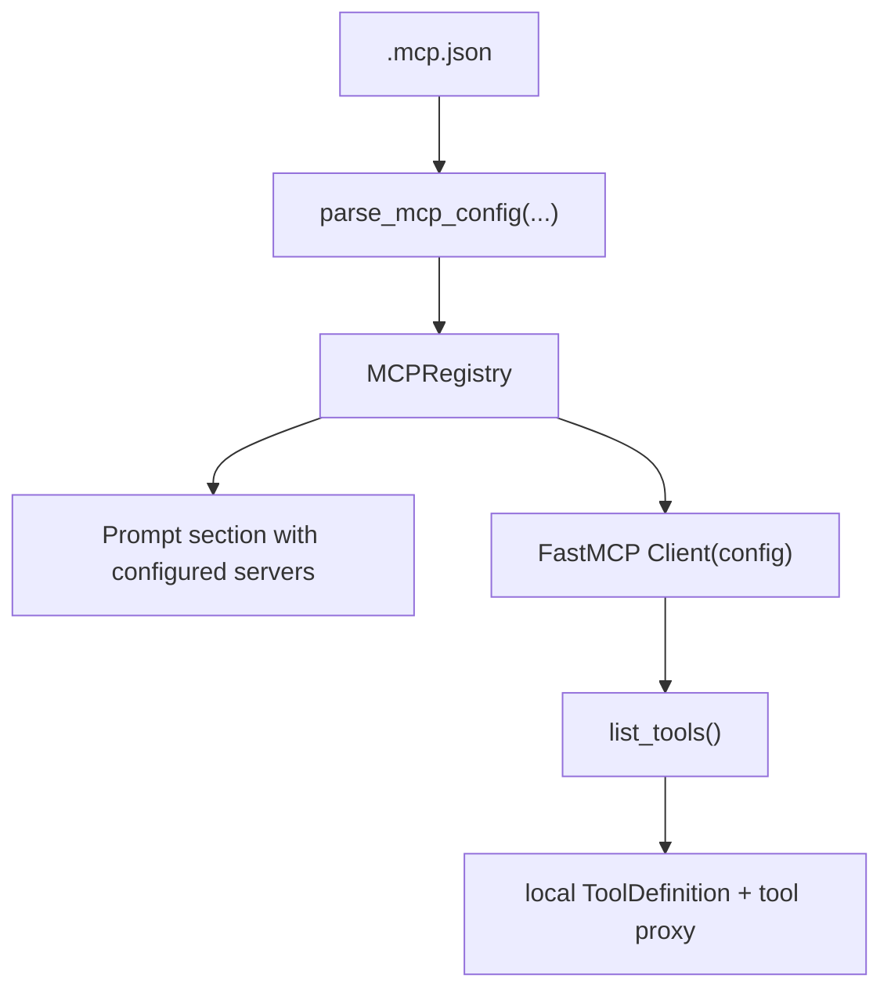
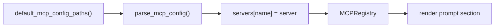

# Chapter 15: MCP

Tools and skills make the agent more capable inside the local repository.

But real coding work often needs systems outside the repo:

- a database
- an API
- GitHub
- a ticket system
- internal company services

You do not want to hard-code every one of those integrations directly into the
agent runtime.

That is exactly the problem **MCP** solves.

MCP stands for **Model Context Protocol**. It gives the agent a standard way to
describe and connect external tool servers.

In this chapter, you will add a real MCP layer to the Python port.

This version is still intentionally disciplined.

It does **not** try to implement the MCP protocol from scratch.

Instead, it combines:

- loading `.mcp.json` files
- parsing MCP server definitions
- expanding environment variables
- merging user and project config
- rendering a prompt section that tells the model which MCP servers are
  configured
- connecting to configured MCP servers with `FastMCP`
- listing remote tools and exposing them as normal agent tools

That matches the progression of the earlier chapters:

- first make the runtime understand the config and capability boundary
- then use a proven MCP client to turn that configuration into real tools

## What you will build

1. an `MCPServer` dataclass
2. a parser for `.mcp.json`
3. environment-variable expansion for MCP config values
4. an `MCPRegistry` that merges user and project configs
5. a prompt section that catalogs configured MCP servers
6. a FastMCP-backed adapter that loads MCP tools into the runtime

## Why use FastMCP here?

Because this project is teaching agent architecture, not reimplementing the MCP
wire protocol.

`FastMCP` already gives you a real Python client that can:

- connect from local process config
- connect from HTTP config
- list available tools
- call those tools with structured arguments

That makes it a strong fit for this chapter.

You still keep your own project-specific pieces:

- `.mcp.json` discovery
- environment-variable expansion
- user/project override rules
- prompt composition
- integration into `PlanAgent`

So the split is:

- your code owns local runtime design
- FastMCP owns MCP transport mechanics

That is the right boundary.

## Why still start with config?

Because the config layer is the stable foundation.

Before the runtime can call an MCP server, it needs to know:

- which servers exist
- whether they use `stdio`, `http`, or `sse`
- where the config came from
- which values come from environment variables
- which project config should override user config

That is already real functionality.

It also keeps this chapter aligned with the rest of the Python project:

- plain Python
- small dataclasses
- explicit parsing
- no hidden framework

Then FastMCP can use that registry to attach real MCP tools to the harness.

## Mental model

The key idea is **progressive wiring**:

- the runtime first discovers MCP servers from config
- the prompt gets a small catalog of those external integrations
- the runtime then hands the merged config to FastMCP
- FastMCP lists the remote tools
- the agent exposes those remote tools through the same local tool interface



That is enough to make MCP configuration explicit, executable, and easy to
test.

## What `.mcp.json` looks like

Claude Code popularized a clean JSON format for MCP server configuration:

```json
{
  "mcpServers": {
    "database-tools": {
      "command": "/path/to/db-server",
      "args": ["--config", "/path/to/config.json"],
      "env": {
        "DB_URL": "${DB_URL}"
      }
    },
    "api-server": {
      "type": "http",
      "url": "${API_BASE_URL:-https://api.example.com}/mcp",
      "headers": {
        "Authorization": "Bearer ${API_KEY}"
      }
    }
  }
}
```

The important parts are:

- top-level `mcpServers`
- one object per server
- `stdio`-style local process servers
- `http`-style remote servers
- optional environment-variable expansion

For the first Python version, that is the right compatibility target.

## The two main transports

### `stdio`

This means the MCP server runs as a local process.

Typical fields:

- `command`
- `args`
- `env`

Example:

```json
{
  "command": "npx",
  "args": ["-y", "@modelcontextprotocol/server-filesystem", "."],
  "env": {}
}
```

### `http`

This means the MCP server is remote.

Typical fields:

- `url`
- `headers`

Example:

```json
{
  "type": "http",
  "url": "https://api.example.com/mcp",
  "headers": {
    "Authorization": "Bearer token"
  }
}
```

The reference implementation also accepts `sse` so the config layer can stay
compatible with older MCP setups, even though newer guidance usually prefers
HTTP.

## `MCPServer`

The Python runtime starts with a small dataclass:

```python
@dataclass(slots=True)
class MCPServer:
    name: str
    config_path: Path
    transport: str
    command: str | None = None
    args: list[str] = field(default_factory=list)
    env: dict[str, str] = field(default_factory=dict)
    url: str | None = None
    headers: dict[str, str] | None = None
    oauth: dict[str, object] | None = None
    headers_helper: str | None = None
    metadata: dict[str, object] | None = None
```

This is intentionally pragmatic.

It keeps the fields that matter for discovery and later transport hookup, while
also leaving room for evolving config such as OAuth metadata or helper
commands.

The dataclass also has a `to_config()` helper so the registry can rebuild a
canonical MCP config dictionary for FastMCP.

## Parsing `.mcp.json`

Unlike skills, MCP config is not one file per integration.

One `.mcp.json` file can define many servers.

So the parser should:

1. load JSON
2. read `mcpServers`
3. validate each server object
4. return one `MCPServer` per entry

The parser should also normalize one important detail:

- if `type` is omitted but `command` exists, treat it as `stdio`

That matches common config examples and keeps the local process case concise.

## Environment-variable expansion

This is the most important feature in the chapter.

Real MCP configs often contain placeholders like:

```text
${API_KEY}
${API_BASE_URL:-https://api.example.com}
```

The runtime should expand those before storing the server definition.

The first Python version supports:

- `${NAME}` for required values
- `${NAME:-default}` for values with defaults

If a required variable is missing and has no default, parsing should fail fast.

That is better than silently storing half-valid config.

## Why environment expansion belongs in the parser

Because this is config semantics, not UI behavior.

If expansion is scattered across CLI code, test code, and future runtime code,
the behavior will drift.

Putting it in the parser gives you:

- one rule
- one error path
- one place to test

That is much cleaner.

## `MCPRegistry`

After parsing one config file, the next question is discovery.

The registry is responsible for:

- finding default config paths
- parsing them
- merging servers by name
- rendering the prompt catalog

This chapter keeps the discovery model simple:

1. user config: `~/.mcp.json`
2. project config: nearest `.mcp.json` from the working directory upward

If both define the same server name, the project config wins.

That gives you the same useful rule you already used in the skills chapter:

- global defaults are easy
- project-local overrides are easy

## Discovery flow



Later paths win. That is the override rule.

## Rendering the prompt section

Just like the skills chapter, the model should not receive a giant wall of raw
JSON.

It only needs a small catalog.

The prompt section should teach the model:

1. these MCP servers are configured
2. they represent external capability the runtime may expose
3. do not invent MCP tools that are not actually available
4. read the source config if exact details are needed

That might look like this:

```text
<mcp_system>
You may be running with MCP servers configured in local `.mcp.json` files.
Use this catalog to understand what external integrations exist.

Guidelines:
1. Prefer configured MCP integrations when the active runtime exposes their tools.
2. If exact connection details matter, read the source `.mcp.json` file.
3. Do not invent MCP tools that are not present in the active tool list.

<configured_mcp_servers>
    <server>
        <name>api-server</name>
        <transport>http</transport>
        <source>/abs/path/.mcp.json</source>
        <summary>HTTP MCP server at https://api.example.com/mcp</summary>
    </server>
</configured_mcp_servers>
</mcp_system>
```

This is an important design choice.

The prompt section does **not** claim the Python runtime has already connected
the server and exposed its tools.

It only catalogs configured integrations honestly.

That keeps the chapter accurate while still making MCP visible inside the
runtime.

## Connecting with FastMCP

Once the runtime has a merged `MCPRegistry`, the next step is to connect.

FastMCP supports exactly the input shape you already have:

- a single server
- a full `{"mcpServers": ...}` config dictionary

That means the integration can stay very small:

```python
client = Client(registry.to_config())
tools = await client.list_tools()
```

This is one of the nicest parts of the chapter.

You do **not** need a custom transport switch statement for:

- stdio
- http
- sse

FastMCP handles that based on the config.

## Turning MCP tools into local agent tools

The rest of the runtime still expects local `ToolDefinition` objects and local
`tool.call(...)` methods.

So the Python port adds a thin adapter:

1. call `client.list_tools()`
2. convert each remote MCP tool schema into `ToolDefinition`
3. wrap each tool in a proxy whose `call()` method forwards to
   `client.call_tool(...)`

That means the rest of the agent loop does not need to know whether a tool is:

- built in
- a subagent
- backed by MCP

That continuity is important.

MCP becomes another tool source, not a second execution system.

## `MCPToolAdapter`

The adapter opens one FastMCP client session for the whole agent run.

That session:

- connects on entry
- lists tools once
- keeps the connection open while the agent is running
- closes cleanly when the run finishes

That is much better than reconnecting for every single tool call.

The proxy tool then turns MCP results back into strings for the current agent
loop.

For this tutorial implementation, that means:

- plain strings stay plain strings
- structured JSON results are serialized
- text content blocks are joined into a readable result

That is enough for a working coding agent.

## Integrating MCP into `PlanAgent`

The nicest continuation from Chapter 14 is a builder method:

```python
agent.enable_default_mcp()
```

That method should:

1. discover default MCP config paths
2. render the prompt section
3. store the merged `MCPRegistry`
4. append the prompt section to the plan and execution prompts

This keeps the API parallel with:

```python
agent.enable_default_skills()
```

That symmetry matters.

It makes the runtime easier to teach:

- skills are reusable local workflows
- MCP is reusable external integration config

During execution, `PlanAgent` now:

1. builds a temporary runtime `ToolSet`
2. opens the `MCPToolAdapter` if MCP is enabled
3. pushes the discovered MCP tool proxies into that runtime tool set
4. runs the normal plan/execute loop

That means Chapter 15 now produces a real outcome:

- if `.mcp.json` points at a working server
- and the model chooses one of its tools
- the agent can actually call it

## Example file for the tutorial project

The reference project includes a sample `.mcp.json`.

That sample should demonstrate:

- one `stdio` server
- one `http` server
- at least one environment-variable placeholder with a default

That gives the tests a real config file to parse and gives readers a concrete
template to copy.

## What this chapter still does **not** build yet

This is important to state clearly.

This chapter now **does** implement real MCP tool execution through FastMCP.

But it still does **not** yet implement:

- direct use of MCP resources
- direct use of MCP prompts
- custom tool filtering or transforms
- persistent multi-run MCP sessions
- approval policy around external MCP tools
- a fully generic harness-level MCP manager

Those are valid next steps, but they are a different layer of work.

This chapter intentionally stops at:

- config discovery
- config normalization
- prompt composition
- real MCP tool exposure through FastMCP

That is still useful, still testable, and still a real step toward a harness
agent.

## Tests to write

The reference tests should cover:

1. parsing a real sample `.mcp.json`
2. defaulting missing `type` to `stdio`
3. expanding `${NAME}` and `${NAME:-default}`
4. rejecting missing required environment variables
5. project config overriding user config
6. rendering a prompt section with server name, transport, source, and summary
7. actually calling a FastMCP-backed tool from `PlanAgent`

That gives you a clean chapter boundary:

- the chapter is about configuration and discovery
- the tests verify configuration and discovery

## Recap

MCP is bigger than one transport client.

But after this chapter, the Python port now has a real end-to-end path:

- discover `.mcp.json`
- normalize it
- merge user and project config
- render MCP awareness into the prompt
- connect with FastMCP
- expose remote tools as normal agent tools

That is what this chapter adds:

- `.mcp.json` parsing
- environment-variable expansion
- user/project merge rules
- prompt-level MCP cataloging
- FastMCP-backed MCP tool execution

This keeps the Python tutorial honest and incremental.

You are not implementing the whole MCP universe at once.

You are implementing the useful path first.

## What’s next

With MCP config discovery in place, the next chapter can focus on **safety**.

That is a good ordering because external integrations make safety more
important, not less.
