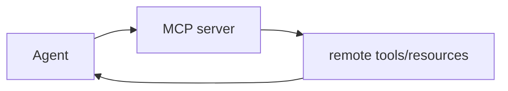

# Chapter 15: MCP: Model Context Protocol (coming soon)

The Python port has not implemented MCP yet.

## Mental model

The next logical step is to expose the Python tools through an MCP server or
connect the agent to external MCP services.

Likely design topics for a future chapter:

- mapping `ToolDefinition` to MCP tool schemas
- adapting async Python tools to an MCP transport
- attaching remote resources as agent context
