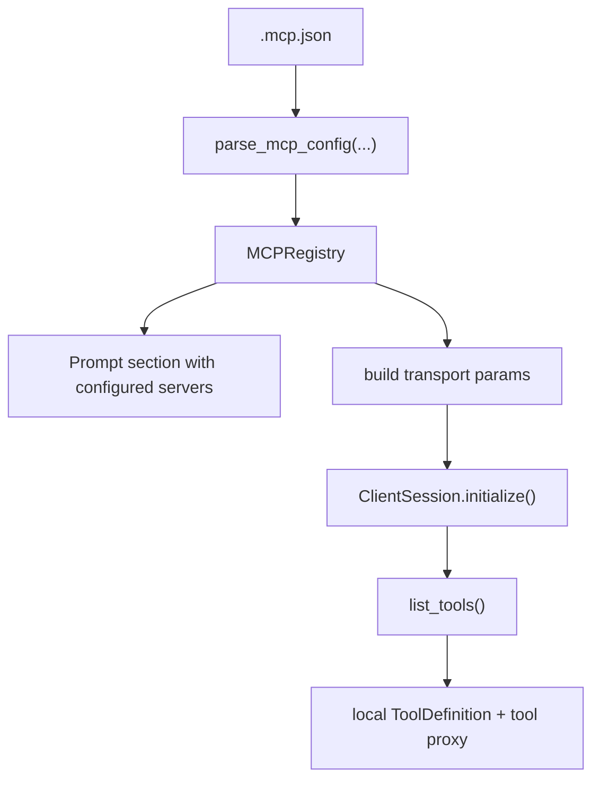
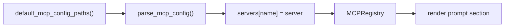

# Chapter 15: MCP

Tools and skills make the agent more capable inside the local repository.

But real coding work often needs systems outside the repo:

- a database
- an API
- GitHub
- a ticket system
- internal company services

You do not want to hard-code every one of those integrations directly into the
agent runtime.

That is exactly the problem **MCP** solves.

MCP stands for **Model Context Protocol**. It gives the agent a standard way to
describe and connect external tool servers.

In this chapter, you will add a real MCP layer to the Python port.

This version is still intentionally disciplined.

It does **not** try to implement the MCP protocol from scratch.

Instead, it combines:

- loading `.mcp.json` files
- parsing MCP server definitions
- expanding environment variables
- merging user and project config
- rendering a prompt section that tells the model which MCP servers are
  configured
- building transport parameters from config
- connecting to configured MCP servers with the official Python `mcp` client
- listing remote tools and exposing them as normal agent tools

That matches the progression of the earlier chapters:

- first make the runtime understand the config and capability boundary
- then use a small MCP client adapter to turn that configuration into real
  tools

## What you will build

1. an `MCPServer` dataclass
2. a parser for `.mcp.json`
3. environment-variable expansion for MCP config values
4. an `MCPRegistry` that merges user and project configs
5. a prompt section that catalogs configured MCP servers
6. a transport builder that maps config to stdio/http/sse clients
7. an `mcp` SDK-backed adapter that loads MCP tools into the runtime

## Why use the `mcp` SDK here?

Because this project is teaching agent architecture, not reimplementing the MCP
wire protocol.

The official Python `mcp` package already gives you the core client pieces you
need:

- `stdio_client(...)`
- `streamable_http_client(...)`
- `sse_client(...)`
- `ClientSession.initialize()`
- `ClientSession.list_tools()`
- `ClientSession.call_tool(...)`

That is a better fit for this chapter than `FastMCP`.

You keep the transport layer small, explicit, and close to the protocol client
you actually depend on.

You still keep your own project-specific pieces:

- `.mcp.json` discovery
- environment-variable expansion
- user/project override rules
- prompt composition
- integration into `PlanAgent`

So the split is:

- your code owns local runtime design
- the `mcp` SDK owns MCP transport mechanics

That is the right boundary.

## Design lesson from Deerflow

The Deerflow harness uses a useful split:

- one layer normalizes server config into transport parameters
- another layer opens client connections and loads tools

That is the pattern worth copying here.

The exact dependency can differ, but the architecture should stay the same.

This chapter follows that lesson:

- `MCPServer` and `MCPRegistry` own discovery and merge rules
- a transport builder turns one `MCPServer` into stdio/http/sse client params
- `MCPToolAdapter` owns connection lifecycle and tool loading

That keeps the runtime easier to teach and easier to replace later.

## Why still start with config?

Because the config layer is the stable foundation.

Before the runtime can call an MCP server, it needs to know:

- which servers exist
- whether they use `stdio`, `http`, or `sse`
- where the config came from
- which values come from environment variables
- which project config should override user config

That is already real functionality.

It also keeps this chapter aligned with the rest of the Python project:

- plain Python
- small dataclasses
- explicit parsing
- no hidden framework

Then the adapter can use that registry to attach real MCP tools to the
harness.

## Mental model

The key idea is **progressive wiring**:

- the runtime first discovers MCP servers from config
- the prompt gets a small catalog of those external integrations
- the runtime maps each server to a transport client
- `ClientSession` initializes the connection
- the session lists the remote tools
- the agent exposes those remote tools through the same local tool interface



That is enough to make MCP configuration explicit, executable, and easy to
test.

## How MCP works

At a high level, MCP separates three concerns:

1. the host runtime
2. the MCP client
3. the MCP server

In this project:

- `mini-claw-code-py` is the host runtime
- the Python `mcp` SDK is the client layer
- the external integration is the server

The host does not call the external system directly.

Instead, the flow is:

1. connect to an MCP server
2. discover its capabilities
3. list tools
4. call a selected tool
5. turn the result back into normal agent output

That is why MCP is such a strong fit for agent systems.

It standardizes how outside capability enters the runtime.

## What `.mcp.json` looks like

Claude Code popularized a clean JSON format for MCP server configuration:

```json
{
  "mcpServers": {
    "database-tools": {
      "command": "/path/to/db-server",
      "args": ["--config", "/path/to/config.json"],
      "env": {
        "DB_URL": "${DB_URL}"
      }
    },
    "api-server": {
      "type": "http",
      "url": "${API_BASE_URL:-https://api.example.com}/mcp",
      "headers": {
        "Authorization": "Bearer ${API_KEY}"
      }
    }
  }
}
```

The important parts are:

- top-level `mcpServers`
- one object per server
- `stdio`-style local process servers
- `http`-style remote servers
- optional environment-variable expansion

For the first Python version, that is the right compatibility target.

## The two main transports

### `stdio`

This means the MCP server runs as a local process.

Typical fields:

- `command`
- `args`
- `env`

Example:

```json
{
  "command": "npx",
  "args": ["-y", "@modelcontextprotocol/server-filesystem", "."],
  "env": {}
}
```

### `http`

This means the MCP server is remote.

Typical fields:

- `url`
- `headers`

Example:

```json
{
  "type": "http",
  "url": "https://api.example.com/mcp",
  "headers": {
    "Authorization": "Bearer token"
  }
}
```

The reference implementation also accepts `sse` so the config layer can stay
compatible with older MCP setups, even though newer guidance usually prefers
HTTP.

The important design lesson is:

- transport belongs in config
- not in hard-coded runtime branches spread across the UI

## `MCPServer`

The Python runtime starts with a small dataclass:

```python
@dataclass(slots=True)
class MCPServer:
    name: str
    config_path: Path
    transport: str
    command: str | None = None
    args: list[str] = field(default_factory=list)
    env: dict[str, str] = field(default_factory=dict)
    url: str | None = None
    headers: dict[str, str] | None = None
    oauth: dict[str, object] | None = None
    headers_helper: str | None = None
    metadata: dict[str, object] | None = None
```

This is intentionally pragmatic.

It keeps the fields that matter for discovery and later transport hookup, while
also leaving room for evolving config such as OAuth metadata or helper
commands.

The dataclass also has a `to_config()` helper so the registry can rebuild a
canonical MCP config dictionary when the runtime needs to inspect or render the
merged configuration.

## Parsing `.mcp.json`

Unlike skills, MCP config is not one file per integration.

One `.mcp.json` file can define many servers.

So the parser should:

1. load JSON
2. read `mcpServers`
3. validate each server object
4. return one `MCPServer` per entry

The parser should also normalize one important detail:

- if `type` is omitted but `command` exists, treat it as `stdio`

That matches common config examples and keeps the local process case concise.

## Environment-variable expansion

This is the most important feature in the chapter.

Real MCP configs often contain placeholders like:

```text
${API_KEY}
${API_BASE_URL:-https://api.example.com}
```

The runtime should expand those before storing the server definition.

The first Python version supports:

- `${NAME}` for required values
- `${NAME:-default}` for values with defaults

If a required variable is missing and has no default, parsing should fail fast.

That is better than silently storing half-valid config.

## Why environment expansion belongs in the parser

Because this is config semantics, not UI behavior.

If expansion is scattered across CLI code, test code, and future runtime code,
the behavior will drift.

Putting it in the parser gives you:

- one rule
- one error path
- one place to test

That is much cleaner.

## `MCPRegistry`

After parsing one config file, the next question is discovery.

The registry is responsible for:

- finding default config paths
- parsing them
- merging servers by name
- rendering the prompt catalog

This chapter keeps the discovery model simple:

1. user config: `~/.mcp.json`
2. project config: nearest `.mcp.json` from the working directory upward

If both define the same server name, the project config wins.

That gives you the same useful rule you already used in the skills chapter:

- global defaults are easy
- project-local overrides are easy

## Discovery flow



Later paths win. That is the override rule.

## Rendering the prompt section

Just like the skills chapter, the model should not receive a giant wall of raw
JSON.

It only needs a small catalog.

The prompt section should teach the model:

1. these MCP servers are configured
2. they represent external capability the runtime may expose
3. do not invent MCP tools that are not actually available
4. read the source config if exact details are needed

That might look like this:

```text
<mcp_system>
You may be running with MCP servers configured in local `.mcp.json` files.
Use this catalog to understand what external integrations exist.

Guidelines:
1. Prefer configured MCP integrations when the active runtime exposes their tools.
2. If exact connection details matter, read the source `.mcp.json` file.
3. Do not invent MCP tools that are not present in the active tool list.

<configured_mcp_servers>
    <server>
        <name>api-server</name>
        <transport>http</transport>
        <source>/abs/path/.mcp.json</source>
        <summary>HTTP MCP server at https://api.example.com/mcp</summary>
    </server>
</configured_mcp_servers>
</mcp_system>
```

This is an important design choice.

The prompt section does **not** claim the Python runtime has already connected
the server and exposed its tools.

It only catalogs configured integrations honestly.

That keeps the chapter accurate while still making MCP visible inside the
runtime.

## Building transport params

Once the runtime has a merged `MCPRegistry`, the next step is to map each
server to the right transport client.

This is another place where Deerflow has the right lesson.

Do not spread transport branching across the agent loop.

Build one helper that turns an `MCPServer` into the parameters the transport
expects.

That means:

- `stdio` becomes `StdioServerParameters(...)`
- `http` becomes `streamable_http_client(...)`
- `sse` becomes `sse_client(...)`

The branch still exists, but it is isolated to one place.

That is a much healthier boundary than making the rest of the harness care
about transport details.

## Connecting with `ClientSession`

Once the adapter has a transport, the runtime can open a real MCP session:

```python
async with transport as (read_stream, write_stream, *_):
    session = ClientSession(read_stream, write_stream)
    async with session:
        await session.initialize()
        tools = await session.list_tools()
```

This is still small.

You are not reimplementing framing, capability negotiation, or request/response
machinery yourself.

You are just being more direct about the session lifecycle.

## Connection lifecycle

The MCP client docs emphasize that a connection has a lifecycle, not just a
single function call.

For a coding agent, the healthy lifecycle is:

1. discover config
2. open one client session
3. initialize once
4. list tools once
5. keep the session open while the run is active
6. call tools through that live session
7. close the session cleanly when the run ends

That is exactly why the runtime uses `async with MCPToolAdapter(...)`.

It avoids a weaker design such as:

- reconnecting for every tool call
- relisting tools repeatedly
- letting UI code own connection state

The connection lifecycle should belong to the runtime layer.

## Operations

The `mcp` client exposes the standard MCP client operations.

The most important ones are:

- `list_tools()`
- `call_tool(...)`
- `list_resources()`
- `read_resource(...)`
- `list_prompts()`
- `get_prompt(...)`
- `ping()`

This chapter intentionally implements the tool path first.

That means the current runtime actively uses:

- `list_tools()` to discover remote capabilities
- `call_tool(...)` to execute them

The other operations still matter because they show where the harness can grow
next:

- resources can provide external context
- prompts can provide server-authored workflows
- ping can support health checks

So the chapter should teach the whole MCP shape even though the current runtime
starts with tools.

## Turning MCP tools into local agent tools

The rest of the runtime still expects local `ToolDefinition` objects and local
`tool.call(...)` methods.

So the Python port adds a thin adapter:

1. call `session.list_tools()`
2. convert each remote MCP tool schema into `ToolDefinition`
3. wrap each tool in a proxy whose `call()` method forwards to
   `session.call_tool(...)`

That means the rest of the agent loop does not need to know whether a tool is:

- built in
- a subagent
- backed by MCP

That continuity is important.

MCP becomes another tool source, not a second execution system.

That is one of the best architectural choices in the whole chapter.

Only tool loading changes.

The core agent loop stays the same.

## `MCPToolAdapter`

The adapter opens one MCP client session for the whole agent run.

That session:

- connects on entry
- initializes once
- lists tools once
- keeps the connection open while the agent is running
- closes cleanly when the run finishes

That is much better than reconnecting for every single tool call.

The proxy tool then turns MCP results back into strings for the current agent
loop.

For this tutorial implementation, that means:

- plain text content stays plain text
- structured JSON results are serialized
- embedded resource payloads are turned into readable strings

That is enough for a working coding agent.

The adapter also gives the runtime a clean place to summarize connection state.

That matters because mature agent products do not treat MCP as invisible
background machinery.

If an agent is relying on external capability, the user should be able to see
that capability is connected.

## Integrating MCP into `PlanAgent`

The nicest continuation from Chapter 14 is a builder method:

```python
agent.enable_default_mcp()
```

That method should:

1. discover default MCP config paths
2. render the prompt section
3. store the merged `MCPRegistry`
4. append the prompt section to the plan and execution prompts

This keeps the API parallel with:

```python
agent.enable_default_skills()
```

That symmetry matters.

It makes the runtime easier to teach:

- skills are reusable local workflows
- MCP is reusable external integration config

During execution, `PlanAgent` now:

1. builds a temporary runtime `ToolSet`
2. opens the `MCPToolAdapter` if MCP is enabled
3. pushes the discovered MCP tool proxies into that runtime tool set
4. runs the normal plan/execute loop

That means Chapter 15 now produces a real outcome:

- if `.mcp.json` points at a working server
- and the model chooses one of its tools
- the agent can actually call it

One subtle but important detail is that this runtime keeps planning mode more
conservative than execution mode.

That preserves the spirit of Chapter 12:

- planning should stay focused on inspection and planning
- execution is where external action belongs

## MCP visibility in the TUI

Once the runtime can connect MCP servers, that should be visible.

So the TUI now surfaces a connection notice when MCP tools become live for a
run.

A message like this is enough:

```text
MCP connected: filesystem-demo, langchain-docs (14 tools available)
```

This is a small UX feature, but it matters a lot.

It tells the operator:

- which MCP servers actually connected
- that the tool list is live for this run
- that the agent is not relying only on built-in local tools

This is also an early example of a larger harness principle:

- capability should be observable
- not only configured

## Example file for the tutorial project

The reference project includes a sample `.mcp.json`.

That sample should demonstrate:

- one `stdio` server
- one `http` server

That gives the tests a real config file to parse and gives readers a concrete
template to copy.

## What this chapter still does **not** build yet

This is important to state clearly.

This chapter now **does** implement real MCP tool execution through the Python
`mcp` SDK.

But it still does **not** yet implement:

- direct use of MCP resources
- direct use of MCP prompts
- custom tool filtering or transforms
- persistent multi-run MCP sessions
- approval policy around external MCP tools
- a fully generic harness-level MCP manager

Those are valid next steps, but they are a different layer of work.

This chapter intentionally stops at:

- config discovery
- config normalization
- prompt composition
- real MCP tool exposure through the `mcp` SDK

That is already enough to make MCP genuinely useful in the tutorial runtime.

That is still useful, still testable, and still a real step toward a harness
agent.

## Tests to write

The reference tests should cover:

1. parsing a real sample `.mcp.json`
2. defaulting missing `type` to `stdio`
3. expanding `${NAME}` and `${NAME:-default}`
4. rejecting missing required environment variables
5. project config overriding user config
6. rendering a prompt section with server name, transport, source, and summary
7. actually calling an MCP-backed tool from `PlanAgent`
8. surfacing a connection notice when MCP tools are live

That gives you a clean chapter boundary:

- the chapter is about configuration and discovery
- the tests verify configuration and discovery

## Recap

MCP is bigger than one transport client.

But after this chapter, the Python port now has a real end-to-end path:

- discover `.mcp.json`
- normalize it
- merge user and project config
- render MCP awareness into the prompt
- build transport params from config
- open a real MCP client session
- expose remote tools as normal agent tools
- surface connection state in the TUI

That is what this chapter adds:

- `.mcp.json` parsing
- environment-variable expansion
- user/project merge rules
- prompt-level MCP cataloging
- direct `mcp` SDK-backed MCP tool execution

This keeps the Python tutorial honest and incremental.

You are not implementing the whole MCP universe at once.

You are implementing the useful path first.

## What’s next

With MCP config discovery in place, the next chapter can focus on **safety**.

That is a good ordering because external integrations make safety more
important, not less.
