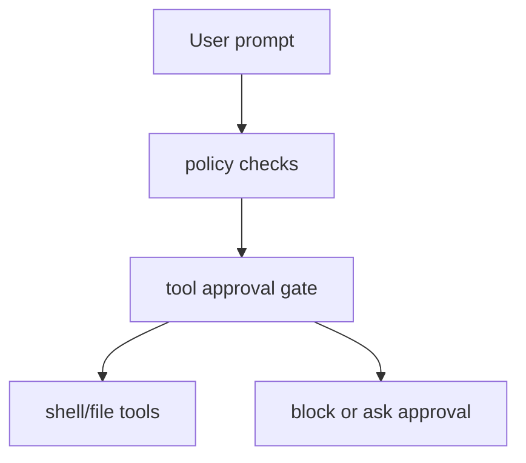

# Chapter 15: Safety Rails (coming soon)

The Python port has not implemented safety rails yet.

## Mental model

A future chapter should cover:

- destructive-command approval prompts
- path allowlists and deny-lists
- shell sandboxing
- maximum edit scope
- audit logging for tool calls

Those controls become more important as soon as the agent can write files and
run shell commands in a real repository.
