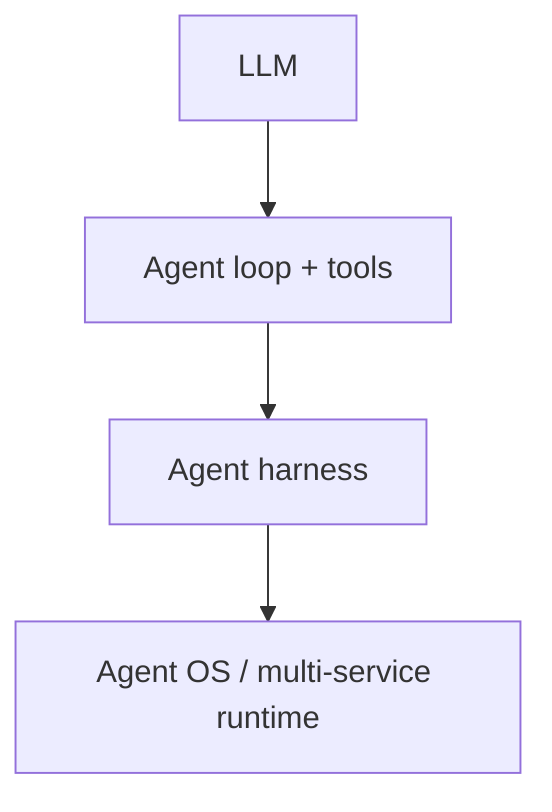
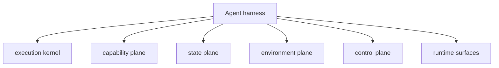

# Chapter 17: What Is an Agent Harness?

By Chapter 16, your Python project already has many useful agent features:

- a core tool-calling loop
- streaming output
- user clarification
- plan mode
- subagents
- skills

That is enough to build a capable coding agent.

But it is still easy to think about each feature in isolation:

- "here is the read tool"
- "here is plan mode"
- "here is subagents"

Real production systems are usually packaged differently.

They do not present themselves as a loose bag of features. They present
themselves as a **ready runtime** with a bundled operating kit and a clear
operating architecture.

That is what an **agent harness** is.

## The idea

A plain agent is usually:

- one model
- one message loop
- some tools

An **agent harness** is a higher-level assembly:

- an execution kernel
- a default tool kit
- prompt and behavior defaults
- context and memory systems
- workspace and sandbox boundaries
- delegation and orchestration
- tool-universe loading
- control-plane checks such as clarification, approval, verification, and loop
  detection
- runtime surfaces such as thread/session state, artifacts, uploads, and client
  wrappers

The harness is not a different species of intelligence.

It is a better **packaging** of the system you already built.

## Why this matters

If you hand an LLM only four raw tools, it can still solve tasks. But each new
session starts from a weak default position:

- it may not know which tools should usually be available
- it may not know what should persist across sessions
- it may not know how to survive long tasks
- it may not know how to stay inside a safe workspace
- it may not know when to delegate, ask, verify, or stop
- it may not know how to expose outputs, images, uploads, or artifacts cleanly
- it may not know how to behave consistently across threads or channels

In other words, the LLM has **capability**, but the runtime still lacks
**operating structure**.

That gap is exactly where a harness lives.

## From agent to harness to agent OS





The important shift is this:

- an **agent** can use features
- a **harness** ships with a default set of features already integrated
- an **agent OS** goes even wider and adds multi-service infrastructure around
  the harness

That last distinction matters.

Some systems stop at the harness layer.

Some systems continue into an OS-like layer with things such as:

- channels
- gateway services
- cron jobs
- heartbeat tasks
- proxy services
- message buses

Those are important, but they are broader than the harness core this book
should teach first.

## Not just "more tools"

It is tempting to say:

> "A harness agent is just an agent with more tools."

That is too small.

More tools help, but tools alone do not explain:

- why some context should be compacted
- why some information should become memory
- why shell access should stay inside a workspace
- why risky work may need clarification first
- why the parent agent should sometimes delegate to a child
- why a huge tool catalog should not flood every prompt

Those are runtime concerns, not just tool definitions.

So the harness should be understood as:

> an opinionated runtime that bundles the core capabilities a serious agent
> needs by default

## What real harnesses bundle

The easiest way to see this is to look at real systems.

### DeepAgents-style bundled surface

A DeepAgents-style runtime bundles things like:

- planning via a todo tool
- filesystem tools for reading and writing context
- shell execution
- subagents with isolated context windows
- prompt defaults that teach the model how to use those tools
- context compaction and output offloading
- memory
- skills
- human-in-the-loop approval

That is much more than "an LLM plus tools". It is already a runtime profile.

### DeerFlow-style bundled surface

A DeerFlow-style runtime adds more product-facing runtime features too:

- multimodal image viewing
- output presentation and artifacts
- uploaded-file awareness
- per-thread workspace, uploads, and outputs
- token usage tracking
- loop detection
- clarification flow
- embedded client surfaces

That means a harness is not only about reasoning tools. It is also about the
runtime surface that makes the agent usable in practice.

### Mimiclaw / OpenClaw-style wider runtime

Then there is a wider class of systems that start to look like an **agent OS**.

Those systems may add:

- channels
- gateway services
- message bus
- cron
- heartbeat
- proxy
- session management

That is the next ring outward.

It is useful to see it, but the book should separate it from the harness core.

## The architecture of an agent harness

If Chapter 17 only listed tools, it would still be too shallow.

The harness needs an architecture.

The most useful architecture for this book is to think in layers.

### 1. Execution kernel

This is the heart of the harness:

- the message loop
- planning and execution phases
- tool execution
- subagent launching
- result synthesis

Without this layer, there is no agent runtime at all.

### 2. Capability plane

This is the bundle of things the runtime can do:

- core built-in tools
- skills
- search
- MCP tools
- multimodal inputs such as images

This is where most people first look, but it is only one layer.

### 3. State plane

This is what lets the runtime stay coherent over time:

- active context
- compacted context
- long-term memory
- thread/session state
- artifacts and outputs
- token usage / telemetry

This is where the harness becomes durable instead of one-shot.

### 4. Environment plane

This defines where the runtime is allowed to operate:

- workspace root
- scratch area
- outputs area
- uploads area
- sandbox constraints

This is how the harness stops being vague about its working world.

### 5. Control plane

This governs how the harness behaves while working:

- clarification
- approvals
- verification-before-exit
- loop detection
- auditability

This is the "brakes, guard rails, and instrumentation" layer.

### 6. Runtime surfaces

This is the layer that makes the harness usable by real clients:

- CLI or client wrapper
- stream events
- file presentation
- image presentation
- thread-safe execution surfaces
- uploads and artifacts

This is where DeerFlow becomes especially informative.

The runtime is not only solving tasks. It is also interacting with users,
threads, and files in a product-shaped way.

## The harness boundary

That layered view gives us a cleaner definition:

> An agent harness is the runtime layer that sits above the raw agent loop and
> below the wider agent OS. It packages the execution kernel, capability plane,
> state plane, environment plane, control plane, and runtime surfaces into one
> ready operating kit.

## The target shape in this project

This book is still not going to use LangChain, LangGraph, or another external
agent framework.

That constraint is important.

The goal is to extend the code you already have in `mini-claw-code-py`, not to
replace it with a new stack.

So in this project, a future `HarnessAgent` should grow out of the existing
pieces:

- `SimpleAgent` for the core loop
- `StreamingAgent` for evented execution
- `PlanAgent` for controlled planning and execution
- `SubagentTool` for delegation
- `SkillRegistry` for progressive disclosure
- `render_system_prompt()` for prompt assembly
- later, small runtime modules for context, memory, workspace, and control

That means the harness is a **composition layer** over the current project, not
a hard reset.

But there is one implementation detail worth making explicit now:

- the earlier runtime files should stay simple for learning
- the harness should get its own runtime file

So from Chapter 17 onward, the project should treat these as two tracks:

- the original learning track:
  - `agent.py`
  - `streaming.py`
  - `planning.py`
  - `examples/chat.py`
  - `examples/tui.py`
- the new harness track:
  - `harness.py`
  - `src/mini_claw_code_py/tui/app.py`
  - `src/mini_claw_code_py/tui/console.py`

This is a good tradeoff.

It keeps the early chapters readable while giving the harness room to grow
without smearing complexity across the old teaching files.

## What belongs in this book

Now that the harness is defined architecturally, the next question is:

> which parts should this book teach and later implement?

The right answer is:

- teach the harness core first
- mention the OS ring, but do not collapse everything into one chapter series

### Core harness features we should teach and implement

These are the features that belong inside the `HarnessAgent` arc of this book.

Just as important, the harness arc should now build toward **one evolving app**
instead of a new app for every later chapter.

So from Chapter 18 onward, the tutorial should keep extending one CLI:

- `src/mini_claw_code_py/tui/app.py`

The `examples/cli.py` file can stay as a tiny wrapper, but the real app logic
should now live in the package.

That CLI can eventually absorb:

- richer runtime notices
- memory and context features
- workspace behavior
- subagent orchestration
- later client/channel adapters

This mirrors the way real systems evolve:

- one runtime
- one main app surface
- more bundled capability over time

### 1. Bundled core tools

At minimum, the harness should know how to ship with a practical default tool
kit such as:

- `read`
- `write`
- `edit`
- `bash`
- `ask_user`
- `subagent`
- later `write_todos`
- later search tools
- later MCP-loaded tools
- later multimodal helpers such as image viewing when the runtime needs it

The key point is still the same: the harness should expose a **ready tool
profile**, not force every caller to rebuild the same default stack manually.

### 2. Context durability

Long tasks create long histories.

So a harness should eventually know how to:

- compact stale conversation history
- keep recent context live
- preserve older context in an archived form
- continue work after compaction without losing the thread

This is different from memory. Context is the active working window. Memory is
what should persist beyond the current task.

### 3. Memory

A harness should have a durable place for stable guidance and learned patterns:

- project instructions
- user preferences
- workflow rules
- recurring conventions

But it should also know what **not** to remember:

- transient facts
- one-off requests
- sensitive secrets

### 4. Sandbox and workspace

Raw shell access is powerful, but it is also dangerous.

A harness should define:

- where temporary work happens
- where final outputs go
- which paths are safe to read or write
- how commands are constrained

Even if the first Python version is lightweight, the harness should still have
a clear workspace model.

### 5. Subagent orchestration

The project already has a child-agent pattern.

The next step is to treat delegation as a bundled harness behavior:

- when to delegate
- how to write a child brief
- how to limit child scope
- how to prevent runaway recursion
- how to synthesize results cleanly

### 6. Tool universe management

A serious harness may have many more tools than the model should see all at
once.

So the harness should eventually support:

- built-in tools
- project-local skills
- external MCP tools
- deferred tool discovery for large catalogs

This keeps the prompt small while still allowing the runtime to scale.

### 7. Control plane

A harness should not only give the model power. It should also shape how that
power is used.

That includes:

- clarification before ambiguous work
- approval before risky work
- verification before claiming success
- loop detection when the agent gets stuck
- auditability of important actions
- token usage / observability hooks where useful

This is the "dashboard, brakes, and guard rails" part of the system.

### 8. Runtime surfaces

One thing the earlier draft underemphasized is that serious harnesses also need
runtime surfaces such as:

- stream events
- artifacts / output presentation
- thread or session state
- uploads
- multimodal input handling

These do not all need their own major chapters immediately, but the book should
recognize them as part of the harness architecture, not as random extras.

DeerFlow is especially useful here because it shows that file presentation,
image handling, uploads, and per-thread workspaces are not side details. They
are part of the runtime surface.

### 9. Telemetry and observability

A small but important design lesson from DeerFlow is that runtime telemetry also
matters.

Examples:

- token usage
- visible tool activity
- traceable task execution
- artifact visibility

This does not need to become a giant monitoring chapter in the first version of
the book, but it does belong in the architecture.

It helps explain why a harness feels production-shaped even before it becomes a
full agent OS.

## What does not belong in the first harness core

OpenClaw-style or Mimiclaw-style systems suggest a wider ring of features:

- gateway
- channels
- bus
- cron
- heartbeat
- proxy

Those are real and important.

But they are broader than the first `HarnessAgent` we should teach and build in
`mini-claw-code-py`.

They belong in a later section such as:

- "Agent OS extensions"
- or an appendix after the harness arc

That keeps the book scoped correctly.

## A useful analogy

One way to think about the stack is:

- the LLM is raw capability
- the agent loop is the engine
- the agent harness is the full vehicle platform
- the agent OS is the road network, dispatch system, garages, and city
  infrastructure around the vehicle

The vehicle includes the engine, but it also includes:

- controls
- storage
- safety systems
- instrumentation
- routing rules

That is why a harness feels different from a toy agent, even if both are built
around the same underlying model.

And it is why an agent OS feels different from a harness: it expands from the
vehicle itself into the surrounding service infrastructure.

## What `HarnessAgent` should feel like

The eventual Python API should feel like a bundled runtime, not like a
collection of unrelated toggles.

For example:

```python
agent = (
    HarnessAgent(provider)
    .enable_core_tools()
    .enable_default_skills()
    .enable_memory_file(".agents/AGENTS.md")
    .enable_subagents()
    .workspace(".")
)
```

That is only a sketch, not the final API.

But it captures the design goal:

- keep the current builder style
- keep the current lightweight Python architecture
- package the default operating kit in one place
- leave room for later OS-style extensions without forcing them into the first
  implementation

## What this chapter is really doing

This chapter does **not** introduce a new low-level primitive yet.

Instead, it defines the target:

- what the harness is
- what architectural layers it has
- what it should bundle
- how it differs from a plain agent
- how it differs from a wider agent OS
- how it should extend the current codebase without breaking its style

That conceptual clarity matters before the implementation chapters begin.

Otherwise it is too easy to add isolated features without understanding the
larger runtime shape they belong to.

## Recap

An agent harness is a pre-bundled agent runtime.

It is not just:

- more tools
- more prompt text
- more abstractions

It is a deliberate assembly of:

- an execution kernel
- a capability plane
- a state plane
- an environment plane
- a control plane
- runtime surfaces

In this project, the harness should grow directly out of the code you already
have in `mini-claw-code-py`.

## What's next

In [Chapter 18: Bundled Core Tools](./ch18-bundled-core-tools.md) you will turn
that definition into code by introducing the first real harness behavior: a
default core tool profile that ships as part of the runtime.
