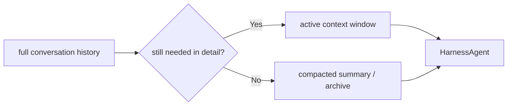

# Chapter 19: Context Durability

Bundled core tools make the harness useful on short tasks.

The next problem appears as soon as the task gets bigger.

Imagine this conversation:

```text
User: "Investigate the failing tests, patch the bug, update the docs, and tell me what changed."
```

The agent may need to:

1. inspect several files
2. run the tests
3. edit code
4. rerun the tests
5. update documentation
6. summarize the final result

That can easily produce a long message history full of:

- tool calls
- tool results
- partial findings
- stale plans
- intermediate failed attempts

If the harness keeps all of that active forever, the runtime gets weaker over
time:

- prompts become larger
- cost grows
- latency grows
- earlier noise crowds out current work
- the model loses focus on what still matters

A serious harness needs a way to survive long tasks.

This chapter calls that property **context durability**.

In the Chapter 17 architecture, this chapter belongs mainly to the
**state plane**.

This is the part of the harness that answers:

> "How does the runtime preserve useful state while the task keeps moving?"

## What you will build

This chapter defines the next harness capability after bundled core tools:

1. a mental model for active context versus archived context
2. a compaction strategy for stale history
3. a durable summary artifact for older work
4. a clean way for `HarnessAgent` to continue after compaction
5. the design boundary between context durability and long-term memory

In the Python implementation, this chapter now adds a real first slice:

- a small `context.py` helper module
- deterministic history compaction
- one archived summary message inserted back into `messages`
- a `HarnessAgent.enable_context_durability(...)` builder
- a runtime notice when compaction happens

The architectural boundary here is:

- active and archived context belong to the state plane
- long-term memory belongs to the next chapter
- workspace paths and sandbox rules belong to the environment plane
- approvals and verification belong to the control plane
- outputs, artifacts, images, and token reports are runtime surfaces that may
  feed into the state plane without becoming the same thing

## The problem with naive history growth

The simplest agent strategy is:

```python
messages.append(...)
messages.append(...)
messages.append(...)
```

That is exactly how the early chapters work, and it is the correct place to
start.

But appending forever creates a bad long-task runtime.

The problem is not only token count.

It is also that old conversation content gradually stops being equally useful.

For example, after the agent:

- inspected five files
- tested three hypotheses
- abandoned two failed ideas
- fixed the bug

the active conversation no longer needs every old detail at full resolution.

The harness still needs the **state of the work**, but not necessarily every
raw step.

That is the core insight behind compaction.

## Active context versus archived context

The most useful model here is to split conversation history into two layers.

### Active context

This is the live working window the model still needs in full detail.

It usually includes:

- the latest user request
- the most recent tool results
- the current plan
- the current local findings
- the most recent assistant decisions

### Archived context

This is older work that still matters, but no longer needs to stay in raw,
turn-by-turn form.

It may include:

- earlier exploration
- finished sub-investigations
- stale tool outputs
- discarded hypotheses
- intermediate notes that can now be summarized

This split gives the harness a much stronger runtime shape.

## Mental model



The important part is this:

- older context is not thrown away
- it is **compressed into a more durable representation**

That is why this chapter uses the phrase **context durability** instead of only
"truncation".

Simple truncation loses work.

Durability preserves the work in a smaller form.

In a serious harness, that may include compressing or offloading:

- large shell output
- bulky file reads
- subagent findings
- artifact-generation steps
- image-analysis results that no longer need to stay inline

## What compaction should preserve

A good harness compaction step should preserve the things the agent still needs
to reason correctly.

That usually means keeping:

- the current task objective
- the current status of the work
- important facts discovered so far
- edits or outputs already produced
- unresolved blockers
- important constraints from the user
- the next useful action

That means a compacted summary should read less like a transcript and more like
a handoff note.

Bad compact summary:

```text
First I read a.py, then I ran pytest, then I read b.py, then I edited c.py...
```

Better compact summary:

```text
Current objective: fix the failing auth tests.
Key findings: the failure comes from token expiry handling in auth.py.
Relevant changes already made: auth.py updated to reject missing exp.
Still unresolved: one integration test still fails in tests/test_sessions.py.
Next step: inspect session fallback behavior and rerun the targeted test.
```

That second form is much more useful to the runtime.

It is also much closer to what a parent harness needs after long work:

- what has been established
- what has been produced
- what is still blocked
- what should happen next

## Context durability is not memory

This distinction matters enough to make explicit.

### Context durability answers:

> "How does the harness keep a long task coherent while it is still running?"

### Memory answers:

> "What information should persist beyond this task and influence later tasks?"

Those are related, but they are not the same system.

Examples of compacted context:

- "The root cause is in auth.py."
- "The write step already completed successfully."
- "The remaining blocker is one failing integration test."

Examples of memory:

- "This project prefers type hints."
- "The user likes concise change summaries."
- "This repository uses `uv` for Python commands."

Compacted context is still about the current task.

Memory is durable guidance across tasks.

That is why context durability should come **before** the memory chapter.

## What should trigger compaction?

The first implementation in this project does not need a perfect token-aware
algorithm yet.

But the runtime still needs a trigger model.

Practical trigger families are:

- too many messages
- too many tool-heavy turns
- explicit phase boundary
- user moves to a new subtask

Later versions may also use runtime signals such as:

- unusually large outputs written to files
- repeated delegated tasks
- growing artifact trails in the workspace
- token-usage telemetry that shows the active window is getting too expensive

### Message-count trigger

The simplest first version is a fixed threshold:

```text
if len(messages) > N:
    compact older messages
```

This is easy to teach and easy to test.

### Tool-heavy trigger

Some histories are small in turn count but large in content because tool
results are bulky.

So later versions may also compact after:

- several large file reads
- verbose shell outputs
- many subagent results

### Phase-boundary trigger

A harness can also compact when a natural phase ends:

- research finished
- implementation finished
- verification begins
- one delegated task is done

This is often cleaner than waiting for pure size thresholds.

## The right first design in this project

Because `mini-claw-code-py` is intentionally lightweight, the first version
should not start with a deep token-accounting subsystem.

The cleanest first design is:

1. keep full `messages` while the history is still small
2. compact older assistant/tool turns when a threshold is crossed
3. keep recent turns live
4. inject one synthetic summary message back into the conversation

That preserves the existing runtime model:

- the agent still operates on `list[Message]`
- no graph state is required
- no external summarization framework is required

This is important because it means context durability can fit naturally into the
current project instead of replacing its architecture.

That is exactly what the reference code now does.

It keeps the same core runtime model:

- `messages` is still a `list[Message]`
- `HarnessAgent` still runs a normal loop
- context durability is a helper around that loop, not a new framework

## What the synthetic summary message should look like

The simplest durable representation is a normal `Message.system(...)` or
`Message.user(...)` entry that summarizes older work.

The reference implementation uses a synthetic `Message.system(...)` entry with
an explicit wrapper:

```text
<archived_context>
...
</archived_context>
```

That makes the compacted state visible and easy to detect in tests.

## Why the first version is deterministic

There are two broad ways to build compaction:

1. use another model call to summarize history
2. build a deterministic summary from older messages

For this chapter, the second option is the better fit.

Why:

- it is easier to test
- it does not add another provider dependency yet
- it keeps the runtime behavior predictable
- it fits the tutorial's step-by-step style

So the first Python implementation summarizes archived history by extracting:

- earlier user requests
- assistant tool activity
- key tool results
- assistant conclusions

That produces a summary that is simple, stable, and good enough for the first
harness version.

## The new builder

The first harness API should stay small:

```python
agent = (
    HarnessAgent(provider)
    .enable_core_tools(handler)
    .enable_context_durability(max_messages=12, keep_recent=6)
)
```

That builder does three things:

1. stores the compaction settings
2. enables compaction in the runtime loop
3. appends a prompt section that teaches the model how to treat archived context

This keeps the feature aligned with the rest of the project:

- opt-in
- builder-style
- small explicit parameters

## Where compaction lives in the runtime

The implementation is intentionally small:

- `context.py` owns compaction rules
- `HarnessAgent` calls compaction before the next model turn
- the UI receives a notice when compaction happens

That split is clean.

It keeps `harness.py` readable without hiding the feature in a heavy subsystem.

## The first trigger we actually implement

The chapter discusses several possible triggers.

The first reference implementation uses the simplest one:

```text
if live_message_count > max_messages:
    compact older messages
```

That is the right starting point.

Later chapters can become smarter with:

- tool-output size
- artifacts
- token usage
- phase boundaries

But message count is enough to teach the pattern clearly.

## How repeated compaction works

One subtle problem is repeated compaction.

If the runtime compacts once, then later compacts again, it should not create a
mess of unrelated archive messages.

So the first implementation merges existing archived context into the next
archived summary.

That keeps one durable archive message in the history instead of an ever-growing
stack of synthetic system messages.

## Visibility in the CLI

Context durability should not be silent.

When the harness compacts history, the operator should know it happened.

So the runtime emits a notice like:

```text
Context compacted: archived 6 messages, kept 6 live messages.
```

The new harness CLI displays that notice through the same event path already
used for MCP connection status.

This is another good harness principle:

- runtime state changes should be observable
- not hidden

## Tests to write

The reference tests for Chapter 19 should cover:

1. inserting an archived summary message
2. keeping recent live messages untouched
3. merging prior archive content on repeated compaction
4. rendering the context-durability prompt section
5. emitting a compaction notice during a harness run

For example:

```text
Context summary:
- Objective: fix auth test failures and update docs
- Findings so far: auth.py expiry handling was incorrect
- Completed work: patched auth.py and reran unit tests
- Remaining issue: one integration test still fails
- Important constraint: preserve session fallback behavior
```

This has several advantages:

- it reuses the current message model
- it is easy to inspect in tests
- it does not need a new transport format
- it keeps the runtime mentally simple

Later chapters may decide where this summary should live in the message list,
but the representation itself can stay simple.

## A possible module boundary

The cleanest next module would be something like:

```text
mini_claw_code_py/
├── harness.py
├── context.py
└── ...
```

With small types such as:

```python
@dataclass(slots=True)
class ContextSummary:
    text: str
    kept_messages: list[Message]
```

And a helper like:

```python
def compact_messages(
    messages: list[Message],
    *,
    keep_last: int,
) -> list[Message]:
    ...
```

This stays consistent with the rest of the project:

- plain dataclasses
- small helper functions
- explicit transformations

## Where this should live in the runtime

The compaction behavior should belong to `HarnessAgent`, not to each tool and
not to the CLI.

Why?

Because context durability is a property of the runtime loop itself.

The ownership should be:

- tools produce messages
- the harness decides how much history remains active
- the UI only renders events

That mirrors the earlier chapter decision about bundled core tools:

- the harness owns runtime defaults
- apps consume them

## How compaction should interact with streaming

This project already has streamed execution through `StreamingAgent` and
`PlanAgent`.

That means compaction should happen at stable boundaries, not in the middle of
an unfinished streamed turn.

Good compaction times:

- after a completed tool round
- after a finished assistant answer
- after a plan submission
- after a completed child task result

Bad compaction time:

- while the model is still streaming the current response

That keeps the runtime predictable.

## How compaction should interact with plan mode

Plan mode adds an important nuance.

Sometimes the harness should compact:

- after planning is complete
- before execution begins

Why?

Because the raw planning conversation may contain useful reasoning structure,
but execution does not need every exploration detail in full form.

A compact handoff such as:

- approved plan
- assumptions
- selected approach
- remaining questions

is often a much better starting point for execution than the full planning
transcript.

So context durability is not only about giant conversations. It is also about
**clean phase transitions**.

## How compaction should interact with subagents

Subagents already help reduce context growth by returning a short final summary
instead of leaking their full internal history back to the parent.

That means subagents are already one form of context durability.

This is a useful design lesson:

- subagents reduce context growth across branches of work
- compaction reduces context growth over time in the parent thread

Together they make the harness much more resilient on large tasks.

So the future harness should treat both as part of the same larger goal:

> keep the active context small, relevant, and durable

## What not to do

There are several bad first designs to avoid.

### 1. Blind truncation

Do not just drop the oldest messages.

That may remove:

- the actual task objective
- key constraints
- important earlier findings

### 2. Summarize everything constantly

Too-frequent compaction can make the runtime unstable and expensive.

The harness should compact at clear thresholds or boundaries, not after every
few turns.

### 3. Mix memory and context summary together

If the same mechanism tries to handle both:

- current-task durability
- long-term reusable memory

the design gets muddy fast.

Keep them separate.

### 4. Put the policy in the UI

The terminal UI should not decide when the agent compacts history.

That belongs inside the harness runtime.

## A realistic first milestone

The first concrete implementation milestone after this chapter should be
modest.

It only needs to prove:

1. the harness can detect when history has grown too large
2. it can keep recent messages live
3. it can replace older raw turns with one compact summary
4. the task can continue correctly afterward

That is enough to establish the concept.

Later versions can improve:

- trigger quality
- summary quality
- archived history storage
- richer handoff formats

## Recap

Context durability is the harness capability that keeps long tasks coherent
without keeping every old message alive at full detail.

The key ideas are:

- split active context from archived context
- compact stale history instead of blindly truncating it
- preserve task state, findings, blockers, and next steps
- keep this separate from long-term memory
- let the harness runtime own the compaction policy

This is the next big step from "agent that works" toward "runtime that stays
useful over long sessions".

## What's next

In [Chapter 20: Memory](./ch20-memory.md) you will build the next durable
feature of the harness: deciding what should persist beyond the current task
and how that differs from compacted working context.
