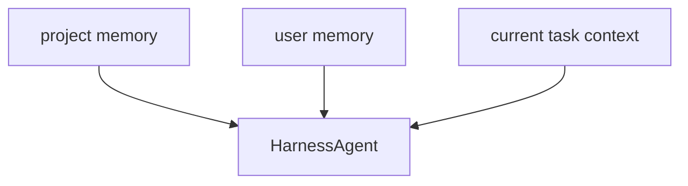
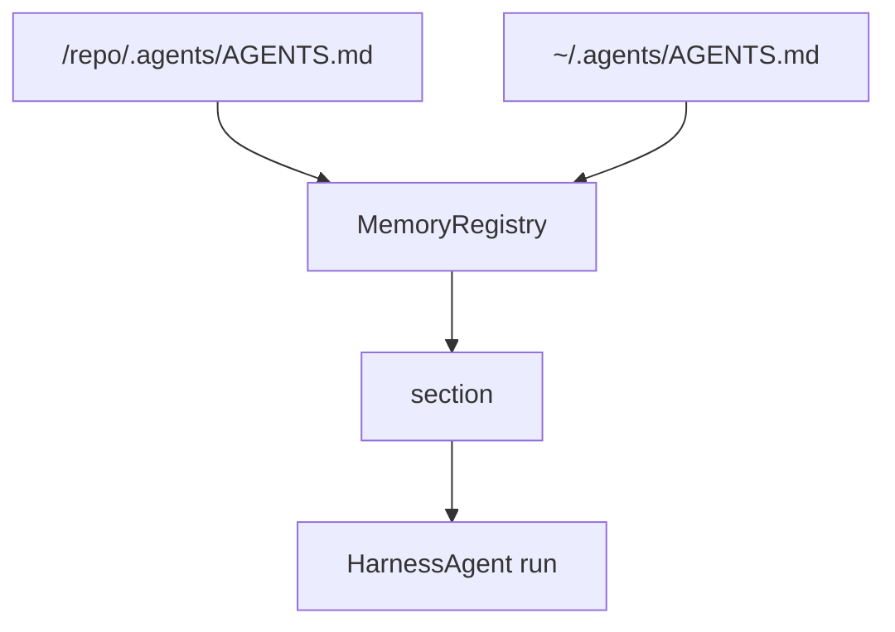
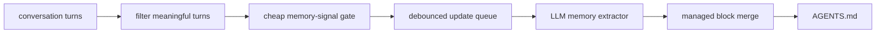

# Chapter 20: Memory

Context durability helps the harness survive one long task.

Memory solves a different problem:

> what information should still matter after the current task is over?

That question appears quickly in real usage.

For example:

- the project always uses `uv`
- the repository prefers small patches over rewrites
- the user likes concise summaries
- the team wants tests run before the final answer

If the harness relearns those patterns from scratch every session, it wastes
time and becomes inconsistent.

So after context durability, the next bundled runtime feature is **memory**.

In the Chapter 17 architecture, memory also belongs to the **state plane**.

But it is a different state system from context durability.

Context durability protects the current task.

Memory carries stable guidance across tasks.

## What you will build

This chapter defines the next durable harness capability:

1. a clear difference between memory and current-task context
2. a split between project memory and user memory
3. rules for what should and should not be remembered
4. a runtime-loaded prompt design for memory files
5. a clean path for later memory updates in the Python runtime

As with the previous harness chapters, this chapter describes the design shape
that should fit naturally into `mini-claw-code-py`.

The architectural boundary matters here too:

- compacted task history is not memory
- project and user memory are not workspace metadata
- approvals are not memory
- artifact locations are not memory
- token usage and event logs may help decide what to remember later, but they
  are still runtime surfaces rather than memory itself

## Memory is not the same as context

This distinction is the most important part of the chapter.

### Context answers:

> "What does the model need right now to continue the current task?"

Examples:

- the latest failing test output
- the current plan
- the remaining blocker
- the most recent file contents

### Memory answers:

> "What stable guidance should still be true next time?"

Examples:

- this project uses `uv run pytest`
- the repository prefers precise edits instead of broad rewrites
- the user likes concise, practical explanations
- the codebase requires public functions to have docstrings

That is why memory comes after context durability in the harness sequence.

Context keeps the current task coherent.

Memory keeps repeated work consistent across tasks.

## Why a harness should own memory

You could leave memory entirely to ad-hoc prompt editing.

But that produces a weak runtime:

- one entry point loads extra instructions
- another entry point forgets them
- project conventions are copied into random prompts
- there is no stable place for durable guidance to live

A harness should solve that by giving the runtime a standard memory layer.

That means:

- memory has a known file format
- memory has a known loading path
- memory has known scope rules
- memory is treated as runtime input, not random prompt text

This keeps the system teachable and predictable.

## The most useful split: project memory and user memory

The first memory design should stay simple.

The cleanest split is:

- **project memory**
- **user memory**

### Project memory

This is information about the repository or working environment.

Examples:

- build and test commands
- code style expectations
- architectural notes
- release workflow conventions
- repo-specific safety rules

Project memory belongs to the working directory, not to one particular user.

### User memory

This is information about the current user's stable preferences or recurring
instructions.

Examples:

- prefers short answers
- prefers Python examples
- wants tests run before finishing
- likes explicit tradeoffs in design discussions

User memory should be separate from project memory because its scope is
different.

The project memory may apply to everyone who works on the repository.

The user memory is personal.

## Mental model



The harness should treat all three as different layers:

- current task context
- project-level durable memory
- user-level durable memory

If those layers stay separate, the runtime stays understandable.

That separation becomes even more important in richer harnesses that also carry:

- uploads
- output artifacts
- image-analysis notes
- per-thread runtime data

Those may affect the current run, but they should not automatically become
long-term memory.

## What should be remembered

A good first memory system should be conservative.

Remember information when it is:

- stable
- reusable
- likely to matter on future tasks
- safe to store

Good candidates:

- preferred commands
- preferred explanation style
- repository conventions
- repeated workflow rules
- architectural facts that remain useful

In practice, a good harness should be much more willing to remember stable
instructions than raw observations.

Examples:

```text
- Use `uv run pytest` for tests.
- Prefer exact string edits over broad file rewrites.
- Keep final answers short unless the user asks for detail.
- Add docstrings to public functions.
```

Those are all useful future guidance.

## What should not be remembered

A weak memory system stores too much.

Do **not** remember:

- one-off requests
- temporary state
- stale tactical details
- secrets
- raw transient tool output

Bad examples:

```text
- The user asked me to inspect auth.py today.
- The current failing test mentions line 83.
- The user is away for two hours.
- OPENAI_API_KEY=...
```

Those do not belong in memory.

Some are temporary. Some are dangerous.

A harness memory system should be opinionated enough to say "no" to those.

## The simplest file format for this project

The cleanest first memory format is plain Markdown files.

That is already consistent with the rest of the project:

- simple to read
- easy to edit
- easy to inspect in tests
- no extra parser required for the first version

The most natural naming convention is:

- `AGENTS.md` for durable memory-like guidance

This matches the broader ecosystem direction and also fits the project well.

It also keeps the first Python implementation aligned with the rest of the
book:

- inspectable in the repo
- editable by hand
- easy to test
- easy to inject into prompt assembly without new infrastructure

Possible locations:

```text
/repo/.agents/AGENTS.md   # project memory
~/.agents/AGENTS.md       # user memory
```

This is the default layout we will implement in `mini-claw-code-py`.

It fits the current codebase nicely:

- project-scoped durable guidance stays in the repository
- user-scoped durable guidance stays in the user's home directory
- the layout matches the existing `.agents/` convention used for skills

## How memory should enter the runtime

The first version should avoid magic, but it should still feel like a real
harness feature.

The harness should simply:

1. register explicit memory sources or discover the default ones
2. read those files at runtime
3. combine them in a deterministic order
4. inject them into the system prompt

That runtime-loading detail matters.

If `AGENTS.md` changes on disk, the next agent run should see the latest memory
without requiring a new `HarnessAgent` object.

That is enough to create a useful memory layer.

Because `mini-claw-code-py` already has prompt composition through
`render_system_prompt()`, memory can fit naturally into the same pattern.

For example:

```python
agent = (
    HarnessAgent(provider)
    .enable_core_tools(handler)
    .enable_default_memory(cwd=Path.cwd())
)
```

Or, when you want to be explicit:

```python
agent = (
    HarnessAgent(provider)
    .enable_core_tools(handler)
    .enable_project_memory_file(".agents/AGENTS.md")
    .enable_user_memory_file(Path.home() / ".agents" / "AGENTS.md")
)
```

That keeps the style consistent with earlier chapters:

- small builder methods
- explicit file paths
- plain string composition
- no hidden database or vector store

## Memory prompt section

Just as skills are exposed through a structured prompt section, memory should be
made explicit too.

A simple shape is:

```text
<agent_memory>
<memory scope="project" path="/repo/.agents/AGENTS.md">
- Use `uv run pytest` for Python tests.
- Keep patches small and focused.
</memory>

<memory scope="user" path="/home/dzung/.agents/AGENTS.md">
- Prefer concise explanations.
- Run tests before finalizing when practical.
</memory>
</agent_memory>
```

This has several advantages:

- the model can clearly separate memory from task-specific context
- the source of each memory block stays visible
- debugging stays easy

And because the current project already likes prompt sections with explicit
tags, this matches the existing style well.

## Ordering rules

Order matters.

The first version should define one simple policy:

- project memory first
- user memory second

Why this order?

Because project memory explains the environment, while user memory explains the
preferred way of working within that environment.

That is a natural reading order for the model.

It is also easy to test.

It is also the order we will implement in the Python runtime:

```python
sources = [
    project_agents_md,
    user_agents_md,
]
```

If the runtime later needs deeper precedence rules, those can be added then.

For now, simplicity is better.

## Why memory updates should come later

A production harness often updates memory as it learns from the user.

That is useful, but it is not the first thing this Python project needs.

The first milestone should only prove:

- memory can be loaded
- memory has stable scope
- memory is distinct from current context

Automatic memory updates are a second-stage feature because they raise harder
questions:

- when is the signal strong enough?
- what should be rewritten versus appended?
- how do we avoid storing noise?
- how do we avoid storing sensitive data?

Those are real questions, but they should not block the first memory design.

That is why this chapter should be read in **two stages**:

1. load durable memory correctly
2. then add a careful memory updater

The updater should not be the first memory feature.

But once the loading layer is stable, adding a small updater becomes realistic.

## A good next module boundary

The cleanest next module would be:

```text
mini_claw_code_py/
├── harness.py
├── memory.py
└── ...
```

With lightweight helpers such as:

```python
def default_memory_sources(...) -> list[MemorySource]:
    ...

def load_memory_sources(sources: Sequence[MemorySource]) -> list[MemoryDocument]:
    ...

def render_memory_prompt_section(blocks: list[MemoryDocument]) -> str:
    ...
```

That fits the codebase well:

- plain functions
- plain dataclasses
- explicit I/O
- no hidden state manager

That shape also gives the harness a natural place to add later features:

- memory editing helpers
- memory validation
- memory update policies
- memory safety checks

The current Python implementation now includes the first updater slice in the
same module:

- message filtering
- memory-signal gating
- managed-block merging
- a debounced async update queue

## Mental model



This is deliberately simple.

The runtime is not trying to infer memory from every conversation yet.

It starts by loading explicit durable memory files and presenting them clearly
to the model.

Then, when memory updates are enabled, the same module can queue a filtered
conversation snapshot for later memory extraction.

## Runtime-loaded memory

The implementation should load memory at **run time**, not only when the agent
object is created.

That gives the harness two useful properties:

- if a memory file changes on disk, the next run sees the update
- tests can prove that the runtime uses fresh memory rather than stale cached
  text

This is a better fit for a local coding agent than a one-time prompt assembly
step.

## Manual memory and learned memory

A practical harness should not rewrite the entire `AGENTS.md` file every time
it learns something new.

That would be too destructive.

The better design is:

- keep manual memory as normal Markdown the user can edit freely
- let the updater manage only one small generated block

For example:

```text
# Project memory
- Use `uv run pytest` for tests.

<!-- mini-claw:memory-updater:start -->
- Prefer concise final answers.
- Read the target file before editing when context is missing.
<!-- mini-claw:memory-updater:end -->
```

This is a good tutorial design because:

- hand-written memory stays readable
- generated memory stays easy to replace
- tests can verify exactly what the updater owns

## Filter before updating memory

DeerFlow gets an important thing right: memory updates should not see every
intermediate tool step.

For this project, the correct first filter is:

- keep user messages
- keep final assistant responses without tool calls
- drop system prompts
- drop tool results
- drop intermediate assistant tool-call steps

That gives the updater the part of the conversation that is most likely to
contain stable guidance.

## Gate memory updates before calling the LLM

A full LLM memory update after every turn is expensive.

So the first harness updater should use a cheap gate before doing any model
call.

For example, only consider an update when recent user messages look like they
contain durable signal:

- "remember this"
- "prefer concise answers"
- "always use `uv run pytest`"
- "for this repo, keep patches small"

That means the updater can skip obvious non-memory turns such as:

- "what files changed today?"
- "show me the failing test output"
- "open auth.py"

This is a very good tradeoff for a local coding agent.

## Debounced memory updates

DeerFlow also gets another important thing right: memory updates should be
queued and debounced.

The runtime may receive several quick turns in a row:

- the user corrects the agent
- the agent answers
- the user refines the preference

If the harness writes memory on every one of those turns, it wastes model calls
and churns the memory file.

The smaller design for this project is:

- queue the latest filtered conversation snapshot
- keep only the newest pending update per memory target
- wait a short debounce interval
- then run one LLM-based extraction

That is enough to teach the right idea without building a full background
service.

## Mental model for the updater



This is the right level for `mini-claw-code-py`.

It borrows the useful pattern from DeerFlow without copying the heavier runtime
shape.

## How the updater should write memory

The updater should not free-form rewrite the whole file.

It should:

1. read the current target `AGENTS.md`
2. ask the LLM for up to a few durable memory lines
3. merge those lines into the managed block
4. deduplicate normalized lines
5. preserve the rest of the file exactly

This design is safer than whole-file regeneration.

It also keeps the update policy understandable for readers of the book.

## Recommended API

The current runtime shape should be:

```python
agent = (
    HarnessAgent(provider)
    .enable_default_memory(cwd=Path.cwd())
    .enable_user_memory_file(Path.home() / ".agents" / "AGENTS.md")
    .enable_memory_updates(
        debounce_seconds=2.0,
        target_scope="user",
    )
)
```

And when the runtime is shutting down, it should flush pending updates:

```python
await agent.flush_memory_updates()
```

That gives the harness a small but real long-term learning loop.

## How memory should interact with skills

Memory and skills are related, but they should stay distinct.

### Memory

Memory tells the agent what tends to be true.

Examples:

- the repository uses `uv`
- the project values small changes

### Skills

Skills tell the agent how to perform a reusable workflow.

Examples:

- how to package a Python release
- how to do structured web research

That means:

- memory is durable standing guidance
- skills are reusable task-specific playbooks

If the harness keeps those roles separate, the runtime stays much easier to
reason about.

## How memory should interact with context durability

This is another important distinction.

Compacted context may say:

```text
Current blocker: one integration test still fails in session fallback mode.
```

Memory may say:

```text
This project preserves backward compatibility for session fallback behavior.
```

The first is temporary state about the live task.

The second is durable guidance that should still matter next time.

Both can be injected into the prompt, but they answer different questions.

That is why the harness should expose them as separate sections.

## How memory should interact with the control plane

Later, the harness will gain control-plane features such as:

- clarification
- approvals
- verification-before-exit

Memory should support those systems, not replace them.

For example:

- memory can say "always verify with tests when practical"
- the control plane decides when verification is mandatory

That boundary is important.

Memory stores durable preference or convention.

The control plane enforces runtime behavior.

## What not to do

Avoid these first-memory mistakes.

### 1. Store everything

If every user message becomes memory, the runtime becomes noisy fast.

### 2. Hide memory sources

If the prompt does not show where the memory came from, debugging gets harder.

### 3. Mix project and user memory together without labels

That makes scope confusing and future editing harder.

### 4. Treat memory as current-task scratch space

That is context, not memory.

### 5. Store secrets

A harness should be strict here.

### 6. Rewrite the whole memory file

That makes manual memory and generated memory fight each other.

### 7. Call the LLM for every trivial turn

That adds cost without adding useful long-term signal.

## A realistic first milestone

The first concrete implementation milestone after this chapter is already the
runtime-loaded memory layer:

1. add project/user memory sources to `HarnessAgent`
2. support default discovery for project and user `AGENTS.md`
3. load those files at runtime
4. render a memory section into the system prompt
5. preserve ordering and visible source paths
6. emit a small runtime notice when memory was loaded

That establishes a real harness memory layer.

The next milestone is the careful updater:

1. filter messages before extraction
2. gate obvious non-memory turns before calling the LLM
3. debounce updates
4. merge new lines into a managed memory block
5. flush pending updates on shutdown

Later versions can add:

- richer memory update policies
- safety checks for stored content
- removal or rewriting of stale learned memory
- different updater targets for project and user scopes

## Recap

Memory is the harness feature that preserves stable guidance across tasks.

The key ideas are:

- memory is not the same as current context
- project memory and user memory have different scopes
- only durable, reusable, safe guidance should be remembered
- Markdown memory files fit this project well
- the first version should load memory into the prompt at runtime
- memory updates should be filtered, gated, and debounced
- the updater should own only a small managed block instead of rewriting the
  whole file
- default discovery can stay simple: project `.agents/AGENTS.md`, then user
  `~/.agents/AGENTS.md`

This gives the harness a durable sense of how to work, not just what it is
working on right now.

## What's next

In [Chapter 21: Sandbox and Workspace](./ch21-sandbox-workspace.md) you will
define the runtime boundaries that keep the harness useful and safe when it can
run shell commands and modify files.
