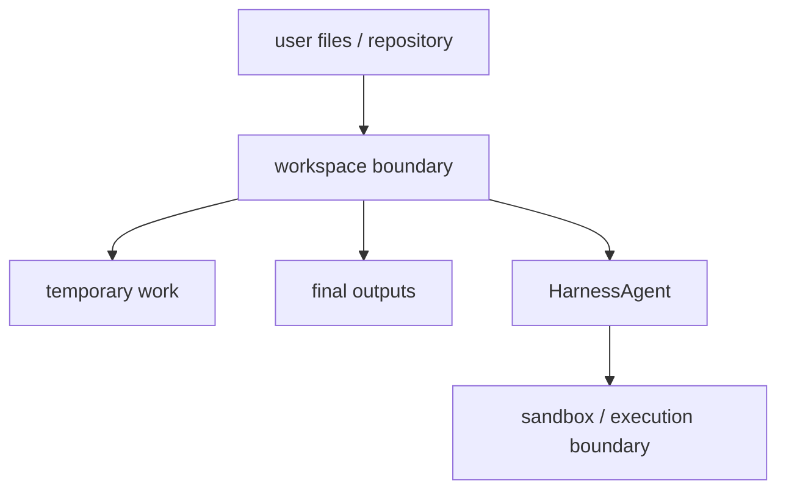

# Chapter 21: Sandbox and Workspace

By this point, the harness has:

- bundled core tools
- context durability
- memory

Those features make it more capable and more consistent.

But they do not answer a critical runtime question yet:

> where is the agent actually allowed to work?

Once the harness can:

- read files
- edit files
- create files
- run shell commands

it needs a clear operating boundary.

That is the job of the **workspace and sandbox model**.

In the Chapter 17 architecture, this chapter belongs mainly to the
**environment plane**.

This is the part of the harness that answers:

> "Where can the agent operate, and under what execution boundary?"

## What you will build

This chapter defines the next harness capability:

1. a workspace model for where work should happen
2. a sandbox boundary for how commands and file access should be constrained
3. path-safety rules for runtime operations
4. a split between temporary work and final outputs
5. a design path that fits the lightweight Python project

This chapter also connects directly to runtime surfaces.

A serious harness often needs explicit places for:

- uploaded inputs
- scratch work
- final outputs or presented artifacts
- image files that may later be inspected visually

## Why the harness needs a workspace

A basic tool like `write` accepts a path.

A basic tool like `bash` accepts a command.

That is enough for a toy agent.

But a harness should know more than that.

It should know:

- where scratch work belongs
- where user files live
- where final outputs should go
- which paths are in-bounds
- which actions should be considered risky

Without those rules, the runtime is too vague.

It has power, but no operating shape.

## Mental model



The important idea is this:

- the harness does not just know *how* to run tools
- it also knows *where* tool activity belongs

That is one of the clearest differences between a plain tool-using agent and a
harness runtime.

## Workspace before sandbox

It helps to separate two ideas.

### Workspace

The workspace defines the logical operating area:

- current repository
- scratch directory
- output directory
- upload directory if needed later

### Sandbox

The sandbox defines the execution boundary:

- what commands may run
- what paths may be touched
- what environment restrictions exist

The workspace answers:

> "Where does work belong?"

The sandbox answers:

> "What is allowed inside that working area?"

That distinction keeps the design clean.

## The first workspace model for this project

The Python project should keep the first version simple.

The cleanest first model is:

- one repository root
- one optional scratch directory
- one optional outputs directory

Later, the same model can grow to include:

- an uploads directory
- a presented-artifacts directory
- per-thread working areas

For example:

```python
agent = (
    HarnessAgent(provider)
    .enable_core_tools(handler)
    .workspace(Path.cwd())
    .scratch_dir(Path.cwd() / ".agent-work")
    .outputs_dir(Path.cwd() / "outputs")
)
```

This is intentionally lightweight.

It does not need container orchestration or a remote execution system to be
useful.

It just gives the harness a known operating shape.

## Why scratch and outputs should be different

This is a small design choice with big benefits.

### Scratch directory

This is where messy intermediate work belongs:

- generated notes
- temporary files
- intermediate reports
- large tool outputs

### Outputs directory

This is where final deliverables belong:

- reports intended for the user
- finished generated files
- final exports

Keeping those separate helps the harness in several ways:

- temporary noise does not pollute final deliverables
- the runtime can explain where final output went
- later cleanup policies become easier

It also helps later chapters:

- context durability can summarize large outputs instead of replaying them
- subagents can write local results to predictable places
- control-plane rules can classify "write to outputs" differently from "edit
  source files"

This is much cleaner than treating the whole filesystem as one flat work area.

## Path safety rules

The first runtime should establish a few simple path rules.

### Rule 1: normalize paths early

The harness should resolve the working root and normalize target paths before
acting.

This helps prevent confusion and makes checks easier to implement.

### Rule 2: reject path traversal

Paths such as:

```text
../../somewhere-else
```

should not silently escape the intended workspace boundary.

### Rule 3: distinguish in-bounds and out-of-bounds paths

The harness should be able to say clearly:

- this path is inside the workspace
- this path is outside the workspace

### Rule 4: final outputs should have a designated home

If the runtime claims it produced a deliverable, the output location should be
predictable.

These rules are not glamorous, but they are exactly the kind of runtime shape a
harness needs.

## Shell commands need the same boundary mindset

Path checks alone are not enough, because the shell is much more flexible than
individual file tools.

That means a future sandbox-aware `bash` path should eventually know:

- the working directory it starts from
- whether destructive commands are allowed
- whether environment access is restricted
- whether the command should be reviewed first

The lightweight Python version does not need to solve every shell-security
problem immediately.

But it should still define the policy shape now.

That is better than leaving shell behavior implicit.

## The harness should own these rules

Just as with context durability and memory, workspace and sandbox policy should
belong to the harness runtime, not the UI.

That means:

- tools perform operations
- the harness decides the operating boundary
- the CLI simply invokes the harness

This keeps the runtime reusable.

If later you build:

- a terminal app
- a web app
- a batch runner

they can all use the same workspace/sandbox rules from the harness layer.

And if later you build richer runtime surfaces such as a browser client,
threaded runs, uploads, or artifact viewers, those surfaces can still depend on
the same underlying environment model.

## How this should fit the current codebase

The current project already has small tool classes such as:

- `ReadTool`
- `WriteTool`
- `EditTool`
- `BashTool`

Those tools currently operate directly on raw paths or commands.

That was the right early design.

The next stage is not to throw those tools away.

It is to gradually give the harness a surrounding runtime model that constrains
how they are used.

That means the future design should likely introduce small helper objects such
as:

```python
@dataclass(slots=True)
class WorkspaceConfig:
    root: Path
    scratch: Path | None = None
    outputs: Path | None = None
```

And helpers such as:

```python
def ensure_within_workspace(path: Path, root: Path) -> Path:
    ...
```

This stays consistent with the rest of the codebase:

- explicit dataclasses
- explicit helper functions
- no hidden runtime container

## What sandbox means in this book

The word "sandbox" can sound heavier than necessary.

In this project, the first meaning should be practical:

- controlled working root
- constrained paths
- intentional output locations
- clear runtime policy around command execution

Later, if you want to add:

- subprocess restrictions
- approvals for shell commands
- remote execution

those can build on the same concept.

But the first chapter should keep the idea at the right level:

> a harness should know the boundary of its own working world

## How workspace interacts with memory

Memory can tell the harness things like:

- "use `uv run pytest`"
- "keep patches small"

But memory should not define the workspace boundary itself.

That belongs to the runtime configuration.

This is another useful separation:

- memory stores durable guidance
- workspace config defines the operating area

That keeps the system easier to debug.

## How workspace interacts with context durability

Long tasks often produce large artifacts:

- test logs
- generated reports
- temporary summaries

If the harness has a scratch directory, those artifacts can live there instead
of inflating the live context window.

This creates a strong relationship:

- context durability keeps active prompt state small
- workspace design gives large intermediate artifacts somewhere sane to live

Together, those two features make long-running agent work much more realistic.

## How workspace interacts with control-plane features

Later, the control plane will add things like:

- clarification
- approval
- verification
- auditability

Workspace and sandbox policy make those control-plane rules easier to define.

For example:

- editing inside the workspace may be normal
- writing outside the workspace may require approval
- deleting outputs may be considered risky

In other words, good workspace boundaries make later safety rules much more
precise.

## What not to do

Avoid these weak first designs.

### 1. Treat the whole host filesystem as the default workspace

That is too vague for a harness runtime.

### 2. Mix scratch work and final outputs together

That makes output management noisy.

### 3. Put path policy inside every individual caller

The harness should own that policy centrally.

### 4. Jump straight to a heavy external sandbox system

The lightweight Python project should first establish the model clearly before
chasing heavier infrastructure.

## A realistic first milestone

The first concrete implementation milestone after this chapter should be:

1. add workspace configuration to `HarnessAgent`
2. define root, scratch, and outputs paths
3. validate file paths against the workspace root
4. expose a predictable place for final outputs

That is enough to make the runtime feel much more intentional.

Later versions can extend this with:

- richer shell policies
- uploads
- virtual path mapping
- external sandboxes
- approval checkpoints

## Recap

The workspace and sandbox model gives the harness a defined operating boundary.

The key ideas are:

- workspace and sandbox are related but different
- scratch work and final outputs should be separated
- path boundaries should be explicit
- shell execution needs the same boundary mindset
- the harness runtime should own these rules centrally

This is how the harness stops being just a powerful tool bundle and starts
feeling like a real operating environment.

## What's next

In [Chapter 22: Subagent Orchestration](./ch22-subagent-orchestration.md) you
will return to delegation and turn the existing child-agent pattern into a more
explicit bundled harness behavior.
