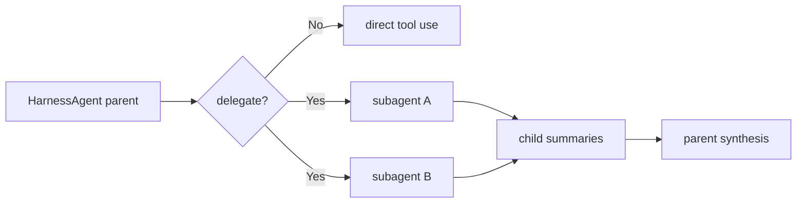

# Chapter 22: Subagent Orchestration

The project already has subagents.

In Chapter 13, you built the key primitive:

- the parent delegates a focused task
- the child gets its own local history
- the child returns a concise result

That was the right first step.

Now the harness needs to treat delegation as more than "one useful tool".

It needs to treat delegation as a bundled runtime behavior with clear rules.

That is the next step: **subagent orchestration**.

In the Chapter 17 architecture, this chapter spans more than one layer:

- the **execution kernel**, because the parent decides how work is split
- the **capability plane**, because delegation is an exposed operation
- the **control plane**, because scope, limits, and synthesis rules are policy

## What you will build

This chapter defines the harness-side orchestration model:

1. when the harness should delegate
2. how child scope should be controlled
3. how batching and concurrency should be reasoned about
4. how parent synthesis should work
5. how this extends the existing `SubagentTool` design instead of replacing it

Runtime surfaces matter here too.

A serious harness may want to expose:

- child task progress
- child summaries
- child-produced files or artifacts
- child token usage
- thread-safe handoff of results back to the parent

## Why orchestration is different from "having a subagent tool"

A tool definition can answer:

> "Can the parent call a child agent?"

But orchestration answers bigger runtime questions:

> "When should it do that?"
>
> "How many children should run?"
>
> "What should the parent keep for itself?"
>
> "How should results be combined?"

That is why orchestration belongs in the harness layer.

The harness should not only expose the mechanism.

It should also teach the operating pattern.

Two runtimes may both have a `task` tool, but only the stronger harness will
also define:

- when the parent should use it
- how many children are sensible
- how child scope is narrowed
- how results are merged back into the main thread

This is one of the biggest lessons from DeepAgents and DeerFlow.

The user should not need to type:

> "please use a subagent"

The lead agent should infer that from the task shape.

That is what orchestration means.

## Delegation is a context-management tool

One of the easiest ways to misunderstand subagents is to think they exist only
for parallelism.

Parallelism is useful, but it is not the whole story.

Subagents are also a way to control context growth.

A child agent can:

- do focused exploration
- spend tokens locally
- use tools multiple times
- return only the final summary

That means delegation is part of the same family of harness concerns as:

- context durability
- workspace management
- tool-universe management

And it often interacts with runtime surfaces such as progress events,
artifacts, or child-run telemetry.

All of them help the harness stay usable at larger scale.

## Mental model



The parent still owns the task.

The children own only bounded local subproblems.

That means subagents should feel like a structured extension of the parent
runtime, not a separate hidden world.

## When the harness should delegate

The first orchestration rule should stay simple and practical.

Delegate when the task is:

- multi-step
- locally self-contained
- likely to create a lot of local context
- narrow enough that the child can finish independently
- or one large branch of work that is cleaner to isolate even if there is only one child

Good examples:

- "Inspect `auth.py` and summarize the security risks."
- "Review the migration files and explain the schema change."
- "Write the fixture file and report where it was saved."
- "Research two approaches and summarize the tradeoffs."

Bad examples:

- "Read one file."
- "Ask the user which option they want."
- "Make one exact edit."

That rule stays very close to Chapter 13, but the harness now treats it as a
default operating policy.

That last point matters.

DeerFlow and DeepAgents both teach the lead agent to use delegation
proactively.

They do not wait for the user to ask for a subagent by name.

The current Python harness should follow that same idea:

- if a task naturally decomposes, delegate
- if one branch is large and context-heavy, one subagent may still be the right choice
- if the task is tiny, do it directly

## Child scope is the first safety boundary

The first line of subagent safety is not approval.

It is scope.

A child agent should receive:

- a clear goal
- a narrow scope
- the smallest useful tool set
- a turn limit

That is already part of the current `SubagentTool` design, and it should remain
part of the harness design too.

This is important because orchestration should extend existing patterns, not
introduce a second incompatible subagent model.

In practice, this is also where many harnesses set limits such as:

- max concurrent children
- max depth of delegation
- default child tool profile
- whether child output is returned inline or saved as a file or artifact

## Parent responsibilities

Once the harness treats delegation as orchestration, the parent gains a clearer
set of responsibilities.

The parent should:

- decide whether delegation is useful
- define the child brief
- choose the child tool scope
- launch one or more child tasks
- synthesize the child results
- decide whether another round is needed

This is a useful teaching shift.

In Chapter 13, the subagent tool showed how the child runs.

In the harness section, the focus shifts to how the **parent conducts the
overall workflow**.

That also means the parent prompt should speak in stronger terms than the
Chapter 13 primitive.

It should say:

- you are a task orchestrator
- you should decompose, delegate, and synthesize
- you should choose delegation proactively when it is the better execution strategy

## Batching and concurrency

Real orchestration often creates several possible child tasks.

For example:

```text
User: "Compare three implementation strategies and tell me which one fits this repo best."
```

The harness might want children for:

- strategy A analysis
- strategy B analysis
- strategy C analysis

This is where batching and concurrency enter the picture.

The first design lesson is simple:

- not every delegable task must become a child
- not every possible child must run at once

So the harness should eventually reason about:

- how many child tasks are worth spawning
- whether they are independent
- whether they can run in the same round
- whether they should be split into batches

The Python project does not need a heavy distributed execution system to teach
this concept.

It only needs clear orchestration rules.

## Why batching matters even in a simple runtime

Suppose the parent sees six child-worthy subtasks.

Launching all of them may be a bad idea because:

- the parent may lose synthesis discipline
- the runtime may become noisy
- some child work may depend on earlier results
- the CLI may become harder to follow

That means a harness should eventually have a notion of:

- maximum useful child concurrency
- sequential batches when needed

Even if the first Python reference keeps child execution simple, the chapter
should still define the orchestration mindset now.

## Synthesis is part of orchestration

Delegation is only half the pattern.

The parent also needs to combine child results into a coherent answer.

Good parent synthesis should:

- avoid replaying every raw child detail
- compare or combine the key findings
- decide what still needs direct parent action
- give the user one coherent result

This is why orchestration belongs to the harness instead of living only in the
child tool.

The parent is not just a launcher.

It is the coordinator and synthesizer.

## Task, subagent task, and todo list

These three terms are easy to mix together.

They should stay separate in the tutorial.

### 1. The user task

This is the overall request from the user.

Example:

> "Write four poems and store them in `outputs/`."

The parent harness always owns this task.

### 2. A subagent task

This is a delegated child brief.

Example:

> "Write the Ruby poem and save it to `outputs/ruby_poem.txt`."

A subagent task is one bounded slice of the user task.

It should be delegated only when that slice is worth isolating.

### 3. The todo list

The todo list is the parent's visible progress tracker.

It is not a child agent.

It is not a second plan document.

It is just a short runtime checklist such as:

- inspect the current code
- draft the plan
- edit the target file
- run the tests

In the Python harness, this is stored as small in-memory runtime state and
shown in the CLI as progress feedback.

That gives the tutorial a simple but useful teaching model:

- the parent owns the task
- subagents own delegated slices
- the todo list shows the parent's current execution picture

## How this extends the current codebase

The project already has:

- `SubagentTool`
- child system prompts
- scoped child toolsets
- turn limits

So the harness should not replace those ideas.

It should package them more intentionally.

A future `HarnessAgent` might add helpers such as:

```python
agent.enable_subagents(
    max_parallel_subagents=2,
)
```

Those do not create a new delegation system.

They package the existing one into the bundled runtime profile.

That keeps the architecture continuous.

## How orchestration interacts with context durability

Subagents are one of the strongest tools for context durability.

Instead of pulling a large branch of work into the parent thread, the harness
can keep that branch local to the child and receive only the summary.

That means:

- subagents reduce local context pressure
- compaction reduces temporal context pressure

Those two features complement each other.

The harness should treat them as part of the same broader runtime goal:

keep the active parent context focused and manageable.

## How orchestration interacts with the workspace

If the harness has a workspace/sandbox model, the parent should be able to give
children tool scopes and workspace expectations too.

For example:

- one child may be read-only
- another child may be allowed to write only in a scratch area
- another child may be allowed to edit a specific file family

That is why orchestration should be taught after workspace and sandbox
boundaries are defined.

Good delegation relies on clear operating boundaries.

## How orchestration interacts with memory

Memory can inform delegation strategy.

Examples:

- "This project prefers small focused changes."
- "The user likes concise comparative summaries."

But memory should not replace orchestration rules.

The harness still needs explicit runtime policy for:

- when to delegate
- how much to delegate
- how to synthesize results

Memory informs those decisions.

The harness runtime still owns them.

## What not to do

Avoid these weak orchestration designs.

### 1. Delegate everything

If every task becomes a child task, the parent becomes useless overhead.

### 2. Give every child the full tool universe by default

That weakens scope and makes errors more likely.

### 3. Ignore synthesis

Returning a pile of child summaries is not orchestration. It is only fan-out.

### 4. Confuse subagents with general concurrency

Sometimes direct tool calls are still the better choice for small parallel work.

### 5. Let children recurse without a clear reason

The first harness design should stay conservative here.

## A realistic first milestone

The first concrete implementation milestone after this chapter should be:

1. add bundled subagent support to `HarnessAgent`
2. define the default delegation rules in prompt and runtime shape
3. keep child scope narrow and explicit
4. expose a simple concurrency or batching policy

That is enough to make delegation feel like part of the harness, not just one
optional advanced tool.

The current Python implementation should now make that concrete:

1. `HarnessAgent.enable_subagents(...)` adds the bundled `subagent` tool
2. the execution prompt gets an orchestration section with a visible child-call limit
3. child tools default to a narrow core profile such as `read`, `write`, `edit`, `bash`
4. child scope can be narrowed explicitly with `tool_names=[...]`
5. the parent runtime accepts only a small number of subagent calls per turn
6. extra child calls are rejected with a clear runtime notice
7. the CLI distinguishes "subagent capability available" from actual "subagent started" and "subagent finished" notices
8. the harness keeps a short `write_todos` list so progress is visible even when no child is running

That is a strong first orchestration slice for this project.

## What the implementation should look like

The cleanest way to extend the current codebase is:

```python
agent = (
    HarnessAgent(provider)
    .enable_core_tools(handler)
    .enable_subagents(
        max_parallel_subagents=2,
    )
)
```

If the parent wants a narrower child profile:

```python
agent.enable_subagents(
    tool_names=["read", "bash"],
    max_parallel_subagents=2,
)
```

This keeps the API aligned with the rest of the harness:

- explicit builder methods
- visible runtime defaults
- no hidden orchestration service

## The first concurrency policy

The first Python implementation does **not** need a complex scheduler.

It only needs one clear rule:

- in one parent turn, run at most `N` subagent calls

If the model emits more than that in one response:

- execute only the first `N`
- return an error result for the rest
- emit a notice so the user can see the limit was applied

This teaches batching without adding a large orchestration subsystem.

## What the user should see in the CLI

This is an important runtime-design point.

A user should be able to tell the difference between:

- subagent support is available
- the parent is working directly
- a child task has actually started
- a child task has finished

So the CLI should surface different signals:

- a capability notice at startup
- a visible `write_todos` task list
- `subagent started ...` notices when delegation really happens
- `subagent finished ...` notices when results come back
- end-of-turn todo completion so finished work does not stay stuck as `in_progress`

Without that distinction, a user may wrongly assume delegation happened when
the parent only used direct tools.

That exact confusion is common in real agent UIs.

## Child scope in the current implementation

The most important runtime control is still child scope.

So the current harness should make child scope explicit through the tool list:

- default child scope: bundled core tools
- narrower child scope: caller passes a smaller `tool_names` list
- no recursive `subagent` tool inside children by default
- no `ask_user` inside children by default

That is a good first orchestration policy because it keeps children useful
without letting them become uncontrolled copies of the parent.

## Conservative planning-mode policy

The current harness should stay conservative in planning mode.

That means the bundled `subagent` tool should remain unavailable there unless
you intentionally design a read-only planning-child policy later.

This is a good tutorial tradeoff:

- execution mode gets real orchestration
- planning mode stays easy to reason about

The current Python harness adds one useful exception:

- planning mode may still update the internal todo list with `write_todos`

That is safe because it changes only runtime state, not the user's files.

## Recap

Subagent orchestration is the harness feature that turns delegation from a
mechanism into an operating pattern.

The key ideas are:

- delegate focused, context-heavy, self-contained work
- keep children narrowly scoped
- reason about batching and concurrency
- treat synthesis as part of orchestration
- build on the current `SubagentTool` design instead of replacing it

This gives the harness a much stronger way to stay effective on larger tasks.

## What's next

In [Chapter 23: Tool Universe Management](./ch23-tool-universe-management.md)
you will look at another scale problem: how the harness should manage a large
tool catalog without flooding every prompt.
