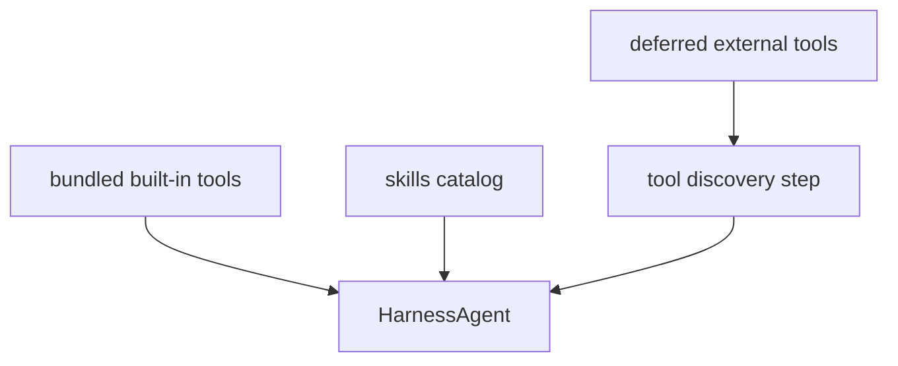

# Chapter 23: Tool Universe Management

The first agent chapters used a tiny tool set.

That was the right place to start.

But a serious harness eventually wants access to more than a handful of built-in
functions.

It may need:

- core local tools
- project-local skills
- search tools
- MCP tools
- later, domain-specific external integrations

At that point a new scale problem appears:

> how should the harness expose many tools without overwhelming the model?

This chapter calls that problem **tool universe management**.

In the Chapter 17 architecture, this chapter belongs mainly to the
**capability plane**, but it also touches runtime surfaces and the control
plane.

It is about capability at scale.

## What you will build

This chapter now implements the next harness capability:

1. a split between always-visible bundled tools and deferred external tools
2. a `tool_search` helper for discovering and activating deferred tools
3. a runtime notice that makes the tool universe visible in the CLI
4. a concrete first use of MCP as deferred external tools
5. a clean path to grow this later without changing the harness shape again

The architectural boundary is:

- built-in tools, external tools, and skills are part of the capability plane
- deferred discovery and visibility policy are harness responsibilities
- approvals and sensitive-tool rules belong to the control plane
- tool listings, searchable catalogs, and presented results are runtime
  surfaces layered around the tool universe

## Why a large tool universe is hard

If you inject every possible tool into every request, several things get worse:

- the prompt grows
- tool selection gets noisier
- the model sees too many irrelevant schemas
- reliability drops

This is especially true when external tool systems appear.

For example:

- one project may expose a handful of MCP tools
- another may expose dozens
- a future system may expose hundreds

A harness cannot treat that the same way it treats five built-in tools.

It needs a management strategy.

## Mental model



The important idea is:

- some tools are always visible
- some tools should only become fully visible when the runtime needs them

That is the heart of tool-universe management.

That pattern matters even more once the harness gains richer built-ins such as:

- image-view tools
- artifact-presentation tools
- setup or configuration helpers
- search tools for the tool catalog itself

## The three layers of the tool universe

The cleanest first design is to think in layers.

### Layer 1: bundled built-ins

These are the tools the harness always expects to have.

Examples:

- `read`
- `write`
- `edit`
- `bash`
- `ask_user`
- `subagent`

They are small in number and central to the runtime.

### Layer 2: local extensions

These are project-level or user-level additions the harness may want to expose
more selectively.

Examples:

- skills
- project utility tools
- repo-specific helpers

### Layer 3: external or deferred tools

These are tools from a larger external universe.

Examples:

- MCP-loaded tools
- remote service integrations
- large plugin catalogs

These are the hardest layer to expose well.

## Why skills are related but different

Skills are part of tool-universe management, but they are not the same thing as
tools.

Skills do not primarily expand the function catalog.

They expand the workflow vocabulary of the agent.

That means skills and tools work together:

- skills help the model decide *how* to work
- tools let the model decide *what operation* to call

So the harness should think about both together, but not collapse them into one
mechanism.

If the book collapses skills, tools, MCP, and search into one bucket, the
runtime becomes harder to reason about and harder to implement cleanly.

This is why the current project was right to give skills their own chapter and
their own prompt section.

## Why MCP belongs here

MCP is one major way the tool universe gets larger.

It gives the runtime a way to connect to external tool providers and external
resource systems.

That is powerful, but it also means:

- the tool catalog may become much larger
- some tools may be rare or domain-specific
- the agent may not need all schemas up front

So once MCP enters the system, tool-universe management stops being optional.

The harness needs a deliberate exposure strategy.

## Deferred tool discovery

One strong pattern for large tool catalogs is:

- expose only lightweight metadata first
- load the full schema only when the tool becomes relevant

This is sometimes called deferred tool discovery or progressive tool loading.

The runtime might first show:

- tool name
- short description

Then later, when the model decides the tool may be relevant, the harness can
load or reveal the full callable schema.

This is conceptually similar to how skills already use progressive disclosure.

That is why this pattern fits the harness section so naturally.

In a richer harness, the discovery step may itself be a runtime surface:

- a searchable catalog
- a filtered tool list for the current task
- a presented explanation of why certain tools were chosen

## Why deferred discovery belongs to the harness

This policy should not live inside every individual tool adapter.

It belongs to the harness because it is about:

- prompt size
- runtime scaling
- relevance filtering
- predictable tool exposure

Those are harness concerns.

The harness should decide:

- which tools are always visible
- which tools are searchable but deferred
- how many tool schemas to expose at once

That is much cleaner than scattering the logic across many adapters.

## The Python implementation in this chapter

The Python harness now implements a first real slice of this design.

The runtime shape is:

```text
HarnessAgent
├── bundled core tools
├── skill catalog metadata
├── optional MCP registry
└── deferred external tools + tool_search
```

The key design choice is:

- bundled tools stay visible
- MCP tools may be deferred
- `tool_search` becomes the bridge between the active tool set and the wider catalog

That keeps the runtime small without losing access to the larger tool universe.

## `tool_search`

The first built-in discovery helper is:

```text
tool_search(query="...")
```

Its job is simple:

1. search deferred external tools by capability words
2. show matching tool names and descriptions
3. activate selected tools for the current run

The activation flow is:

```text
tool_search("docs")
-> see matching tools
tool_search("select:docs_lookup")
-> selected tools become callable in the next turn
```

This is intentionally simple.

The tutorial runtime does not need a huge plugin host to teach the core idea.

## Why MCP is the first deferred layer

MCP is already the largest external catalog in the current project.

So Chapter 23 uses MCP as the first deferred tool family:

- when tool-universe management is off, MCP tools are exposed eagerly
- when it is on, MCP tools are registered as deferred external tools instead
- the model sees `tool_search`, not every MCP schema up front

That gives the harness a real scaling behavior without changing the rest of the
agent loop.

## A good first mental model for the Python project

The lightweight Python project does not need to implement the whole external
tool universe immediately.

But it should still define the right model now.

The runtime API now looks like:

```text
HarnessAgent
├── bundled core tools
├── skill catalog
├── optional MCP registry
└── deferred tool discovery helper
```

And the first concrete builder method is:

```python
agent = (
    HarnessAgent(provider)
    .enable_core_tools(handler)
    .enable_default_mcp(cwd=Path.cwd())
    .enable_tool_universe_management()
)
```

That keeps the architecture easy to explain.

The first implementation can stay minimal while still pointing toward a serious
runtime shape.

## How this interacts with context durability

Large tool catalogs and long histories create a similar failure mode:

- too much low-value material in the active prompt

Context durability reduces prompt bloat across time.

Tool-universe management reduces prompt bloat across capability space.

That parallel is worth noticing.

Both are ways the harness protects the model from unnecessary noise.

## How this interacts with memory

Memory can help the harness make better tool decisions.

Examples:

- "this project frequently uses HTTP-based tools"
- "this user prefers local tools first"

But memory should not replace tool-universe policy.

The harness still needs an explicit runtime design for:

- tool visibility
- tool discovery
- deferred schema loading

Memory may influence those choices, but it should not stand in for them.

## How this interacts with subagents

A large tool universe may be especially useful for child agents.

For example:

- the parent may work mostly with bundled tools
- a specialized child may load a narrower external tool family

This is another reason tool-universe management belongs to the harness.

The harness should eventually be able to reason not only about:

- which tools exist

but also:

- which tools belong in which agent role

That makes orchestration stronger too.

## A likely future shape in this project

The future Python project may want small runtime helpers such as:

```python
agent.enable_mcp()
agent.defer_external_tools()
agent.max_visible_external_tools(5)
```

Those names are only sketches.

The more important idea is that the harness should be able to express:

- built-in tool defaults
- external tool catalogs
- deferred exposure strategy

without losing the current builder style.

## What not to do

Avoid these weak designs.

### 1. Dump every tool schema into every prompt

That does not scale.

### 2. Treat skills and tools as the same mechanism

They are related, but they solve different problems.

### 3. Put tool-universe policy inside the CLI

This belongs to the runtime layer.

### 4. Make deferred discovery so complex that the basic model disappears

The Python project should stay explainable.

## What the runtime now does

The current Python implementation now makes this concrete:

1. bundled tools remain the stable always-visible layer
2. the harness can build a deferred external-tool registry
3. `tool_search` can search and activate deferred tools during a run
4. MCP becomes the first deferred external-tool family
5. the CLI gets a `Tool universe ready: ...` notice so the user can see that this layer exists

That is enough to give the harness a scalable first capability model.

## Recap

Tool-universe management is the harness feature that keeps the capability space
scalable.

The key ideas are:

- separate bundled built-ins from the wider tool world
- treat skills, MCP, and external tools as distinct but related layers
- use deferred discovery when the tool catalog gets large
- let the harness own tool exposure policy centrally

This is how the runtime grows beyond a tiny local tool set without drowning the
model in irrelevant schemas.

## What's next

In [Chapter 24: Control Plane](./ch24-control-plane.md) you will define the
last major bundled harness layer: the runtime rules that govern clarification,
approval, verification, loop detection, and auditability.
