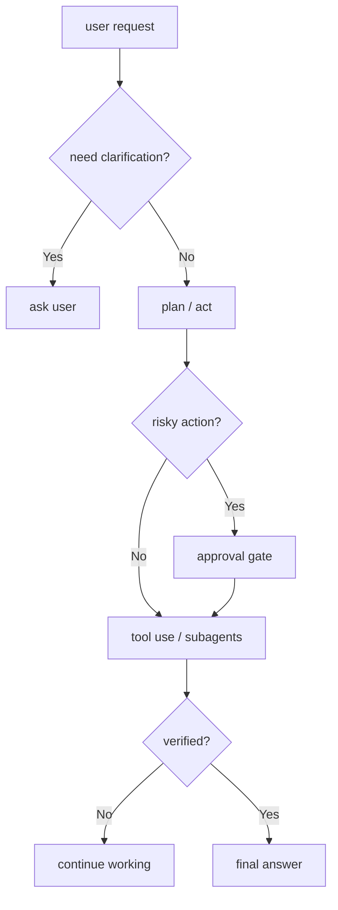

# Chapter 24: Control Plane

By now, the harness has accumulated a serious amount of capability:

- core tools
- context durability
- memory
- workspace rules
- delegation
- tool-universe management

That is powerful.

But capability alone is not enough.

A serious harness also needs a way to govern how the runtime behaves while it is
working.

That is the job of the **control plane**.

In the Chapter 17 architecture, this chapter is the clearest example of the
**control plane** itself.

This is the part of the harness that decides:

> "Under what rules should the agent be allowed to continue, pause, ask,
> verify, or stop?"

## What you will build

This chapter now implements the first real control-plane slice:

1. clarification-first rules in the harness prompt
2. approval gates for risky overwrites and risky shell commands
3. verification warnings before the agent finalizes mutated work
4. loop detection for repeated identical tool calls
5. an audit log of important runtime control decisions

These rules are not just safety decoration.

They are what turns a capable harness into a governable one.

They also depend on information from the other planes:

- capability plane tells the harness what actions are possible
- state plane tells it what has already happened
- environment plane tells it where those actions would occur
- runtime surfaces expose the resulting decisions to users and operators

## What the control plane means here

In this book, the control plane is the runtime policy layer that answers
questions like:

- when should the harness ask before acting?
- when should it stop and request approval?
- when is work really finished?
- how should it react when it is stuck?
- what record of important actions should exist?

Those are not tool definitions.

They are runtime decisions about how the harness should operate.

## Mental model



This is the "dashboard, brakes, and instrumentation" layer of the harness.

A modern harness often makes control-plane behavior visible through runtime
surfaces such as:

- clarification requests
- approval prompts
- task status events
- loop warnings
- token and action traces
- audit logs

## Why the control plane belongs in the harness

You could try to push these rules into:

- the prompt alone
- the CLI
- each individual tool

But none of those is the right home.

### Prompt alone is too weak

The model may ignore or inconsistently apply soft instructions.

### CLI is the wrong abstraction level

The UI is only one consumer of the runtime.

### Individual tools are too local

Clarification, approval, and verification are cross-cutting runtime concerns.

That is why the harness should own them.

The control plane is one of the clearest examples of what makes a harness more
than "an agent with many tools".

Two agents can have the same tools and still behave very differently if only
one of them has a serious control plane.

## Clarification rules

The first control-plane rule should be:

> do not act on ambiguous or incomplete requests as if they were clear

That sounds obvious, but it is one of the most common failure modes in agentic
systems.

Examples:

- "Deploy this" without an environment
- "Make it better" without a concrete goal
- "Add auth" with multiple valid approaches

The harness should not just hope the model asks.

It should treat clarification as a runtime norm.

That means the runtime should have a clear path for:

- recognizing missing information
- pausing execution
- routing a question back to the user

The current project already has `AskTool`.

The harness should treat that capability as part of a broader clarification
policy, not just as a raw tool.

That is a good example of the relationship between planes:

- `ask_user` is a capability
- "when must the agent ask?" is control-plane policy

The first Python implementation keeps clarification lightweight:

- the control plane strengthens the clarification-first prompt rule
- risky runtime approvals also use `ask_user`

That keeps the first version simple while still making clarification a policy,
not just a tool that may or may not be used.

## Approval rules

Some actions are more risky than others.

Examples:

- destructive shell commands
- deleting files
- overwriting important configuration
- writing outside the intended workspace

The harness should eventually have a policy for:

- which actions are normal
- which actions require explicit approval

This does not need to be complicated in the first version.

A simple approval model is already valuable because it creates a visible
boundary between:

- routine work
- risky work

That is one of the most important control-plane distinctions.

The Python harness now implements two concrete approval gates:

- overwrite an existing file with `write`
- run a risky shell command such as `rm`, `git reset --hard`, or `sudo`

When approval is needed, the runtime asks the user directly and records the
decision in the audit log.

## Verification before exit

One of the easiest agent failures is premature completion.

The model writes code, sounds confident, and stops.

But the work is not really done until it has been checked against the task.

That means the harness should gradually adopt a norm like:

- implement
- verify
- only then finalize

Verification can mean:

- rerunning the tests
- checking the edited file
- confirming output existence
- validating the expected change actually happened

This is different from approval.

Approval asks:

> "May I do this risky thing?"

Verification asks:

> "Did the intended work really succeed?"

That distinction matters.

The current Python control plane keeps the first slice intentionally modest:

- it does not hard-stop the agent for missing verification
- it emits a visible warning before finalizing mutated work without a clear
  verification step
- it records that warning in the audit log

## Loop detection

Another common runtime failure is repetition.

Examples:

- reading the same file repeatedly without progress
- rerunning the same failing command without a new hypothesis
- asking the same question in different words
- bouncing between the same two states

The harness needs a way to recognize when execution is stuck.

The first version does not need advanced behavior prediction.

It only needs the right policy direction:

- detect repetitive patterns
- stop blind repetition
- either change strategy or surface the blocker

In practice, loop detection often benefits from observability signals such as:

- repeated tool calls
- repeated command failures
- repeated clarification loops
- unusual token growth without task progress

The Python harness now implements a simple deterministic loop check:

- hash the tool name plus arguments
- count repeated identical calls in a short runtime window
- warn first
- then block the repeated call when the hard limit is reached

That alone makes the runtime much stronger.

## Auditability

A serious harness should leave a useful trail of important actions.

That does not mean a giant observability platform in the first Python version.

It simply means the runtime should make important behavior visible enough to
inspect and reason about.

Examples of auditable events:

- asked for clarification
- requested approval
- ran a risky command
- compacted context
- delegated to a child
- produced a final output

In a more mature harness, auditability may also include:

- where outputs were written
- which artifact was presented to the user
- which child produced which result
- how much usage the run consumed

This matters for:

- debugging
- trust
- testing
- later UI improvements

The current Python runtime now records audit entries for:

- clarification or approval prompts
- approval granted or denied
- loop warnings and loop blocks
- mutation steps
- verification observations and verification warnings

Auditability is another good example of a harness concern that sits above any
one tool.

## How this interacts with the workspace

Approval policy becomes much stronger when the workspace boundary is clear.

For example:

- editing inside the workspace may be normal
- editing outside it may require approval
- deleting output files may be considered risky

That is why the workspace chapter comes before the control-plane chapter.

The control plane becomes more precise when the operating boundary is already
defined.

## How this interacts with memory

Memory may tell the harness things like:

- "the user prefers confirmation before destructive work"
- "always run tests when practical"

That is useful.

But memory should not be the mechanism that enforces those runtime rules.

The control plane still owns:

- when to ask
- when to approve
- when to verify

Memory can inform policy.

The control plane enforces policy.

## How this interacts with subagent orchestration

Delegation creates its own control-plane questions.

Examples:

- should a child be allowed to ask the user directly?
- should a child be allowed to perform risky writes?
- should the parent verify child outputs before using them?

The first harness design should stay conservative here.

A good initial rule is:

- the parent owns user-facing clarification
- the child works within a bounded delegated brief

That keeps orchestration and control aligned.

## The runtime shape in this project

The Python project now exposes the control plane through one builder:

```python
agent.enable_control_plane()
```

That method bundles the first control-plane policy set while keeping the same
builder style as the rest of the harness.

The more important point is structural:

- these are harness-level features
- they should layer on top of the current builder style
- they should remain understandable as explicit runtime policies

## What not to do

Avoid these weak designs.

### 1. Treat the control plane as only prompt text

Prompt text helps, but it is not enough.

### 2. Put every policy inside the CLI

The harness runtime should stay reusable across interfaces.

### 3. Merge clarification, approval, and verification into one vague concept

They are related, but they solve different runtime problems.

### 4. Allow endless retries without detecting repetition

That makes the runtime look active while actually being stuck.

## What the runtime now does

The current Python implementation now makes this concrete:

1. `enable_control_plane()` adds the control-plane prompt section
2. risky overwrites and risky shell commands ask for approval
3. repeated identical tool calls are warned, then blocked
4. final answers after mutation warn when no clear verification step happened
5. audit entries can be inspected from the CLI

That is enough to establish a real control plane without making the runtime too
heavy too early.

## Recap

The control plane is the harness layer that governs how capability is used.

The key ideas are:

- ask when the request is unclear
- require approval for risky operations
- verify before claiming success
- stop blind repetition when the runtime is stuck
- make important actions visible enough to inspect

This is the final bundled layer that turns a capable harness into a governable
runtime.

## What's next

At this point the harness section has a full implemented roadmap:

- bundled core tools
- context durability
- memory
- workspace and sandbox
- subagent orchestration
- tool-universe management
- control plane

The next step is to keep refining these runtime policies as the harness grows.
