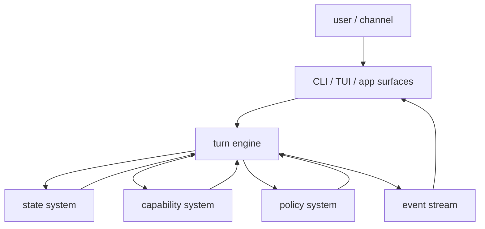
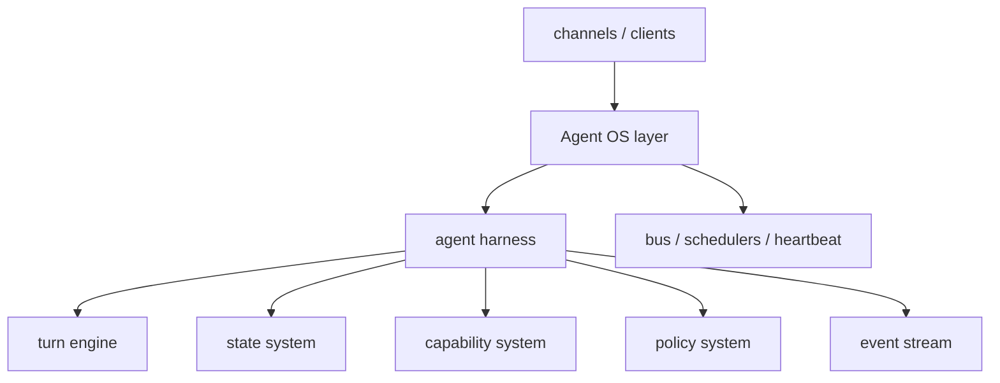

# Chapter 25: Agent-Native Harness Architecture

By Chapter 24, the harness is no longer a toy.

It already has:

- bundled core tools
- context durability
- memory
- workspace rules
- subagent orchestration
- tool-universe management
- control-plane behavior

That creates a new problem.

The problem is no longer:

> "How do I add one more feature?"

The problem becomes:

> "What is the right architecture for an agent runtime?"

That is an important shift.

If we answer that question badly, the project starts to feel like a random pile
of modules.

If we answer it well, the project can grow from a tutorial harness into the
core of a larger agent system later.

This chapter is about that architecture.

## Why the last mental model was too weak

One tempting design is to think about the harness like a web service:

- request comes in
- middleware runs
- response goes out

That is too shallow for an agentic runtime.

An agent harness is not mainly an HTTP request pipeline.

It is mainly a **stateful turn runtime**.

It repeatedly does something more like this:

1. receive a user turn
2. load and shape state
3. ask the model what to do next
4. execute capabilities
5. update state
6. emit events
7. decide whether to continue, pause, or stop

That means the architecture should be centered on the **turn engine**, not on
middleware.

Middleware is still useful.

But it should not be the headline architecture.

## The right center of gravity

The cleanest definition for this project is:

> An agent harness is a stateful runtime that repeatedly plans, acts, observes,
> updates state, and emits events under policy control.

That is a much better fit for:

- DeerFlow-style harnesses
- DeepAgents-style harnesses
- the path toward a later Agent OS

This chapter introduces a more agent-native structure with seven parts:

1. turn engine
2. state system
3. capability system
4. policy system
5. event stream
6. surfaces
7. Agent OS boundary

## The agent-native architecture



This diagram puts the right thing in the middle:

- not middleware
- not tools
- not the model alone

The center is the runtime that drives a turn.

## 1. Turn engine

The **turn engine** is the heart of the harness.

It owns the repeated execution cycle:

- accept user input
- construct active context
- call the model
- interpret tool calls
- run tools
- launch subagents
- merge results
- decide continue, ask, pause, or stop

This is the most important architectural unit in the harness.

If the turn engine becomes too large, the harness becomes hard to reason about.

So the turn engine should stay focused on orchestration.

It should not become the place where every feature stores its own logic.

## 2. State system

An agent harness is stateful.

That state is not one thing.

It is a family of state stores the turn engine reads and writes while work is
happening.

Examples:

- live conversation history
- compacted context
- long-term memory
- todo state
- workspace state
- outputs and artifacts
- thread or session state
- token-usage state

This is one of the most important differences from a simple agent loop.

A simple agent can often get away with:

- one list of messages

A harness cannot.

It needs a real state system.

### Why state should be explicit

If memory, todos, outputs, and token tracking are hidden inside random runtime
fields, the harness becomes fragile.

So this book should start thinking in terms of explicit state subsystems.

For example:

- `context state`
- `memory state`
- `todo state`
- `workspace state`
- `telemetry state`

That does not mean over-engineering.

It means naming the state clearly.

## 3. Capability system

The harness also needs a clean model of what it can do.

That is the **capability system**.

This is broader than "a list of tools".

It includes:

- built-in tools
- MCP tools
- skills
- subagents
- multimodal capabilities later

This system answers questions like:

- what capabilities are always available?
- which ones are deferred?
- which ones are scoped to subagents?
- which ones are visible in the prompt?
- which ones require policy checks?

So the capability system is where the harness becomes a real operating
environment rather than a raw tool bag.

## 4. Policy system

The harness also needs a place for runtime rules.

That is the **policy system**.

This includes:

- clarification policy
- approval policy
- verification policy
- loop and stall policy
- safety/trust profiles

This is where `policy profiles` belong.

For example:

- `safe`
- `balanced`
- `trusted`
- `review_only`

These profiles are not UI details.

They are not middleware by themselves either.

They are runtime rules that shape how the turn engine is allowed to act.

So the policy system should be treated as one of the core architecture layers.

## 5. Event stream

This is the part many simple agent tutorials miss.

A serious harness should not only do work.

It should also **emit events while work is happening**.

Examples:

- thinking started
- tool called
- subagent started
- subagent finished
- todo updated
- memory updated
- approval requested
- clarification requested
- context compacted
- turn completed

This is extremely important for an agentic runtime.

Why?

Because multiple surfaces may want to observe the same run:

- CLI
- TUI
- later web UI
- logs
- audit views
- maybe background dashboards later

So the harness should think in terms of:

- runtime does work
- runtime emits events
- surfaces render those events

That is much closer to real agent systems than a web-style response pipeline.

## 6. Surfaces

Surfaces are the places where users and operators see the harness.

Examples:

- CLI
- TUI
- later web app
- audit view
- status panel

These are not the runtime itself.

They are consumers of runtime state and runtime events.

That distinction matters.

If the CLI owns too much logic, the harness becomes hard to reuse.

So a better design is:

- the runtime decides and emits
- the surfaces observe and render

## 7. The Agent OS boundary

The harness is not the whole future system.

That is another important design boundary.

A later **Agent OS** layer can sit around the harness and provide wider runtime
infrastructure such as:

- channels
- gateway APIs
- message bus
- schedulers
- cron jobs
- heartbeat tasks
- background workers
- session registry

Those are important.

But they should not be forced into the harness too early.

The harness should stay the **single-agent runtime core**.

That is the cleanest path toward a larger system later.



## Where configuration belongs

Yes, this project also needs a real `config` layer.

That layer should be explicit.

It should not be scattered across:

- environment lookups
- CLI defaults
- random constructor arguments
- hard-coded module constants

### What config should cover

The harness needs configuration for things like:

- model/provider defaults
- workspace paths
- MCP server discovery
- memory paths
- policy profile selection
- token budgets
- context-compaction thresholds
- subagent limits
- UI rendering defaults

That means `config` is not just "some helper values".

It is the place where runtime profiles become concrete.

### Config is not policy

This distinction matters too.

- config selects values
- policy interprets rules

For example:

- config may say `profile = "safe"`
- policy defines what `safe` means at runtime

Or:

- config may say `max_parallel_subagents = 2`
- the turn engine enforces that limit

So config should stay separate from policy logic.

## The first flat refactor

This book should not jump straight from a flat tutorial layout into a deep
package tree.

That would make the code harder to read right when the runtime is becoming more
interesting.

So the first refactor should stay flat.

That is the approach the Python project should take first:

- keep `harness.py` as the main runtime file
- add `events.py` for runtime event types
- add `config.py` for harness assembly defaults
- keep state and capability modules flat until they become too large

That gives us a cleaner architecture without sacrificing readability.

### Why `events.py` comes first

The harness already emits a real runtime stream:

- text deltas
- tool-call notices
- memory notices
- subagent notices
- control-plane notices
- completion and error events

So `events.py` is a natural first extraction.

It makes the event model explicit without changing the learning flow.

### Why `config.py` comes first

The harness CLI was already assembling a large runtime profile:

- core tools
- workspace
- memory
- context durability
- subagents
- MCP
- tool-universe management
- skills
- control plane

That is exactly the point where configuration should stop being an ad hoc chain
inside the app entrypoint.

So `config.py` should become the place for:

- default runtime profile selection
- path defaults
- feature toggles
- runtime thresholds and limits

That is a clean first architectural step.

## Where middleware fits now

Now we can place middleware in the architecture without giving it too much
importance.

Middleware is an **internal extension mechanism** around turn-engine lifecycle
points.

That is useful.

But it is not the architecture center.

A good rule is:

- turn engine = the runtime driver
- state/capability/policy/config = core systems
- event stream = observation layer
- middleware = reusable cross-cutting runtime behavior

So middleware is still valid.

It is just not the main story.

## Good middleware candidates

Once the architecture is framed correctly, middleware becomes much easier to
place.

Good candidates:

- token-usage tracing
- memory update triggering
- context compaction
- audit-event emission
- progress notices
- approval interception
- clarification interception
- loop-pattern detection

These are cross-cutting behaviors around the turn engine.

That is a good use of middleware.

## What should not be reduced to middleware

These should stay first-class systems:

- workspace
- MCP registry
- subagent runner
- todo store
- memory store
- policy profiles
- event stream
- config profiles

Those are bigger than hook-attached behavior.

They are part of the harness structure itself.

## Flat now, structured later

The current project is still intentionally flat.

That was the right decision while the tutorial was building the ideas one by
one.

So the immediate code shape can stay like this:

```text
mini_claw_code_py/
  agent.py
  config.py
  context.py
  control_plane.py
  events.py
  harness.py
  mcp.py
  memory.py
  skills.py
  subagent.py
  todos.py
  tool_universe.py
  workspace.py
```

That is still easy to read.

But the target architecture should now become clearer.

The folder shape I recommend is:

```text
mini_claw_code_py/
  __init__.py

  core/
    types.py
    prompts.py
    providers/

  runtime/
    harness_agent.py
    turn_engine.py
    events.py
    session.py

  state/
    context.py
    memory.py
    todos.py
    workspace_state.py
    artifacts.py
    telemetry.py

  capabilities/
    builtins.py
    tools/
    skills.py
    mcp.py
    subagents.py
    tool_universe.py
    workspace.py

  policy/
    profiles.py
    clarification.py
    approvals.py
    verification.py
    loop_control.py

  config/
    models.py
    defaults.py
    loader.py

  surfaces/
    notices.py
    cli.py
    tui.py
    audit_view.py
    status_view.py

  internal/
    hooks.py
    middleware/
      token_usage.py
      memory_updates.py
      context_compaction.py
      approvals.py
      clarification.py
      audit.py
```

This deeper structure is a **target shape**.

It does not mean the tutorial should refactor into all of this immediately.

It means future moves should trend in this direction.

## Why this folder shape is more agent-native

This layout matches the real runtime concerns better.

### `runtime/`

This is the turn-centered execution core.

That is where the harness should feel alive.

### `state/`

This makes durable runtime state explicit.

That is crucial for agent systems.

### `capabilities/`

This groups together the managed ability surface of the harness.

That is more honest than flattening everything into tools.

### `policy/`

This keeps runtime rules separate from both raw config and raw capabilities.

### `config/`

This gives the harness a clean place for runtime selection and environment
loading.

That will matter a lot once there are multiple profiles, surfaces, and entry
points.

### `surfaces/`

This makes it easier to support CLI, TUI, and later web or app shells without
pushing too much UI logic into the runtime.

### `internal/`

This is where hooks and middleware can live without pretending to be the entire
architecture.

That is the right size for them.

## Migration strategy

This should still happen gradually.

The tutorial should not collapse into a giant refactor.

The best path is:

1. define the target architecture
2. introduce `config`
3. introduce a small `events` model
4. move one or two cross-cutting behaviors behind middleware
5. extract stateful subsystems when they become too large

That keeps the project teachable.

## What this means for the next implementation steps

If the project follows this architecture, the next design moves become clearer.

### `token-usage tracing`

It should be thought of as:

- telemetry state
- runtime events
- surface rendering
- maybe middleware around model calls

Not just "one middleware".

### `policy profiles`

They should be thought of as:

- policy definitions
- selected through config
- enforced by the turn engine and cross-cutting helpers

Not just prompt text.

### `config`

It should become the next explicit module because the harness now has enough
runtime choices that ad hoc defaults are starting to become a liability.

## Recap

The most important correction in this chapter is:

- the harness should not be designed like a web-service middleware stack

It should be designed like a **stateful agent runtime**.

The clean architecture is:

- turn engine
- state system
- capability system
- policy system
- config system
- event stream
- surfaces
- later Agent OS boundary

Middleware still matters.

But now it has the right place:

- useful
- internal
- cross-cutting
- not the center of the architecture

That is a much stronger foundation for the next implementation chapters.

## What comes next

The next implementation step should not be a huge refactor.

The next good step is smaller and clearer:

1. introduce a `config` module
2. introduce an explicit runtime `events` model
3. then move one cross-cutting behavior into middleware only when it becomes
   worth extracting

That keeps the harness architecture agent-native while still preserving the
clarity of the tutorial.
