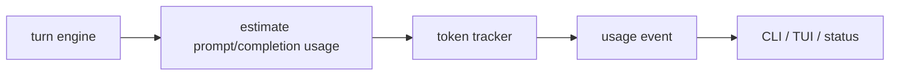

# Chapter 26: Token Usage Tracing

By Chapter 25, the harness has a clearer internal architecture:

- turn engine
- state
- capabilities
- policy
- config
- events
- surfaces

That makes the next runtime feature much easier to place.

This chapter adds the first slice of **token-usage tracing**.

## Why this matters

A serious harness should not only do work.

It should also help users understand the cost and size of that work while it is
happening.

That is especially important for long-running agent tasks because token growth
often explains:

- why context is getting compacted
- why responses are slowing down
- why subagent isolation helps
- why a task is becoming expensive

So token usage belongs to the harness as part of **observability**.

## What you will build

The first Python implementation keeps this intentionally simple:

1. estimate prompt tokens for each model turn
2. estimate completion tokens for the returned assistant turn
3. record those values in a runtime tracker
4. emit a visible runtime event
5. show cumulative usage in the CLI status view

This is not billing math.

It is runtime telemetry.

That distinction matters.

## Exact usage vs estimated usage

Some providers return token usage metadata.

Some do not.

Some return it for normal calls but not for streaming in the same way.

So the first harness implementation uses **estimated tokens**.

That is the right tradeoff for this tutorial:

- it works across providers
- it works in streaming mode
- it stays simple
- it is good enough for runtime visibility

Later, the harness can adopt provider-native token counts when available.

But the first architecture step is:

> make token usage visible at all

## Where token tracing lives

Token usage should not be treated as "just a CLI feature".

It spans several parts of the harness:

- estimation logic lives in a telemetry module
- runtime state lives in a token tracker
- turn execution records usage after each model turn
- runtime events surface the result
- CLI status renders the cumulative totals

That makes token tracing a very good example of the Chapter 25 architecture.

## Mental model



The important part is that token usage is now part of the runtime story, not
just a debug print.

## The Python design

The flat codebase adds one new module:

- `telemetry.py`

It contains:

- a per-turn token snapshot
- a cumulative token tracker
- simple token-estimation helpers

The harness then exposes:

- `enable_token_usage_tracing()`
- `token_usage_tracker()`

And the default harness config enables token tracing automatically.

## What gets estimated

The first version estimates:

- prompt tokens from active messages plus tool definitions
- completion tokens from the assistant turn text and tool-call payloads

That means the numbers are directional, not exact.

But they are still very useful.

For example, a status panel can now show:

- how many turns have run
- how large the prompt side is becoming
- how much output work the agent has produced

## Why this is enough for now

This chapter does not need:

- provider billing integration
- cost estimation in dollars
- per-subagent billing trees
- token budgets that hard-stop execution

Those are good future features.

But the first step should stay small and reliable.

## What the user sees

When tracing is enabled, the runtime emits a usage event after each model turn.

The CLI can render a line like:

```text
Token usage: turn 2, prompt~940, completion~83, total~1023, session~1841
```

And `/status` can render cumulative totals from the tracker.

That already makes the harness much easier to understand during real work.

## Why this chapter belongs after policy profiles

This order is important.

First we made the harness runtime more explicit.

Then we added policy profiles.

Now we add observability.

That sequence works well because token tracing can later support:

- context-durability decisions
- policy decisions
- UI warnings
- subagent comparison

So this chapter is the first telemetry slice, not the last one.

## Recap

The important design choices are:

- treat token usage as runtime telemetry
- use estimated tokens first
- record usage per turn
- keep cumulative totals in the harness
- surface usage through runtime events and status views

This is a small feature, but it is a very meaningful step toward a more serious
agent runtime.

## What comes next

Once token tracing exists, the next strong step is richer runtime events.

Right now the harness mostly emits general notices.

Later it should emit more structured events for things like:

- todo updates
- subagent lifecycle
- approvals
- memory updates
- compaction

That will make the harness easier to drive from CLI, TUI, and future app
surfaces.
