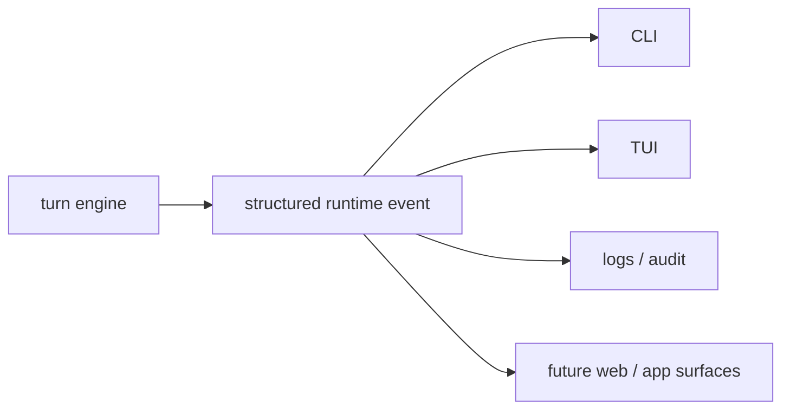

# Chapter 27: Runtime Events

By Chapter 26, the harness already emits useful runtime information:

- notices
- text deltas
- tool-call summaries
- token-usage updates

That is helpful.

But it still leaves one important problem:

too many different runtime situations are being flattened into generic text
notices.

This chapter fixes that direction.

It introduces the first real **structured runtime events** layer.

## Why this matters

If every runtime signal becomes a plain string, the harness quickly becomes hard
to drive from multiple surfaces.

A CLI may still cope.

But a TUI, web UI, log sink, or future app surface will want to know more than:

> "some message happened"

It will want to know:

- was this a todo update?
- was this an approval request?
- was this a subagent starting or finishing?
- was this a memory update?
- was context compacted?

That is why event structure matters.

## What you will build

This chapter adds the first structured event family for:

1. todo updates
2. subagent lifecycle
3. approval lifecycle
4. memory lifecycle
5. context compaction

The existing notice strings still remain for backward compatibility and simpler
CLI output.

But now the runtime also emits explicit event objects.

That is the important change.

## Mental model

The harness is no longer only "printing messages".

It is publishing runtime state transitions.

## The first structured event set

The Python project adds explicit event types such as:

- `AgentTodoUpdate`
- `AgentSubagentUpdate`
- `AgentApprovalUpdate`
- `AgentMemoryUpdate`
- `AgentContextCompaction`

This is not yet a complete event bus.

It is the first good slice.

## Why these events first

These are the most important runtime transitions users already care about:

- what tasks are active
- whether child work is running
- whether human approval is needed
- whether memory is being learned
- whether context was compacted

So this first event set immediately improves the harness without introducing a
large framework.

## Structured events vs notices

The project intentionally keeps both for now.

That is the right migration strategy.

Why?

Because the tutorial already has tests and CLI behavior built around readable
notice text.

So the runtime now does both:

- emit a structured event for machines and richer surfaces
- emit a readable notice for human-friendly compatibility

That lets the project improve without becoming confusing.

## Where these events are emitted

The turn engine emits them at the moments where runtime state changes:

- after `write_todos`
- when all todos are auto-completed at the end of a task
- when a subagent starts
- when a subagent finishes
- when approval is required, granted, or denied
- when memory is queued or updated
- when context compaction happens

That means the event stream is becoming a real runtime surface contract.

## Why this chapter follows token tracing

Token tracing was the first telemetry event slice.

This chapter generalizes the same idea:

- runtime changes should be emitted as structured data

That is the path from:

- ad hoc UI prints

to:

- a reusable runtime event model

## What this unlocks later

Once structured events exist, later surfaces become much easier to build:

- richer TUI panels
- better status views
- event filtering
- per-turn logs
- web socket streaming later
- multi-channel surfaces in a future Agent OS layer

That is why this chapter matters even though the code change is not huge.

It is an architectural step.

## Recap

The main design ideas are:

- notices are still useful, but they are not enough
- important runtime transitions should have explicit event types
- the first event set should cover the things users already watch closely
- backward-compatible notices can coexist during migration

This makes the harness more agent-native because it now behaves more like a
runtime emitting state transitions and less like a script printing strings.

## What comes next

The next strong step is to use these structured events more deeply in the
surfaces.

For example:

- a TUI could render todos, subagents, and approvals in dedicated panels
- a later web surface could subscribe to runtime events directly
- an Agent OS layer could forward these events onto a wider bus

That is the natural next direction once the event model is real.
