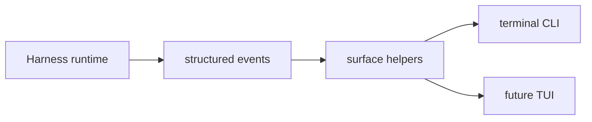

# Chapter 28: Runtime Surfaces

By Chapter 27, the harness emits structured runtime events.

That is a strong internal step.

But users do not consume internal event types directly.

They consume **surfaces**.

This chapter is about that final layer.

## What a runtime surface is

A runtime surface is the part of the system that turns runtime state and runtime
events into something a human can follow.

Examples:

- CLI output
- TUI panels
- audit views
- later web status widgets

The important idea is:

> the runtime emits state transitions, and surfaces render them

That keeps the architecture clean.

The runtime does not need to know whether the user is watching through:

- a plain terminal
- a richer TUI
- a web UI later

It only needs to emit meaningful events.

## What you will build

This chapter adds the first small `surfaces.py` module.

It keeps the code flat and tutorial-friendly, but gives the project a clean
place for:

- formatting structured runtime events
- rendering status blocks
- separating runtime semantics from terminal presentation

That is an important step.

It means the CLI is no longer just hand-formatting everything inline.

## Why this matters

Without a surface layer, the CLI quickly turns into a mixed file that is
responsible for:

- event semantics
- rendering rules
- duplicate suppression
- status layout
- terminal colors

That gets messy fast.

A small surface module solves that without introducing a full UI framework.

## Mental model



This is a very agent-native pattern:

- state transition happens
- event is emitted
- surface decides how to show it

## The first surface module

The Python project now adds:

- `surfaces.py`

This first module is intentionally small.

It contains:

- a `SurfaceBlock`
- `surface_block_for_event(...)`
- `render_surface_block(...)`
- `render_runtime_status(...)`

That is enough to improve the harness CLI a lot without making the project
heavy.

## Why blocks help

Many runtime events are easier to understand when rendered as small labeled
blocks.

Examples:

- todo updates
- approval prompts
- subagent lifecycle
- token usage

Instead of printing every message in the same style, the surface layer can now
render them like:

```text
[todo] 1/2 completed
Todo list:
- [x] Inspect
- [>] Edit
```

Or:

```text
[approval] required for write
Approval required: Overwrite existing file `a.py`?
```

Or:

```text
[subagent] started 1/2: inspect auth
```

That makes the runtime much easier to follow.

## Duplicate suppression

The runtime still emits plain notices alongside structured events during the
migration.

That means the surface layer also needs one practical behavior:

- suppress duplicate notice lines when a structured event already rendered the
  same message

This sounds small, but it matters a lot for perceived quality.

Without it, the CLI feels noisy even when the runtime design is correct.

## Why this chapter stays simple

This project still does not need:

- a full-screen TUI framework
- panel layout state machines
- markdown renderers
- theme configuration
- a dedicated event bus process

Those are possible later.

But the first good step is smaller:

- give runtime surfaces a real module
- make the CLI render structured events more clearly
- keep everything flat and readable

## How this connects to the architecture

This chapter is the practical follow-through of Chapter 25.

There we said the harness should have:

- events
- surfaces

Now it actually does.

That makes the architecture more than a diagram.

## Recap

The important ideas are:

- surfaces are separate from the runtime
- structured events should be rendered through small surface helpers
- labeled blocks are clearer than generic message lines
- duplicate suppression is part of surface quality
- a tiny `surfaces.py` module is enough for the first good step

This is not a huge chapter.

But it is a very meaningful one, because it makes the harness feel more like a
real application runtime and less like a stream of ad hoc prints.

## What comes next

The next clean direction is to use the same surface model in a richer harness
TUI.

That would let the project render:

- a persistent todo panel
- active subagent progress
- approvals
- token usage
- audit summaries

without changing the runtime model again.
