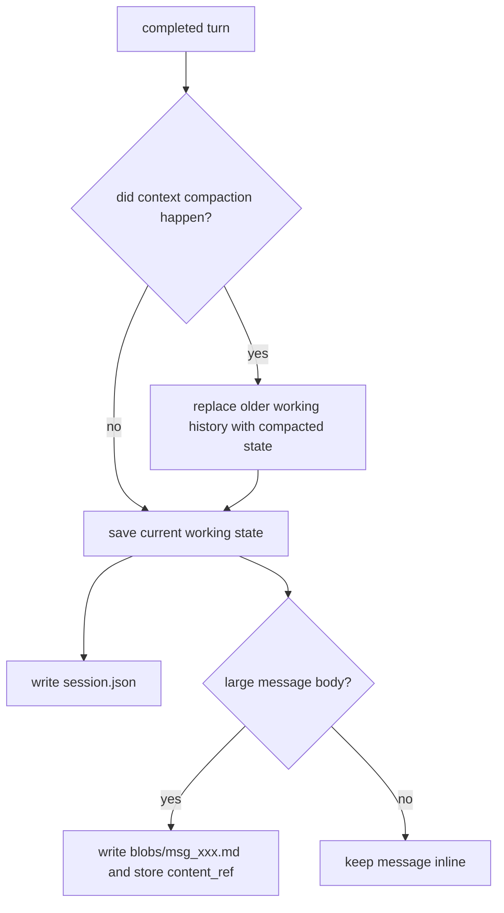

# Chapter 29: Session Persistence and Resume

By Chapter 28, the harness already behaves like a real runtime:

- it has bundled capabilities
- it keeps memory
- it compacts context
- it tracks todos
- it emits runtime events
- it has control-plane behavior

That is a strong base.

But one major property is still missing:

> if the process dies, the runtime dies with it

That is acceptable for a demo.

It is not acceptable for a serious harness.

So the next step is **session persistence**.

This chapter stays design-first on purpose.

Session persistence looks easy at first:

> "Just save the whole conversation to JSON."

That is the wrong model for an agent runtime.

## Why this chapter matters

Persistence changes the kind of system you are building.

Without persistence, the harness is mostly:

- a live loop inside one process

With persistence, the harness becomes:

- a resumable runtime with continuity across process lifetimes

That sounds simple until you consider long-lived tasks:

- coding sessions with hundreds of turns
- research sessions with many tool results
- writing sessions that produce very large outputs

If the persistence model is wrong, resume becomes:

- slow
- RAM-heavy
- stale
- hard to evolve later

So before we write `session.py`, we need the right mental model.

## The first rule: session before thread

It is tempting to introduce both:

- `session_id`
- `thread_id`

immediately.

Do not do that yet.

For this project, the first clean rule is:

> one session is one persisted harness runtime

So in the first implementation:

- `session_id` is the main persisted identity
- `thread_id` is reserved for later Agent OS work

That keeps the first slice teachable.

Later, an Agent OS layer may map:

- channels
- clients
- workers
- schedules

onto wider thread or routing concepts.

But the harness should start smaller:

- save one runtime
- load it later
- continue from there

## The key mistake to avoid

The most common bad design is this:

> treat `session.json` as the full raw transcript forever

That sounds safe, but it is the wrong operational model.

Why?

Because the harness already has **context durability**.

That means the runtime may compact old history into a smaller archived summary
inside the live working state.

If session persistence still tries to keep every raw turn inline forever, then:

- persistence fights the runtime
- restore loads text the next model call will never need
- large sessions become expensive to resume

So the correct rule is:

> the default session store should save an **operational snapshot**, not a full
> raw forever transcript

That distinction is the heart of the design.

## Operational snapshot vs archive

The session layer should split storage into two roles:

1. operational snapshot
2. optional archive

### 1. Operational snapshot

This is what the harness needs in order to resume.

It should be:

- compact
- bounded
- fast to load
- aligned with the current runtime state

This is the thing resume loads by default.

### 2. Optional archive

This is for fidelity, export, debugging, or later product features.

It may contain:

- raw transcript
- event log
- large generated bodies
- exported artifacts

This should be separate from the default resume path.

That way:

- resume stays cheap
- archival fidelity remains possible later

without making the runtime heavier than it needs to be.

## The most important best practice

`session.json` is not a history museum.

It is an **operational snapshot**.

That means it should store the state the harness needs to continue work, not the
entire lifetime of the conversation in raw form.

This one idea solves most of the failure modes in long sessions.

## What should go into the operational snapshot

The operational snapshot should persist only durable state the runtime actually
needs after restart.

### 1. Working conversation state

Persist the current **working** message state:

- user messages
- assistant turns
- tool results

But with one critical rule:

> save the already-compacted working conversation, not a hidden full transcript

This is where long-session design becomes correct.

### 2. Todo state

The todo board is part of runtime state now.

So it should persist too.

Otherwise a resumed session loses its visible task queue.

### 3. Audit log

The audit log belongs to the control plane.

It is worth preserving across resumes, especially for:

- approvals
- warnings
- verification messages
- blocked actions

### 4. Token-usage history

Persist usage snapshots, not only totals.

That keeps telemetry useful after resume.

### 5. Session metadata

Persist a small metadata envelope:

- `id`
- `title`
- `created_at`
- `updated_at`
- `cwd`
- `version`

That is enough for:

- list
- load
- resume
- inspect

without inventing a heavy schema too early.

## What should not go into the operational snapshot

The first implementation should stay disciplined.

Do not persist live runtime objects.

That includes:

- provider instances
- tool objects
- MCP connections
- input queues
- background tasks
- in-flight subagents
- spinner or terminal UI state

Those belong to the current process, not to durable session state.

## The second critical rule: never persist the injected system prompt

This is one of the most important boundaries in the whole design.

Do **not** save the fully injected system prompt in the session store.

Why?

Because the system prompt is rebuilt from live runtime inputs such as:

- current config
- control profile
- memory files
- skills
- MCP setup
- workspace settings

If you persist it, resume restores stale instructions.

That is the wrong behavior.

So the boundary should be:

- persist non-system conversation state
- rebuild the system prompt fresh on resume

This keeps the runtime honest.

## The compaction question

This is the exact point that matters for very large sessions.

Suppose the user is writing a very long book with the agent:

- many long assistant turns
- many file operations
- many context compactions over time

What should happen when the session is saved?

The answer is:

> persist the current compacted working state

not:

> persist every raw historical message forever

### Example

If turn 50 compacts history:

- the live runtime no longer holds the old raw history inline
- it now holds an archived summary plus recent live turns

So when autosave runs after turn 50:

- the session snapshot should store that compacted working conversation

If turn 80 compacts again:

- the next autosave should replace the previous working conversation snapshot
  with the newer compacted one

That is correct.

Because resume should restore:

- the working state the harness actually had

not:

- an imaginary unbounded transcript that the runtime itself had already moved
  past

## Why full raw transcript is wrong for resume

Imagine a long writing session where the assistant has produced:

- 100 chapters
- each chapter is large
- many of those chapters were generated across many turns

If `session.json` stores every large assistant message inline forever, then:

- the file becomes huge
- restore loads huge JSON into RAM
- most of that text is useless for the next turn
- context compaction loses much of its operational value

So the best practice is:

> keep resume storage bounded, even if archival storage later becomes richer

That is a much better fit for agent systems.

## Large message bodies are still a problem

Even a compacted working session can become heavy if recent assistant messages
contain very large bodies.

For example:

- the assistant dumps full chapter text into chat
- several recent turns are each thousands of words

That means the working snapshot can still grow too large.

So the design needs a second best practice.

## Best practice: offload large content

For serious long-form work, the runtime should prefer:

- write large outputs to files or artifacts
- keep chat messages short and referential

Instead of:

- assistant returns the entire chapter inline every time

Prefer:

- assistant writes `outputs/chapter_042.md`
- assistant replies with a short summary and the file path

That is already a better runtime pattern for:

- context size
- session size
- resume speed
- user experience

## Blob offloading in the session layer

The session format should also leave room for a second optimization:

> very large message bodies should be allowed to live outside `session.json`

That means a message record may store either:

- inline content for small messages
- or a reference for large bodies

For example:

```json
{
  "kind": "assistant",
  "content_ref": "blobs/msg_001.md",
  "preview": "Wrote chapter 42 and saved it to outputs/chapter_042.md",
  "tool_calls": [],
  "stop_reason": "stop"
}
```

That gives the persistence layer a good direction:

- default resume can load a compact working snapshot cheaply
- large bodies can be loaded lazily only when truly needed

The first implementation does not need advanced lazy loading yet.

But the schema should not block it.

## Recommended storage layout

The storage layout should stay simple, but it should not paint the project into
a corner.

The clean first layout is:

```text
.mini-claw/
  sessions/
    <session_id>/
      session.json
      blobs/
      archive/
```

Where:

- `session.json` stores the operational snapshot
- `blobs/` stores large message bodies or other offloaded content
- `archive/` is reserved for optional raw transcript or exports later

This is better than one giant file because later you may want to add:

- artifacts
- attachments
- traces
- exports

without redesigning the whole store.

## Recommended `session.json` shape

The first version should stay explicit and boring.

Something like:

```json
{
  "version": 1,
  "id": "sess_20260327_abc123",
  "title": "Session persistence design",
  "created_at": "2026-03-27T10:20:30Z",
  "updated_at": "2026-03-27T10:24:10Z",
  "cwd": "/abs/path",
  "messages": [...],
  "todos": [...],
  "audit_log": [...],
  "token_usage": [...]
}
```

The important point is not the exact field names.

The important point is:

- this is an operational snapshot
- not a forever transcript dump

## Message persistence design

Messages should be serialized in a stable, explicit way.

The harness already has clear message kinds:

- `user`
- `assistant`
- `tool_result`
- `system`

The first store should persist:

- `user`
- `assistant`
- `tool_result`

And it should intentionally skip:

- the injected leading `system` message

For assistant turns, the record should include:

- text or `content_ref`
- tool calls
- stop reason

That is enough to reconstruct the turn correctly.

## Autosave policy

The first autosave policy should be conservative.

Save only at **safe turn boundaries**.

Good boundaries:

- after a completed execution turn
- after a completed planning turn
- after explicit session operations such as new or resume

Bad first-version targets:

- mid-stream partial assistant text
- in-flight tool execution
- in-flight subagent execution
- waiting inside approvals or user-input prompts

Those are much harder.

The tutorial should not try to solve crash-safe mid-turn replay first.

So the clean first rule is:

> autosave after completed turns, not during unstable in-flight work

## Resume policy

A good resume flow should do this:

1. load the operational snapshot
2. restore durable runtime state
3. rebuild a fresh harness runtime
4. inject a fresh system prompt
5. continue from restored working conversation state

That means resume is not:

- "deserialize everything and hope it still works"

It is:

- "restore durable state, rebuild live runtime"

That distinction makes the design robust.


## Save flow with compaction

This is the operational flow the harness should follow:



This is the exact answer to the large-session question:

- the saved snapshot follows the current working conversation
- compaction updates what gets persisted
- `session.json` does not keep every pre-compaction raw turn forever

## Session title design

The first version should keep title generation simple.

Good first rules:

- derive from the first user message
- truncate to a safe length
- allow later manual rename

Do not require an LLM title-generation feature in the first slice.

That would make persistence heavier than it needs to be.

## CLI behavior

The first CLI slice should stay practical.

Good first commands:

- `/session`
  - show current session id and title
- `/sessions`
  - list recent sessions and allow immediate selection
- `/resume <id>`
  - load a previous session
- `/new`
  - start a fresh session

That is enough for the first implementation.

The nice UX detail is that `/sessions` should not just dump ids.

It should behave like a lightweight selector:

- show numbered recent sessions
- allow typing a row number or a raw session id
- resume immediately without forcing a second command

That keeps the interaction simple while still feeling like a real terminal app.

You do not need all of these yet:

- `/fork`
- `/rename`
- `/archive`
- `/export`

Those can come later.

## Where this belongs in the architecture

Session persistence belongs to the **state system**.

It is not middleware.

It is not just a CLI feature.

It is the durable-state boundary for the harness runtime.

That matters because later an Agent OS layer may widen this into:

- thread registry
- multi-channel mapping
- session routing
- background workers

But the first harness implementation should stay smaller:

- one persisted runtime session

## Recommended flat Python design

The first implementation should still keep the code flat.

That means one new file is enough:

- `session.py`

It can contain:

- `SessionRecord`
- `SessionStore`
- `create_session_id()`
- `derive_session_title()`
- `serialize_messages(...)`
- `deserialize_messages(...)`
- `capture_session_state(...)`
- `restore_session_state(...)`

That is plenty for the first slice.

Do not split into:

- `session_store.py`
- `session_models.py`
- `session_serializer.py`

yet.

The tutorial should keep the design readable.

## What the first implementation should not try to solve

To keep the first version strong, avoid these for now:

- distributed thread coordination
- multi-process locking
- partial-turn recovery
- replaying in-flight tool calls
- restoring active background subagents
- persisted MCP connection state
- persisted UI layout state
- loading the full archive by default on resume

Those are real problems.

But they are not the right first chapter.

The right first chapter is:

- durable, compact, turn-complete resume

## Recap

The key design rules are:

- use `session_id` as the main identity for now
- reserve `thread_id` for later Agent OS work
- treat `session.json` as an operational snapshot, not a raw forever transcript
- persist the current compacted working conversation state
- never persist the injected system prompt
- separate operational snapshot from optional archive
- leave room for blob offloading of large message bodies
- autosave only at safe turn boundaries first
- restore durable state, then rebuild a fresh runtime on resume
- keep the first implementation flat in `session.py`

Those rules will make the later code much easier to trust.

## What comes next

The next step is to implement the first session store in Python.

That means:

1. add `session.py`
2. persist compact working messages, todos, audit log, and token usage
3. optionally offload very large bodies into `blobs/`
4. add basic CLI commands for session listing and resume
5. verify that resume rebuilds a fresh system prompt correctly

That will be the first real long-lived runtime slice of the harness.
