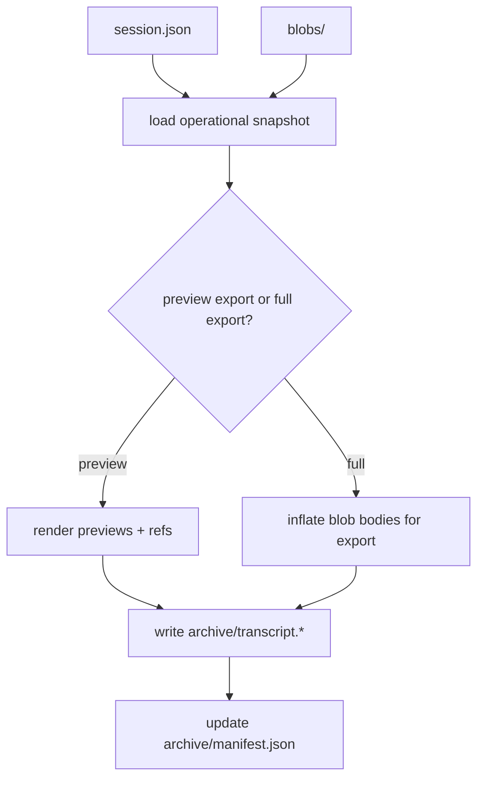
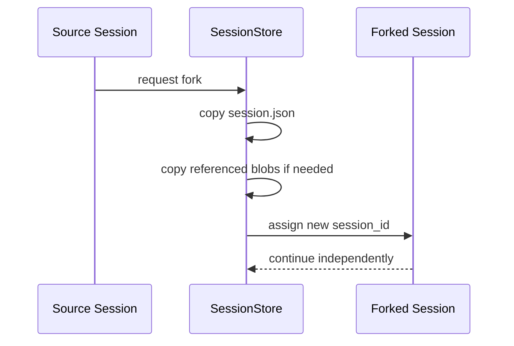

# Chapter 30: Session Archive and Export

By Chapter 29, the harness can already do the most important thing:

- save an operational snapshot
- restore durable runtime state
- resume later with a fresh runtime

That is a real milestone.

But it is not the whole story.

An operational snapshot is optimized for **continuity**.

It is not optimized for:

- perfect historical fidelity
- export
- audit review
- sharing a session with another person
- keeping a long narrative transcript for later reading

That is the next layer:

**session archive and export**

This chapter is design-first.

That is the right order again, because archive design can easily damage the
runtime if we mix it into the operational snapshot carelessly.

## Operational snapshot is not enough

By design, `session.json` is now:

- compact
- bounded
- compaction-aware
- preview-oriented for large blobs

That is correct for resume.

But it means something very important:

> the operational snapshot is not the full historical truth of the session

That is not a bug.

It is the correct tradeoff for a harness runtime.

Still, users often need more than resume:

- “show me the full transcript of this session”
- “export this session to Markdown”
- “keep a permanent archive for review”
- “fork this session before I try a different approach”

Those needs belong to a different storage role.

## The next split: resume store vs archive store

The clean design is to keep two different views of the same session:

1. the **resume store**
2. the **archive/export store**

### 1. Resume store

This is the thing we already built:

- fast
- bounded
- operational

It answers:

- how do I continue work?

### 2. Archive/export store

This should answer:

- what happened?
- what did the agent produce?
- what can I share or inspect later?

This store may be:

- larger
- more faithful
- more verbose
- slower to reconstruct

That is acceptable, because it is not on the hot path of normal resume.

## Why archive should not be fused into `session.json`

It is tempting to say:

> “just store everything in `session.json` too”

That is the wrong design.

If you merge archive concerns back into the main snapshot, then:

- resume becomes heavier
- the RAM boundary gets worse again
- compaction loses much of its value
- blob previews stop helping much

So the rule should be:

> archive is adjacent to the operational snapshot, not inside it

That keeps both systems honest.

## What belongs in an archive layer

A session archive may eventually contain:

- raw transcript
- event log
- approval history
- tool-call history
- references to blob files
- export-ready markdown or JSON
- artifact manifests

Not every implementation needs all of these immediately.

But this is the right conceptual container.

## The first archive features to build

For this project, I would keep the first archive slice small and useful.

The first archive layer should support:

1. session rename
2. session fork
3. transcript export
4. optional archive manifest

That is enough to make the session model much more complete without building a
full data platform.

## 1. Session rename

Before export, there is one very practical session-management operation:

- rename the current session

This sounds small, but it matters.

A generated title is good for the first save.

It is not always the title a user wants later.

So the session layer should support:

- local title updates
- immediate persistence
- no change to runtime history

That is a clean first extension because it only changes metadata.

## 2. Session fork

Forking is a natural next session feature.

It means:

- copy the operational snapshot into a new session id
- preserve the history up to that point
- let the new branch continue independently

This is extremely useful for agentic work:

- compare two implementation strategies
- try a risky change without losing the original path
- explore alternate plans

Forking is conceptually closer to session management than to config or UI.

So it belongs here.

## 3. Transcript export

The first export feature should be straightforward:

- export the session as Markdown
- export the session as JSON

Markdown is good for:

- reading
- sharing
- writing notes

JSON is good for:

- tooling
- debugging
- future conversions

The important design choice is this:

> export is generated from the session store and blobs, not used as the live
> resume source

That keeps export and runtime properly separated.

## 4. Archive manifest

The first archive layer should also have a small manifest.

For example:

```text
.mini-claw/
  sessions/
    <session_id>/
      session.json
      blobs/
      archive/
        manifest.json
        transcript.md
        transcript.json
```

The manifest can describe:

- what exports exist
- when they were generated
- which blob references were included

That keeps the archive folder organized without forcing a heavy database.

## Transcript vs event log

These are related, but they are not the same.

### Transcript

A transcript is a human-friendly rendering of the session.

It should focus on:

- user turns
- assistant turns
- tool results when useful

It is mainly for reading.

### Event log

An event log is closer to runtime truth.

It may include:

- todo updates
- approvals
- compaction events
- memory updates
- token usage events
- subagent lifecycle events

It is mainly for inspection and debugging.

The first archive implementation does not need a full event log export yet.

But the architecture should leave room for it.

## How blob-backed messages should export

This is the subtle part.

In the resume path, blob-backed content stays as:

- preview
- blob path
- explicit read-on-demand

That is correct for runtime.

But in an export path, we often want the opposite:

- resolve the blob
- include the full content in the export

So the export layer should support two modes:

1. **preview export**
2. **full export**

### Preview export

Good for:

- fast summaries
- lightweight archive views

### Full export

Good for:

- final transcript
- documentation
- audit review

This is the right place to inflate blob content, because export is not the
hot-path runtime.

## Archive generation flow



That keeps the export concern separate from resume.

## Session fork flow



The important rule is:

- a fork gets a new `session_id`
- but starts from the same operational state

## Should forks copy blobs or reference them?

This is a real design choice.

There are two approaches:

### Copy blobs

Pros:

- simple
- isolated
- no shared lifetime issues

Cons:

- duplicates disk usage

### Reference shared blobs

Pros:

- more storage-efficient

Cons:

- much more complicated lifetime and deletion rules

For this project, the correct first choice is:

> copy blobs during fork

That is simpler and easier to teach.

Disk duplication is acceptable at this stage.

## What should the first archive/export API look like?

Keep it flat and explicit.

The first version could add functions like:

```python
export_session_markdown(...)
export_session_json(...)
fork_session(...)
```

inside `session.py`.

That is still consistent with the current tutorial style.

No need yet for:

- `session_export.py`
- `archive_writer.py`
- `fork_manager.py`

That would be too much structure too early.

## CLI behavior

The next useful commands after Chapter 29 are:

- `/rename <title>`
- `/fork`
- `/export`

Possible behavior:

- `/rename <title>`
  - updates only session metadata
  - persists immediately
- `/fork`
  - duplicates the current session into a new one
  - switches the CLI to the new fork
- `/export`
  - writes transcript files under `archive/`
  - maybe defaults to Markdown first

That is enough to make sessions feel much more real.

## Where this belongs in the architecture

Archive/export still belongs to the **state system**.

It is not just a CLI convenience.

It is the second storage role around sessions:

- resume state for operation
- archive state for fidelity and sharing

That is a good harness shape.

Later, an Agent OS layer may widen this into:

- background archival jobs
- retention policies
- remote export sinks
- session catalogs

But the harness should start smaller.

## What the first implementation should not try to solve

Avoid these in the first archive slice:

- deduplicated shared blob store
- distributed archival workers
- remote cloud export
- event-sourced replay engine
- content-addressed storage
- full-text search index

Those are later-system problems.

The right first step is:

- simple local archive
- simple local export
- simple local fork

## Recap

The key design rules are:

- keep operational snapshot and archive separate
- do not bloat `session.json` with archival fidelity
- export should be generated from the session store, not replace it
- blob-backed messages should remain preview-only in runtime but may inflate in full export
- session fork should create a new `session_id`
- the first fork implementation should copy blobs, not share them
- keep the first archive/export API flat in `session.py`

## What comes next

The next step is to implement the first archive/export slice.

That means:

1. add local session rename
2. add local session fork
3. add transcript export functions to `session.py`
4. add a small archive manifest
5. expose `/rename`, `/fork`, and `/export` in the TUI app
6. test blob-backed export carefully in both preview and full modes

That will complete the second major layer of the session system:

- resume for continuity
- archive for fidelity
