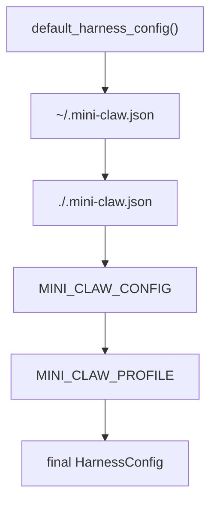

# Chapter 31: Config Files and Runtime Profiles

By Chapter 30, the harness has become a real local application:

- it has a bundled runtime
- it has a TUI app surface
- it has session persistence
- it has session management commands like rename and fork

At this point, one problem becomes obvious:

the runtime shape is too large to keep rebuilding from hardcoded Python defaults
alone.

That is where config files belong.

This chapter defines the next layer:

- config files for runtime defaults
- clear precedence rules
- small environment overrides
- explicit runtime profiles

And just like the session chapters, this should stay:

- flat
- explicit
- easy to test

## Why the harness needs config files

The harness now has many runtime settings:

- workspace paths
- feature toggles
- context durability
- subagent limits
- memory-update behavior
- control-plane profile

Hardcoding all of that in `tui/app.py` eventually becomes a maintenance smell.

It also makes the runtime harder to share:

- one repo may want `safe`
- another may want `balanced`
- one project may disable MCP
- another may want different outputs or scratch paths

So the harness needs a configuration layer.

## The design boundary

Config is not the same thing as policy.

This is the most important conceptual split in the chapter.

### Config chooses values

Config answers questions like:

- should MCP be enabled here?
- where is the outputs directory?
- what is the default control profile?
- should subagents be on by default?

### Policy interprets runtime rules

Policy answers questions like:

- when should approval be required?
- when should loop retries be blocked?
- when should verification warnings fire?

So the clean rule is:

> config selects the runtime shape; policy governs runtime behavior

That means `config.py` should load and merge values, while `control_plane.py`
still owns the meaning of control profiles and policy rules.

## Keep the loader small

The harness does **not** need a giant config framework.

The first version should support only:

1. default Python values
2. user config file
3. project config file
4. one explicit config-file env override
5. one small runtime-profile env override

That is enough.

Anything larger at this stage would mostly create more code, not more clarity.

## Recommended file format

Use one local JSON file:

```text
.mini-claw.json
```

That fits naturally beside:

- `.mcp.json`
- `.agents/AGENTS.md`

and it keeps the project easy to inspect.

The first config shape should stay close to `HarnessConfig`.

For example:

```json
{
  "workspace": {
    "scratch": ".agent-work",
    "outputs": "outputs",
    "uploads": "uploads"
  },
  "enable_mcp": true,
  "enable_skills": true,
  "enable_subagents": true,
  "subagent_max_parallel": 2,
  "subagent_max_turns": 8,
  "control_plane_profile": "balanced",
  "context": {
    "max_messages": 12,
    "keep_recent": 6,
    "max_estimated_tokens": 2400
  },
  "memory_updates": {
    "scope": "user",
    "debounce_seconds": 2.0
  }
}
```

That is boring on purpose.

The best config format for this book is the one that maps directly onto the
runtime you already have.

## Relative path rule

This rule matters a lot:

> relative paths in a config file should resolve relative to the config file
> that declared them

That means:

- `~/ .mini-claw.json` resolves relative paths from the home directory
- `repo/.mini-claw.json` resolves relative paths from the repo root

This is much better than resolving everything from process cwd.

It makes config files portable and unsurprising.

## Precedence rules

The first loader should follow a simple layered model:

1. hardcoded defaults
2. user config
3. project config
4. explicit env-selected config file
5. env value overrides

That gives the harness a clear precedence ladder.

### 1. Hardcoded defaults

These are the defaults already represented by:

- `default_harness_config()`

This should remain the base.

### 2. User config

Path:

```text
~/.mini-claw.json
```

This is the place for user-level preferences such as:

- default control profile
- whether MCP is normally on
- whether skills are normally on

### 3. Project config

Path:

```text
<cwd>/.mini-claw.json
```

This is the place for project-specific runtime defaults such as:

- outputs path
- uploads path
- safer or stricter control profile
- whether subagents are appropriate in this repo

Project config should override user config.

That is the expected behavior.

### 4. Explicit config-file override

Environment variable:

```text
MINI_CLAW_CONFIG
```

This should point to a specific JSON config file to load last.

This is useful for:

- testing
- demos
- alternate runtime profiles without editing local files

### 5. Environment value overrides

The first environment override can stay very small.

A good first one is:

```text
MINI_CLAW_PROFILE=safe
```

That lets the user switch the control profile without editing config files.

This is enough to prove the pattern without inventing dozens of env vars.

## Merge strategy

The merge behavior should also stay small and explicit.

### Simple scalar fields

Fields like:

- `enable_mcp`
- `enable_skills`
- `enable_subagents`
- `control_plane_profile`

can override directly.

### Structured sections

Nested sections like:

- `workspace`
- `context`
- `memory_updates`
- `control_plane`

should merge field-by-field instead of replacing the whole section.

That gives the user a good experience:

- they can set only `workspace.outputs`
- without having to rewrite the whole workspace config

## What should stay out of config

The first config layer should **not** try to manage:

- session state
- live history
- memory file contents
- current todo list
- runtime event stream
- current approvals

Those are runtime state, not config.

This is another important boundary:

> config shapes the runtime before it starts; session state records what the
> runtime did after it started

## Recommended Python API

Keep the config API flat.

The first version should add functions like:

- `default_harness_config(...)`
- `load_harness_config(...)`
- `default_harness_config_paths(...)`
- `apply_harness_config(...)`

That is enough.

Do not split into:

- `config_loader.py`
- `config_schema.py`
- `config_merge.py`

yet.

The tutorial should still feel readable.

## TUI app integration

The TUI app should not manually assemble all runtime defaults forever.

Instead, `tui/app.py` should do:

1. `load_harness_config(...)`
2. `apply_harness_config(...)`

That makes the app clearer:

- config loading happens in one place
- runtime assembly still happens in one place

This is the right architecture boundary.

## Example precedence flow



That is the whole model.

Simple.

Predictable.

Testable.

## What the first implementation should test heavily

This chapter deserves strong tests because config bugs are confusing.

The first test set should cover:

1. default config still works
2. user config loads
3. project config overrides user config
4. relative paths resolve from the config file location
5. explicit `MINI_CLAW_CONFIG` overrides discovered files
6. `MINI_CLAW_PROFILE` overrides file-selected profile
7. `apply_harness_config()` still boots the expected runtime shape

That is exactly the kind of area where strong tests save a lot of debugging.

## Recap

The key design rules are:

- keep config separate from policy
- use `.mini-claw.json` as the first config file format
- resolve relative paths relative to the config file that declared them
- use layered precedence: defaults, user, project, explicit env file, env values
- keep environment overrides intentionally small at first
- keep the loader flat in `config.py`
- wire the TUI app through the loader instead of hardcoding all defaults

## What comes next

The next step is to implement the first real config loader.

That means:

1. add config-file discovery
2. add config-file parsing and merge logic
3. add `MINI_CLAW_CONFIG`
4. add `MINI_CLAW_PROFILE`
5. switch `tui/app.py` to the loader
6. add a dedicated Chapter 31 test file

That will make the harness much easier to run across different projects without
making the codebase more abstract than it needs to be.
