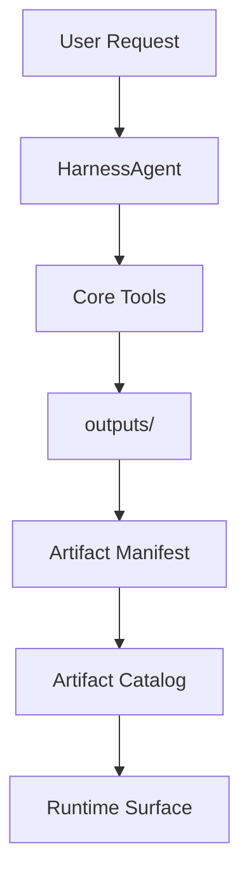
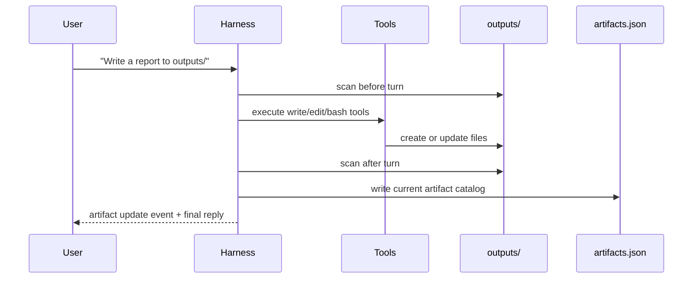

# Chapter 32: Artifact and Output Management

In the previous chapters, the harness learned how to:

- keep context bounded
- persist session state
- resume from an operational snapshot

That is enough for conversation continuity.

But it is not enough for a real coding or writing agent.

When an agent produces valuable output, that output should not live only in chat text.

For example:

- generated code files
- reports
- markdown documents
- screenshots
- exported datasets
- long chapters of a book

Those are not just messages.
They are **artifacts**.

In this chapter we add a small artifact layer to the harness.

The goal is simple:

- the agent writes results into `outputs/`
- the harness tracks those output files
- the runtime surface can show what was created or changed
- the next turn can talk about outputs more clearly

This chapter is intentionally small and practical.

We are **not** building a full asset pipeline yet.

We are only adding:

- an artifact catalog
- an artifact manifest on disk
- artifact change detection after a turn
- a `/artifacts` command in the TUI

That is the right first step.

## The Problem

Without an artifact layer, a harness has two bad failure modes.

### Problem 1: Large results stay inline in chat

Suppose the user asks:

> Write four markdown reports and save them in outputs.

The agent may do the work correctly, but if the runtime only thinks in terms of chat messages, then the result is weak:

- the user has to trust the agent’s text
- the runtime does not have a tracked view of generated files
- later turns do not have a clean status surface for those outputs

### Problem 2: Session persistence is not enough

Session persistence helps restore a conversation.

But artifacts are different from session messages:

- they may be much larger
- they may be edited many times
- they often matter beyond one conversation

If we treat artifacts as ordinary assistant text, we lose the distinction between:

- conversational state
- durable work products

That distinction matters a lot for coding and writing agents.

## What We Want

We want the harness to keep a small catalog of what exists in `outputs/`.

That gives us three benefits:

1. The runtime can tell the user what changed.
2. The user can inspect a clean artifact view with `/artifacts`.
3. The agent can be taught to prefer files for large outputs instead of huge chat replies.

This is the model:



The important point is:

- the agent still writes files through tools
- the artifact layer does not replace tools
- it only tracks output state after the work is done

## Artifact Layer vs Session Layer

Do not confuse these two layers.

### Session layer

The session layer stores:

- working conversation state
- todo state
- audit log
- token usage

That is for **resume**.

### Artifact layer

The artifact layer stores:

- what output files exist
- what changed after a turn
- lightweight metadata about those files

That is for **result tracking**.

They solve different problems.

This distinction is important because later we may export or present artifacts in other ways, while the session snapshot stays small.

## A Small Design

We keep the implementation flat and easy to read.

We add one module:

- `src/mini_claw_code_py/artifacts.py`

Inside it we define:

- `ArtifactRecord`
- `ArtifactDelta`
- `ArtifactCatalog`
- `scan_artifacts(...)`
- `diff_artifacts(...)`
- `write_artifact_manifest(...)`
- `load_artifact_manifest(...)`

That is enough for the first slice.

## What We Track

Each artifact record stores only simple metadata:

- relative path
- size in bytes
- modified time

That means we are **not** storing:

- file body
- previews
- MIME analysis
- checksums

Those can come later if needed.

For now, the harness only needs a lightweight inventory.

## Where We Store It

The manifest lives here:

```text
.mini-claw/artifacts.json
```

This keeps it close to the rest of the harness runtime state, but separate from the session snapshots.

That is intentional.

Artifacts are workspace-level state.
Sessions are conversation-level state.

## How The Runtime Works

The flow is:

1. At the start of a turn, scan the current `outputs/` tree.
2. Let the agent run.
3. At the end of the turn, scan `outputs/` again.
4. Diff `before` and `after`.
5. Update the in-memory catalog.
6. Rewrite `.mini-claw/artifacts.json`.
7. Emit an artifact event if anything changed.

That gives the user visible feedback without adding much complexity.



## Why The Manifest Is Rewritten

You may ask:

Why not append events forever?

Because the first requirement is operational clarity, not audit history.

At this stage we want:

- fast startup
- simple code
- one authoritative current view

So we rewrite the manifest to represent the **current artifact set**.

If later we want artifact history, we can add a separate event log.

Do not overload the first implementation.

## Why This Is Good For Long Outputs

This chapter also reinforces an important best practice:

> Large generated results should prefer output files over long inline assistant messages.

That matters for:

- context window health
- session snapshot size
- user experience

For example, instead of replying with a 20,000-word chapter inline, the agent should:

- write `outputs/chapter_042.md`
- report the path
- let the artifact layer track it

That keeps:

- the runtime smaller
- the session cleaner
- the output easier to inspect

## Teaching The Model

We also add a prompt section that tells the model:

- prefer files in the outputs directory for large results
- clearly mention artifact paths in the final answer

This is a small but useful harness rule.

It does not force the model.
It teaches better defaults.

## The TUI Surface

The runtime surface now gets one new command:

```text
/artifacts
```

That command shows the current tracked artifact catalog.

We also include artifact information in runtime status.

This is useful because the user can now separate:

- chat state
- todo state
- output state

That makes the harness feel more like a real working environment.

## What We Are Not Building Yet

This chapter is intentionally not doing all of these:

- artifact previews
- attachment upload handling
- image/file presentation widgets
- artifact history
- export bundles
- checksums or deduplication
- per-session artifact namespaces

Those are good later extensions.

But they are not needed to establish the concept.

## The Code

The implementation is split across four places.

### 1. `artifacts.py`

This module owns:

- artifact scanning
- diffing
- manifest read/write
- in-memory catalog model

### 2. `harness.py`

The harness now:

- scans outputs before the turn
- refreshes artifacts after the turn
- rewrites the manifest
- emits an `AgentArtifactUpdate` event when outputs change

### 3. `surfaces.py`

We add one structured event block for artifacts.

This keeps artifact updates consistent with:

- todos
- approvals
- subagents
- memory
- token usage

### 4. `tui/`

The TUI gets:

- `/artifacts`
- runtime status lines for tracked outputs

That makes the feature visible to the user, not only hidden in storage.

## Example

Suppose the user says:

> Write a short report and save it in outputs/report.md.

The agent may write the file using the normal `write` tool.

After the turn, the harness detects:

- `report.md` did not exist before
- `report.md` exists now

So the runtime emits something like:

```text
[artifacts] 1 new, 0 updated, 0 removed
```

And `/artifacts` may show:

```text
Artifacts:
- report.md (md, 812 bytes)
```

That is the whole point of this chapter.

The user now has a runtime view of output results.

## Tests

The tests for this chapter should verify:

- artifact prompt section teaches file-first output behavior
- scanning returns stable relative paths
- diffing detects created, updated, and removed files
- manifest writing and loading round-trip correctly
- the harness emits an artifact event after creating an output file
- the in-memory artifact catalog loads from the manifest on startup

These are the behaviors that matter most.

## Recap

This chapter adds a small but important runtime concept:

- outputs are not just chat text
- outputs are tracked artifacts

The first implementation stays simple:

- one catalog
- one manifest
- one diff step
- one TUI command

That is enough to make the harness more useful for real work.

In the next chapter, we will go back to the control plane and refine policy behavior further.
