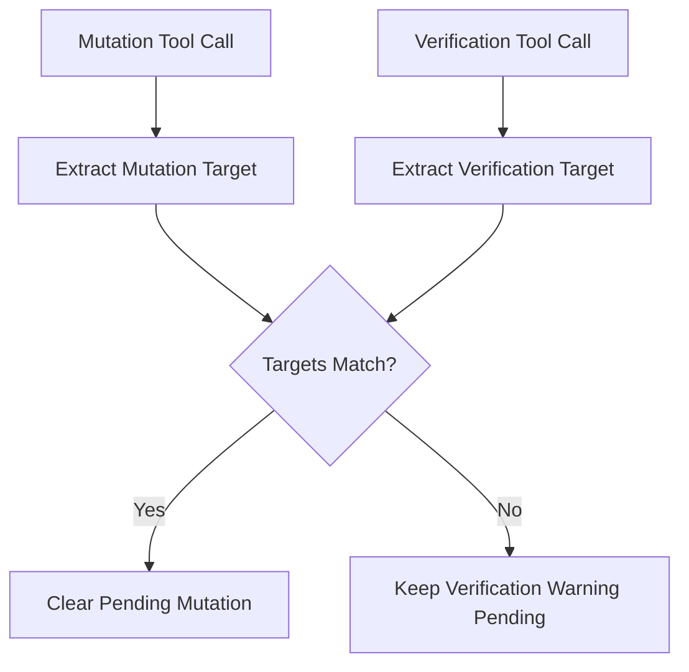

# Chapter 33: Advanced Control Policies

In Chapter 24, we built the first control plane.

It already gave the harness:

- approvals
- verification warnings
- loop detection
- audit logging

That was enough to introduce the concept.

But once the harness becomes more real, the first version shows its limits.

This chapter is about making those policies more precise without turning the code into a giant policy engine.

We will improve three things:

1. edit and overwrite approval consistency
2. verification that matches the actual changed target
3. loop detection based on repeated patterns, not just blunt totals

That is enough to make the control plane feel much more trustworthy.

## Why The First Version Was Too Loose

The early control plane was intentionally simple.

That simplicity made it easy to teach.

But it also caused three real problems.

### Problem 1: `edit` was not gated like `write`

If the agent used `write` to replace an existing file, approval could be required.

But if the agent used `edit` on that same file, it could bypass the overwrite gate.

That is inconsistent.

From the user’s point of view, both are meaningful file mutations.

So the policy should treat them consistently.

### Problem 2: verification was too broad

In the first version, almost any later `read`-like action could count as verification.

That meant this weak sequence could suppress the warning:

1. write `src/app.py`
2. read `README.md`
3. answer “done”

That is not a real verification path.

The follow-up check should match the thing that changed.

### Problem 3: loop detection was too blunt

If we count repeated tool signatures across the whole recent window, we can flag valid workflows too aggressively.

For example:

- read file A
- read file A
- run another tool
- read file A again

That is not the same as:

- read file A
- read file A
- read file A
- read file A

The second pattern looks more like a stuck retry loop.

So we should care more about **consecutive repetition** than total historical count.

## The Design Goal

We want a stronger control plane, but still one that is:

- easy to read
- flat
- local to the runtime
- teachable in a tutorial

So we are **not** building:

- a full policy DSL
- a workflow engine
- a middleware graph
- per-tool YAML rule packs

We are only tightening the existing rules.

## Improvement 1: Consistent Approval For File Mutation

The first rule is:

> If mutating an existing file is risky enough to gate for `write`, it should also be gateable for `edit`.

So in this chapter:

- `write` to an existing file can require approval
- `edit` to an existing file can require approval too

That makes the policy much easier for users to understand.

## Improvement 2: Verification Must Match The Changed Target

This is the most important upgrade in the chapter.

The runtime should not ask only:

> Did some verification happen?

It should ask:

> Did verification happen for the thing that changed?

So we introduce a simple target model.

### Mutation targets

For a mutating tool call, extract the target:

- `write(path=...)` -> that path
- `edit(path=...)` -> that path
- mutating `bash(...)` -> broad shell mutation marker

### Verification targets

For a verification call, extract what it checked:

- `read(path=...)` -> that path
- directory listing in outputs -> outputs marker
- verification-style shell commands -> broad shell verification marker

Then the control plane can match them.

That means:

- write `src/app.py` + read `src/app.py` -> good
- write `src/app.py` + read `README.md` -> not good enough
- write files in `outputs/` + list outputs directory -> good

This is still simple, but much better than treating all reads as equal.

## Improvement 3: Consecutive Loop Detection

We also refine loop detection.

The new idea is:

> Count consecutive repetition of the same tool signature, not just how many times it appeared somewhere in recent history.

That better matches the behavior we actually want to stop:

- blind retries
- stuck loops
- repeated failed action with no strategy change

So:

- `read:a, read:a, read:a` -> warning
- `read:a, read:a, bash:b, read:a` -> less suspicious

That produces fewer false positives.

## What About Subagents?

There is another subtle control-plane problem:

`subagent` should not automatically count as a mutation.

Why?

Because a child agent may be doing:

- review
- search
- summarization
- analysis

Those are not automatically mutating tasks.

So in this chapter, the parent control plane stops assuming:

> subagent = mutation

That avoids false verification warnings after read-only delegated work.

This is a good example of a general control-plane rule:

> Do not infer a stronger side effect than the runtime actually knows.

## The Implementation

We keep the changes focused in two files:

- `src/mini_claw_code_py/control_plane.py`
- `src/mini_claw_code_py/harness.py`

### `control_plane.py`

This module now owns:

- approval rule for `edit`
- mutation target extraction
- verification target extraction
- target-matching logic
- consecutive repetition counting for loops

### `harness.py`

The harness still owns runtime behavior.

It uses those helpers to:

- decide whether approval is required
- record policy-relevant events in the audit log
- decide whether a final missing-verification warning should fire

That split is important:

- `control_plane.py` defines policy helpers
- `harness.py` applies them in the live turn loop

## Why We Still Avoid A Giant Policy Engine

You may be tempted to jump directly to:

- nested policy classes
- middleware stacks
- rule objects
- plugin registries

Do not do that too early.

For this project, the cleaner teaching path is:

1. keep the control logic flat
2. make the policy helpers explicit
3. only split further when the runtime truly needs it

That keeps the code readable for readers of the book.

## Example 1: Good Verification

User asks:

> Update `src/app.py` and verify the change.

Possible tool sequence:

1. `edit(path="src/app.py", ...)`
2. `read(path="src/app.py")`
3. final answer

That is a good path.

The verification target matches the mutation target.

So the control plane does **not** warn at the end.

## Example 2: Bad Verification

User asks:

> Update `src/app.py`.

Possible tool sequence:

1. `edit(path="src/app.py", ...)`
2. `read(path="README.md")`
3. final answer

That is not enough.

The runtime did verification work, but not for the changed target.

So the final warning still fires.

That is the behavior we want.

## Example 3: Read-Only Subagent

User asks:

> Have a subagent review the code and summarize risks.

If the child only reads and analyzes, the parent should not get a “missing verification after mutation” warning.

There was no known mutation.

This is a good example of the control plane becoming more precise, not just stricter.

## Tests

The tests for this chapter should verify:

- `edit` approval matches existing-file edits
- unrelated reads do not clear verification state
- related reads do clear verification state
- read-only subagent work does not trigger a false warning
- loop detection counts consecutive repetition instead of blunt historical totals

These tests matter more than broad “the control plane still works” tests, because they capture the new precision.

## Recap

This chapter upgrades the control plane from a first approximation into a more believable runtime policy layer.

The three big changes are:

- `edit` approval now matches `write`
- verification now matches changed targets
- loop detection now looks at consecutive repetition

That keeps the control plane:

- small
- teachable
- more trustworthy

And that is exactly what this stage of the harness needs.
