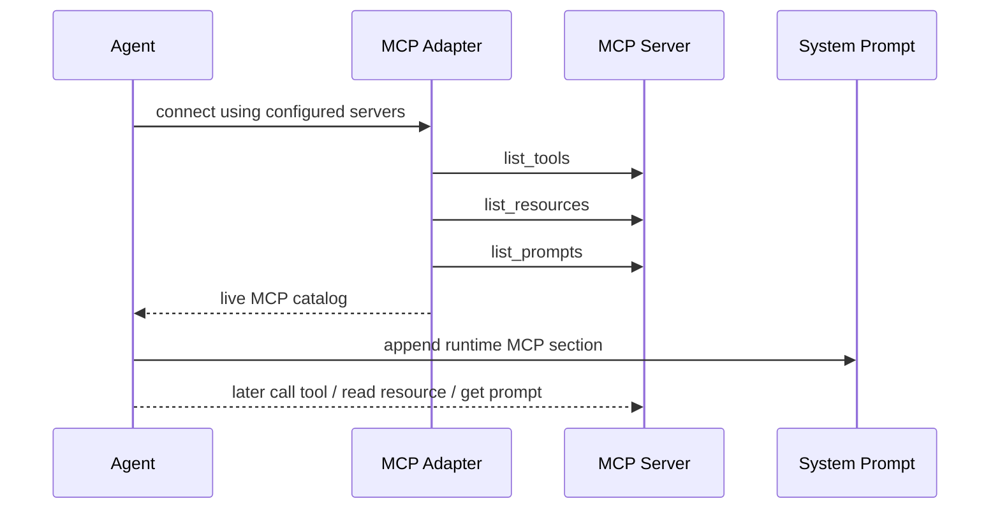

# Chapter 34: MCP Resources and Prompt Surfaces

In Chapter 15, we gave the agent real MCP tool use.

That was the first important step.

The agent could:

- discover configured MCP servers
- connect to them
- list tools
- call those tools

But MCP is not only about tools.

A richer MCP server can also expose:

- resources
- prompts

Those matter because many integrations are not naturally “one tool call”.

Sometimes the best MCP capability is:

- a readable resource
- a reusable prompt template

So in this chapter we extend the MCP layer again.

We add:

- a connected MCP catalog
- generic MCP resource access
- generic MCP prompt expansion
- a runtime MCP surface in the harness and TUI

This completes a much more realistic MCP integration story.

## The Problem

If we only expose MCP tools, we miss two useful parts of the protocol.

### Resources

Resources are useful when the server provides:

- reference documents
- configuration views
- generated reports
- knowledge snapshots

Those are not best modeled as “tools”.

They are better modeled as things you can **read**.

### Prompts

Prompts are useful when the server provides:

- reusable workflows
- structured task templates
- guided instructions for a specific system

Those are not ordinary data files.

They are best modeled as **prompt surfaces**.

So if our harness only knows tools, the model can miss real MCP value.

## What We Want

We want a runtime that can do four things after connecting:

1. know what tools are available
2. know what resources are available
3. know what prompts are available
4. surface that catalog to both:
   - the model
   - the user

That means MCP should become more than:

- “some extra tool names showed up”

It should become:

- “the harness understands the connected MCP capability surface”

## A Simple Design

We keep the implementation small.

We do **not** create one custom Python tool per MCP resource or per prompt.

That would explode the local tool universe.

Instead, we use:

- ordinary MCP tools as usual
- one generic resource bridge tool
- one generic prompt bridge tool

Those two bridge tools are:

- `mcp_read_resource`
- `mcp_get_prompt`

This is a better first design because it scales.

If a server has:

- 2 tools
- 40 resources
- 12 prompts

we still only add two generic local bridge tools for the non-tool surfaces.

## The MCP Catalog

The harness now keeps a live MCP catalog after connection.

That catalog tracks:

- connected server names
- total MCP tool count
- resources
- prompts

This catalog is not the same thing as `.mcp.json`.

`.mcp.json` tells us what is configured.

The live MCP catalog tells us what the runtime actually discovered **after connecting**.

That distinction matters.

## Why Runtime Catalog Beats Config Alone

Config tells us:

- server name
- transport
- source path

But config alone does **not** tell us:

- current resources
- current prompts
- dynamic capability shape

So the harness now has two levels:

### Config surface

This comes from `.mcp.json`.

It answers:

- what servers are configured?

### Runtime surface

This comes from the live MCP connection.

It answers:

- what tools are available now?
- what resources are available now?
- what prompts are available now?

That is a much better mental model.

## Resource Bridge Tool

The generic resource tool is:

```text
mcp_read_resource(server, uri)
```

This is intentionally simple.

The model does not need one custom tool per resource.

It only needs:

- which server to use
- which resource URI to read

The harness validates that the resource exists in the connected catalog, then reads it through MCP.

## Prompt Bridge Tool

The generic prompt tool is:

```text
mcp_get_prompt(server, name, arguments?)
```

This lets the model ask the connected MCP server to expand a named prompt surface.

The result is rendered back into text that the agent can inspect.

That means the model can use an MCP prompt when it is helpful, without our harness needing a special tool for every prompt name.

## Why These Stay Generic

This design is important for tool-universe control.

Imagine a server with:

- many resources
- many prompt templates

If we mapped every resource and every prompt to a local tool definition, the prompt would become noisy and the tool list would grow too much.

Generic bridge tools keep the surface smaller:

- ordinary MCP tools stay direct tools
- resources stay data-like
- prompts stay template-like

That is a better harness boundary.

## Runtime Prompt Surface

The model should not only see the tool names.

It should also see a compact runtime MCP section that lists:

- connected resources
- connected prompts

So after the harness connects, it appends a small runtime MCP section into the active system prompt.

This is different from the `.mcp.json` config section.

The config section says:

- these servers are configured

The runtime section says:

- these resources and prompts were actually discovered

That makes the agent much more capable without hardcoding server-specific logic.



## TUI Surface

The user also needs to inspect the MCP catalog.

So the TUI now gets:

```text
/mcp
```

That command shows:

- connected servers
- resource list
- prompt list

This is useful because users should be able to answer:

- is MCP connected?
- what is currently available?
- should the model be able to use a resource or prompt here?

That visibility makes the harness easier to trust and easier to debug.

## The Code

This chapter mainly touches four places.

### 1. `mcp.py`

This module now owns:

- `MCPCatalog`
- resource catalog entries
- prompt catalog entries
- MCP resource bridge tool
- MCP prompt bridge tool
- runtime MCP prompt section rendering

### 2. `harness.py`

The harness now:

- stores the current live MCP catalog
- appends the runtime MCP section after connecting
- exposes MCP state to the TUI surface

### 3. `planning.py`

The planning/runtime path also gets the live MCP prompt section after connecting.

That keeps the generic MCP behavior consistent in the older runtime too.

### 4. `tui/`

The TUI now surfaces MCP state via:

- `/mcp`
- runtime status output

## Why We Do Not Inline Resources Automatically

One design choice matters a lot:

The harness does **not** automatically read every MCP resource into context.

That would be a bad default because:

- resources may be large
- many resources may be irrelevant
- it would bloat the prompt

Instead, the runtime does this:

1. list the resource in the MCP catalog
2. let the model choose whether to read it
3. read it only on demand through `mcp_read_resource`

This matches the same “progressive loading” idea we used for:

- skills
- tool universe management
- session blob access

## Why We Do Not Expand Every Prompt Automatically

The same logic applies to MCP prompts.

Prompts should stay deferred until they are useful.

The runtime only needs:

- prompt name
- argument names
- a way to expand it on demand

That is enough.

## Example

Suppose an MCP server exposes:

- a resource: `file:///guide.txt`
- a prompt: `review_template(topic=...)`

Then the runtime surface may show:

```text
MCP connected: demo (3 tools, 1 resource, 1 prompt available)
Resources:
- [demo] file:///guide.txt
Prompts:
- [demo] review_template args=['topic']
```

The agent can then:

- call ordinary MCP tool `greet`
- call `mcp_read_resource(server="demo", uri="file:///guide.txt")`
- call `mcp_get_prompt(server="demo", name="review_template", arguments={"topic": "parser"})`

That is a clean, realistic integration.

## Tests

The tests for this chapter should verify:

- the live MCP adapter lists resources and prompts
- `mcp_read_resource` works against a real MCP server
- `mcp_get_prompt` works against a real MCP server
- the runtime MCP prompt section is appended after connection
- the harness stores and renders the live MCP catalog
- the TUI help now includes `/mcp`

These are the behaviors that prove the new surface is real.

## Recap

This chapter completes the next MCP layer.

The harness now understands:

- configured MCP servers
- connected MCP tools
- connected MCP resources
- connected MCP prompts

And it exposes them through:

- generic bridge tools
- runtime prompt sections
- a TUI catalog surface

That is a much more complete MCP story than tools alone, while still keeping the design small and teachable.
