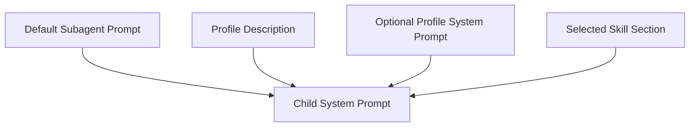
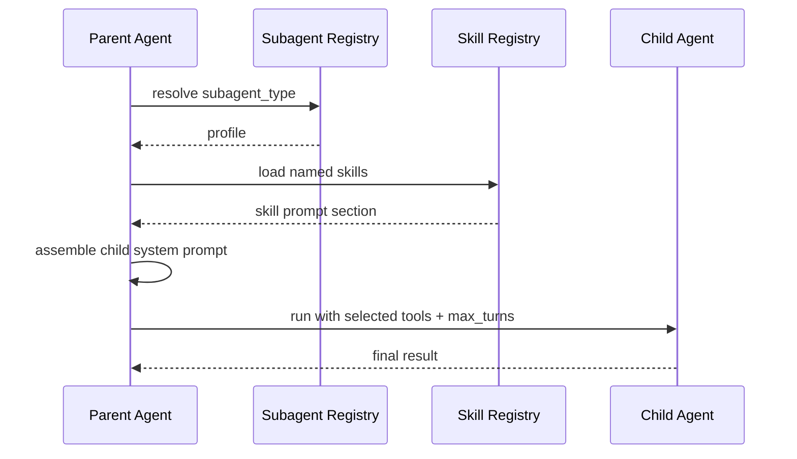

# Chapter 35: Config-Defined Subagents

In Chapter 22, we added bundled subagent orchestration.

That gave the harness a real parent-child runtime:

- the parent can delegate
- the child runs in isolated context
- the parent synthesizes the result

That was the right first step.

But the first version still had an important limitation:

- subagents were defined only in code

For a real agent application, that is not enough.

Users should be able to define specialized subagents the same way they define:

- memory on disk
- skills on disk
- config on disk

This chapter adds that missing piece.

The concrete target is:

- define subagents in a simple config file
- let the harness load them dynamically
- let a subagent be useful with only:
  - a description
  - optional skills
  - optional tool restrictions

That gives us a much more realistic agent application model.

## Why This Matters

A strong agent runtime should not force every specialist child agent to be hardcoded in Python.

That becomes painful quickly.

For example, imagine a content app with:

- `researcher`
- `editor`
- `seo-reviewer`
- `social-writer`

If every one of those must be wired inline in Python, then:

- the application becomes harder to customize
- non-runtime changes still require code edits
- the line between “application behavior” and “runtime engine” becomes blurry

That is exactly why the DeepAgents `content-builder-agent` example is interesting.

It keeps the application mostly filesystem-driven:

- `AGENTS.md`
- `skills/`
- `subagents.yaml`

But even there, a small code loader is still needed to turn config into runnable subagents.

That is the right lesson to carry into our project:

> subagent config should live on disk, but the harness still needs a small runtime loader.

## The Design Goal

We want the feature to be:

- dynamic
- simple
- easy to read
- compatible with the current harness

So we will **not** build:

- a plugin marketplace
- remote subagent graphs
- per-subagent model providers
- nested subagent inheritance rules
- a big YAML-based policy language

Instead, we will build a small local registry.

This registry lives inside the harness runtime.

That is important:

- the application defines profiles on disk
- the harness still owns execution semantics

We are not turning subagents into a second framework.

## The Smallest Good Shape

We use one project-facing file:

```text
.subagents.json
```

Why JSON?

Because the current tutorial runtime already uses JSON for:

- `.mini-claw.json`
- `.mcp.json`

That keeps the configuration story consistent and avoids introducing YAML only for one feature.

## What The File Looks Like

The config looks like this:

```json
{
  "subagents": {
    "researcher": {
      "description": "Use for focused research and note-taking tasks.",
      "skills": ["research-notes"],
      "tools": ["read", "write", "bash"],
      "max_turns": 6
    },
    "editor": {
      "description": "Review and improve drafted content.",
      "system_prompt": "You are an editor. Improve clarity, structure, and tone.",
      "skills": ["editing"],
      "tools": ["read", "edit", "write"]
    }
  }
}
```

This is intentionally small.

The important point is that this file contains **profiles**, not executable code.

The runtime still owns:

- actual tool objects
- child prompt assembly
- child execution
- turn limits

## Required And Optional Fields

Each subagent profile has:

### Required

- `description`

The parent agent uses this to decide when to delegate.

### Optional

- `system_prompt`
- `skills`
- `tools`
- `max_turns`

That is enough for the first slice.

It is also a good stopping point.

If we add too much more in the first version, the feature quickly stops being teachable.

## Why `description` Is Required

The parent needs a routing hint.

If the profile only has a name like `researcher`, that is too weak.

The parent should see:

- what the child is for
- when it is appropriate
- what kind of outcome to expect

So `description` is the real routing contract.

## Why `system_prompt` Is Optional

This is one of the most important design choices in the chapter.

We want a profile to work even if the user defines only:

- description
- skills

That means a profile should not require a large handwritten prompt.

If `system_prompt` is missing, the harness should build a reasonable child prompt from:

1. the default subagent system prompt
2. the profile description
3. the selected skill prompt section

That makes config-defined subagents much easier to author.

This is the “skills only should still work” requirement.

It is also the main reason this design feels practical.

Many users can define a useful specialist without writing a big custom prompt.

## Why `skills` Uses Skill Names

We already have a skill registry.

So the cleanest design is:

- the subagent profile references skill names
- the runtime resolves those names against the loaded skill registry

We do **not** need a separate skill format for subagents.

That keeps the model simple:

- one skill system
- many runtimes can reuse it

## Why `tools` Uses Tool Names

Subagent tools should be a subset of the parent runtime tools.

So the profile only needs to say:

```json
"tools": ["read", "write", "bash"]
```

That is enough.

The harness already knows the real tool objects.

This keeps the profile declarative instead of executable.

It also keeps the file safer.

The config selects capabilities.
It does not define capability behavior.

## General-Purpose Fallback

We still keep one important default:

If no named profile is selected, the harness should still be able to use a general-purpose child.

That means:

- current bundled subagent behavior keeps working
- config-defined profiles extend the system, not replace it

So the runtime supports:

- no `subagent_type` -> general-purpose child
- explicit `subagent_type="researcher"` -> configured profile

This fallback matters because it prevents the new feature from breaking existing behavior.

## Tool Interface

We keep one generic tool:

```text
subagent(task, subagent_type?)
```

That is better than generating one local tool per profile.

Why?

Because the parent already knows how to use one delegation tool.

We only need to extend it with profile selection.

This keeps the tool universe smaller and easier to teach.

It also keeps orchestration stable:

- write a strong task brief
- optionally choose a profile

That is the whole model.

## Parent Prompt

The parent prompt should list available configured subagents, for example:

```text
Available configured subagent types:
- researcher: Use for focused research and note-taking tasks.
- editor: Review and improve drafted content.
```

That gives the parent a routing table.

The parent still owns orchestration.

The config file only gives it better options.

That is an important boundary:

- config suggests specialists
- parent still decides delegation

## Child Prompt Assembly

When the user selects a profile, or the parent selects it automatically, the harness builds the child prompt like this:



This is intentionally compositional.

We are not storing a complete compiled child prompt in config.

We are assembling it from runtime pieces.

That keeps the feature aligned with the rest of the harness.

It also means the child prompt is always rebuilt from live runtime state.

That is good because:

- skills can change on disk
- the default child prompt can improve
- the same profile can behave differently under different loaded runtime features

## User And Project Override

Like other config in this project, subagent config should support:

- user file
- project file

So we use a default path order like:

```text
~/.subagents.json
./.subagents.json
```

And if the same subagent name exists in both:

- project overrides user

This matches the existing config style and keeps behavior predictable.

In practice, this means:

- user config is a personal default library
- project config is the application-specific override

## Runtime Behavior

The runtime should work like this:

1. Load subagent profiles from config files.
2. Merge user and project definitions.
3. Enable the normal bundled subagent tool.
4. Add available profile names and descriptions to the parent prompt.
5. When a `subagent` call includes `subagent_type`, resolve that profile.
6. Build child tools and child prompt from the profile.
7. Run the child with the existing subagent loop.

That is all.



## Validation Rules

The runtime should not fail silently here.

So the first good implementation should validate:

- unknown `subagent_type`
- unknown tool names in a profile
- profile tries to include `subagent` recursively
- profile references skills but no skill registry is active
- profile references unknown skill names

This matters because silent fallback would make the feature hard to learn and hard to trust.

The failure should be explicit.

For example:

- `error: unknown configured subagent type 'researcher'`
- `error: configured subagent 'editor' references unknown tool 'format_doc'`

That is much better than quietly dropping behavior.

## Why This Current Design Is Good

I think this first design is strong for this project because it keeps the right balance.

### What it gets right

- filesystem-driven application behavior
- one generic delegation tool
- live child prompt assembly
- skill reuse instead of a second skill system
- project/user override pattern that matches the rest of the harness
- backward-compatible fallback to the general-purpose child

### What it intentionally does not solve yet

- remote or async subagents
- custom child models
- policy inheritance per subagent
- long-lived child agents
- visual subagent management UI

That is acceptable.

A first design should be good because it is:

- small
- coherent
- extensible

Not because it already covers every future case.

## Why This Is Better Than Hardcoding

With this feature, a user can now build a specialized app mostly from files:

- `AGENTS.md`
- `skills/`
- `.subagents.json`

That is exactly the direction we want for a real harness application.

The runtime stays generic.
The application behavior becomes more configurable.

## Example

Suppose the project has:

- skill `research-notes`
- skill `editing`
- a `.subagents.json` file with `researcher` and `editor`

Then the parent agent can do this:

- use `researcher` when a writing task needs source gathering
- use `editor` after a long draft is created

And the user did not need to write new Python code just to add those roles.

That is the main win.

## What We Will Not Support Yet

To keep the system small, this chapter intentionally does **not** support:

- per-subagent model override
- async/remote subagents
- nested subagent definitions
- profile inheritance
- per-subagent MCP config
- per-subagent control-plane profiles

Those are real future directions.

But they are not necessary for the first filesystem-driven subagent layer.

This is one place where the current design is intentionally conservative.

Why no per-subagent model override yet?

Because the current runtime does not yet have a clean multi-model child-provider story.

If we added model selection too early, the chapter would become about provider wiring instead of subagent profiles.

That is a real feature, but it should come later.

## Tests

The tests for this chapter should verify:

- subagent config file parsing
- user/project merge behavior
- optional `system_prompt` behavior
- skill-only profiles still produce a useful child prompt
- `subagent_type` selects the right profile
- profile-specific tool restrictions are applied
- invalid tool or skill references fail clearly
- unknown subagent types fail clearly
- parent prompt lists configured subagent types

These are the important contracts.

## Recap

This chapter adds a new kind of filesystem-driven application behavior:

- config-defined subagents

The key ideas are:

- keep one generic `subagent` tool
- add optional `subagent_type`
- store profiles in `.subagents.json`
- let profiles work with description + skills only
- compose child prompts at runtime
- validate bad profile references explicitly

This is the smallest good design that gives the harness a much more realistic application layer.
