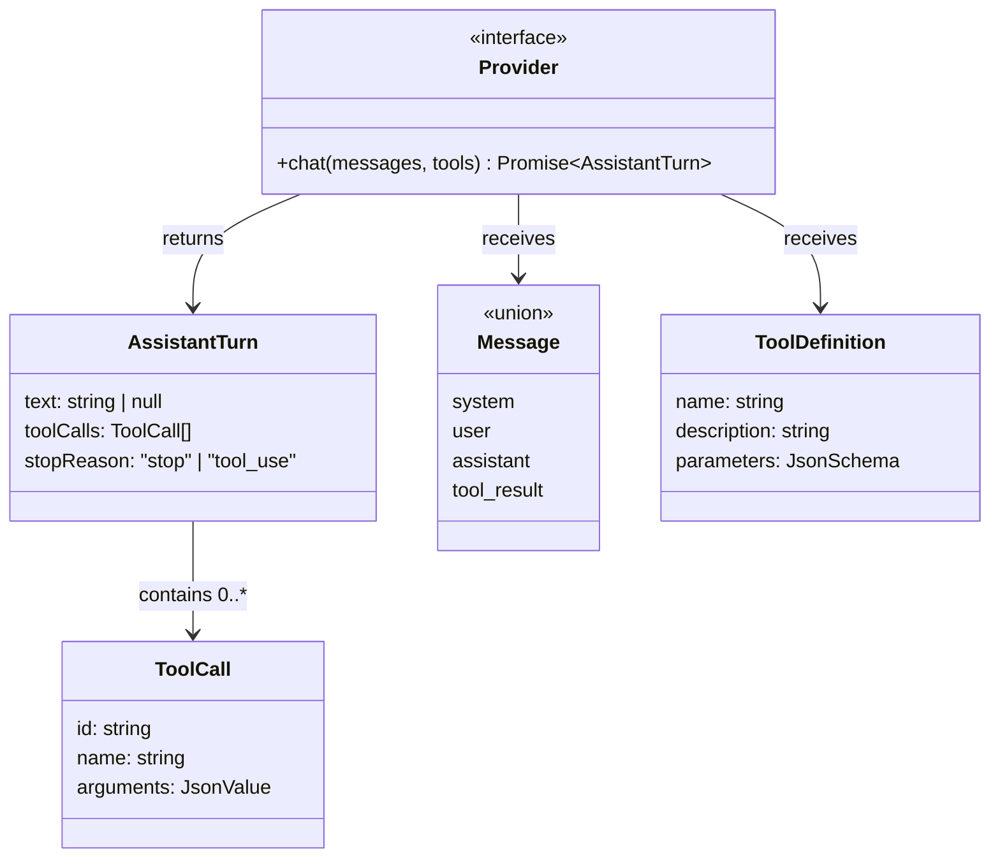

# Chapter 1: Core Types

In this chapter you will understand the types that make up the agent protocol:
`StopReason`, `AssistantTurn`, `Message`, `ToolDefinition`, and the `Provider`
interface. These are the building blocks everything else is built on.

To verify your understanding, you will implement a small test helper:
`MockProvider`, a class that returns pre-configured responses so that you can
test future chapters without an API key.

## Goal

Understand the core types, then implement `MockProvider` so that:

1. You create it with an array of canned `AssistantTurn` responses.
2. Each call to `chat()` returns the next response in sequence.
3. If all responses have been consumed, it throws an error.

## The core types

Open `mini-claw-code-starter-ts/src/types.ts`. These types define the protocol
between the agent and any LLM backend.

Here is how they relate to each other:



`Provider` takes in messages and tool definitions, and returns an
`AssistantTurn`. The turn's `stopReason` tells you what to do next.

### `ToolDefinition` and its builder

```ts
export class ToolDefinition {
  readonly parameters: JsonSchema

  static new(name: string, description: string): ToolDefinition
  param(name: string, type: string, description: string, required: boolean): ToolDefinition
}
```

Each tool declares a `ToolDefinition` that tells the LLM what it can do. The
`parameters` field is a JSON Schema object describing the tool's arguments.

Rather than constructing JSON objects by hand every time, `ToolDefinition`
exposes a builder API:

```ts
ToolDefinition.new("read", "Read the contents of a file.")
  .param("path", "string", "The file path to read", true)
```

- `new(name, description)` creates a definition with an empty parameter schema.
- `param(name, type, description, required)` adds a parameter and returns
  `this`, so you can chain calls.

You will use this builder in every tool starting from Chapter 2.

### `StopReason` and `AssistantTurn`

```ts
export type StopReason = "stop" | "tool_use"

export interface AssistantTurn {
  text: string | null
  toolCalls: ToolCall[]
  stopReason: StopReason
}
```

The `ToolCall` type holds a single tool invocation:

```ts
export interface ToolCall {
  id: string
  name: string
  arguments: JsonValue
}
```

Each tool call has an `id` (for matching results back to requests), a `name`
(which tool to call), and `arguments` (a JSON value the tool will parse).

Every response from the LLM comes with a `stopReason` that tells you *why* the
model stopped generating:

- **`"stop"`** -- the model is done. Check `text` for the response.
- **`"tool_use"`** -- the model wants to call tools. Check `toolCalls`.

This is the raw LLM protocol: the model tells you what to do next. In
Chapter 3 you will write a function that explicitly switches on `stopReason`.
In Chapter 5 you will wrap that logic inside a loop to create the full agent.

### The `Provider` interface

```ts
export interface Provider {
  chat(messages: Message[], tools: ToolDefinition[]): Promise<AssistantTurn>
}
```

This says: "A Provider is something that can take a message history and tool
definitions, and asynchronously return an `AssistantTurn`."

The TypeScript version is simpler than the Rust version because it does not
need traits, generic lifetimes, or `impl Future`. A `Promise` is enough. But
the architecture is identical:

- the provider owns the HTTP / API details
- the agent owns the loop
- tools own side effects

That separation is what makes the system testable.

### The `Message` union

```ts
export type Message =
  | { kind: "system"; text: string }
  | { kind: "user"; text: string }
  | { kind: "assistant"; turn: AssistantTurn }
  | { kind: "tool_result"; id: string; content: string }
```

The conversation history is a list of `Message` values:

- **`{ kind: "system", text }`** -- a system prompt that sets the agent's role
  and behavior. Usually the first message in the history.
- **`{ kind: "user", text }`** -- a prompt from the user.
- **`{ kind: "assistant", turn }`** -- a response from the LLM.
- **`{ kind: "tool_result", id, content }`** -- the result of executing a tool
  call. The `id` matches `ToolCall.id` so the LLM knows which call this result
  belongs to.

You will use these variants starting in Chapter 3 when building the
`singleTurn()` function.

### Why discriminated unions matter

This is one of the places TypeScript shines. The `kind` field turns `Message`
into a discriminated union, which means a `switch (message.kind)` narrows the
shape safely:

```ts
switch (message.kind) {
  case "user":
    return message.text
  case "assistant":
    return message.turn.text
}
```

You do not need inheritance hierarchies or classes for every message variant.
The type system already knows which fields exist in each branch.

### `ToolSet` -- a collection of tools

One more type you will use starting in Chapter 3: `ToolSet`. It wraps a
`Map<string, Tool>` and indexes tools by name, giving O(1) lookup when
executing tool calls. You build one with a builder:

```ts
const tools = ToolSet.new()
  .with(ReadTool.new())
```

You do not need to implement `ToolSet` in this chapter, but it is worth
understanding now because it becomes central in the next two chapters.

## The implementation task

Open `mini-claw-code-starter-ts/src/mock.ts`. You will see a `MockProvider`
class with a constructor, a `new()` helper, and an unimplemented `chat()`
method.

The implementation is small, but pay attention to the behavior:

1. It should return responses in FIFO order.
2. It should ignore the `messages` and `tools` arguments entirely.
3. It should throw when the queue is empty.

The point of `MockProvider` is not realism. The point is deterministic tests.
It lets you validate the agent loop, tools, and provider protocol without any
network dependency.

### A straightforward implementation

Store the response array on the instance, then remove from the front on each
call:

```ts
const turn = this.responses.shift()
if (!turn) {
  throw new Error("MockProvider: no more responses")
}
return turn
```

That is enough for Chapter 1.

## Running the tests

Run the Chapter 1 tests:

```bash
bun test mini-claw-code-starter-ts/tests/ch1.test.ts
```

The important behaviors are:

- returns the next canned response
- preserves the response contents exactly
- throws when exhausted

## Recap

- **`ToolDefinition`** describes what a tool can do.
- **`AssistantTurn`** is the raw LLM response.
- **`Message`** stores the full conversation history.
- **`Provider`** is the abstraction boundary between your runtime and the model.
- **`MockProvider`** gives you deterministic tests before you add real HTTP.

These types are the foundation for every chapter that follows.
