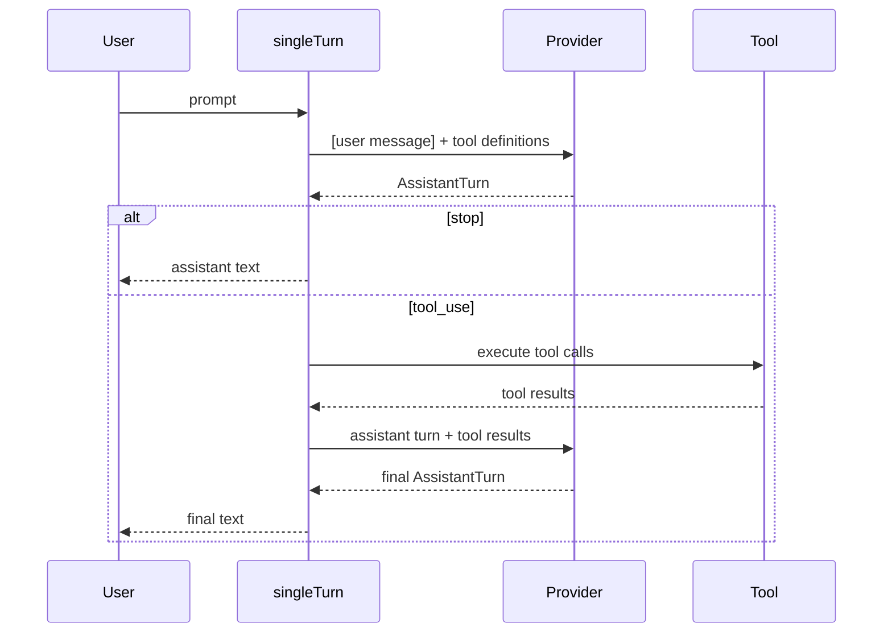

# Chapter 3: Single Turn

In Chapter 2 you built a tool. Now you will connect tools to the provider for
the first time.

This chapter implements `singleTurn()` -- one prompt, one provider call, maybe
one round of tool execution, then a final answer.

That is not yet a full agent loop, but it is the first time the pieces behave
like an agent instead of separate components.

## Goal

Implement `singleTurn()` so that:

1. it sends the user's prompt to the provider
2. if the provider returns `"stop"`, it returns the assistant text directly
3. if the provider returns `"tool_use"`, it:
   - executes each requested tool
   - appends the assistant turn and tool results to the message history
   - calls the provider one more time
   - returns the final text

## The `ToolSet`

The function signature uses a `ToolSet`:

```ts
export async function singleTurn(
  provider: Provider,
  tools: ToolSet,
  prompt: string,
): Promise<string>
```

`ToolSet` wraps a `Map<string, Tool>` and indexes tools by name, giving O(1)
lookup when the model requests `"read"` or another tool.

Important methods:

- `tools.get(name)` -- find the requested tool
- `tools.definitions()` -- collect all tool schemas to send to the provider

## The message flow

The single-turn protocol looks like this:



This is still small enough to understand in one sitting, which is why it is
such a good teaching step.

## Key TypeScript concepts

### Branching on `stopReason`

The provider returns:

```ts
type StopReason = "stop" | "tool_use"
```

So the core branch is just:

```ts
if (turn.stopReason === "stop") {
  return turn.text ?? ""
}
```

Everything else happens in the `"tool_use"` case.

### Graceful tool errors

When a tool fails, you should not crash `singleTurn()`.

Instead, convert the failure into a string result:

```ts
const content = await tool.call(call.arguments)
  .catch((error) => `error: ${message}`)
```

That string becomes a `tool_result` message, and the model can decide what to
do next.

This is important because later agent loops depend on recovery. A missing file
or wrong path should not kill the whole interaction.

## The implementation

Open `mini-claw-code-starter-ts/src/agent.ts`.

### Step 1: Collect tool definitions

At the beginning of `singleTurn()`, collect the schemas for all registered
tools:

```ts
const definitions = tools.definitions()
```

These go to the provider alongside the messages.

### Step 2: Create the initial message history

For a single-turn interaction, the history starts with one user message:

```ts
const messages: Message[] = [
  { kind: "user", text: prompt },
]
```

### Step 3: Call the provider

Ask the provider for the first assistant turn:

```ts
const turn = await provider.chat(messages, definitions)
```

### Step 4: Handle `"stop"`

If the provider returns a final answer immediately, return it:

```ts
if (turn.stopReason === "stop") {
  return turn.text ?? ""
}
```

The `?? ""` handles providers that omit text in a stop response.

### Step 5: Execute tool calls

If the provider wants tools:

1. iterate through `turn.toolCalls`
2. find each tool in the `ToolSet`
3. execute it if present
4. if absent, return an `"unknown tool"` error string
5. collect `{ id, content }` results

A typical pattern looks like this:

```ts
const results: Array<{ id: string; content: string }> = []

for (const call of turn.toolCalls) {
  const tool = tools.get(call.name)
  const content = tool
    ? await tool.call(call.arguments).catch(...)
    : `error: unknown tool \`${call.name}\``

  results.push({ id: call.id, content })
}
```

### Step 6: Push the assistant turn and tool results

The provider needs to see both:

- what it asked for
- what happened when those tool calls ran

So append:

1. the assistant turn as `{ kind: "assistant", turn }`
2. each tool result as `{ kind: "tool_result", id, content }`

### Step 7: Call the provider again

Now ask the provider one more time with the enriched history:

```ts
const finalTurn = await provider.chat(messages, definitions)
return finalTurn.text ?? ""
```

That is the complete `singleTurn()` function.

## Error handling: never crash the loop

This chapter sets an important rule that stays with the project:

> Tool failures become tool-result strings, not uncaught exceptions.

Why?

Because the model can recover.

If `read` fails with:

```text
error: missing 'path' argument
```

the model may respond by trying again with the correct path.

If `singleTurn()` threw instead, the interaction would die immediately.

## Running the tests

Run the Chapter 3 tests:

```bash
bun test mini-claw-code-starter-ts/tests/ch3.test.ts
```

### What the tests verify

- direct responses return text immediately
- tool calls are executed and followed by a second provider call
- unknown tools do not crash the function
- tool errors are converted into strings rather than escaping

## Recap

- `singleTurn()` is the first complete model -> tool -> model cycle.
- `ToolSet` gives you name-based tool lookup.
- `stopReason` determines whether to return text or execute tools.
- Tool failures are handled as recoverable text, not fatal exceptions.

In the next chapter, you will add more tools so the model can do useful work.
