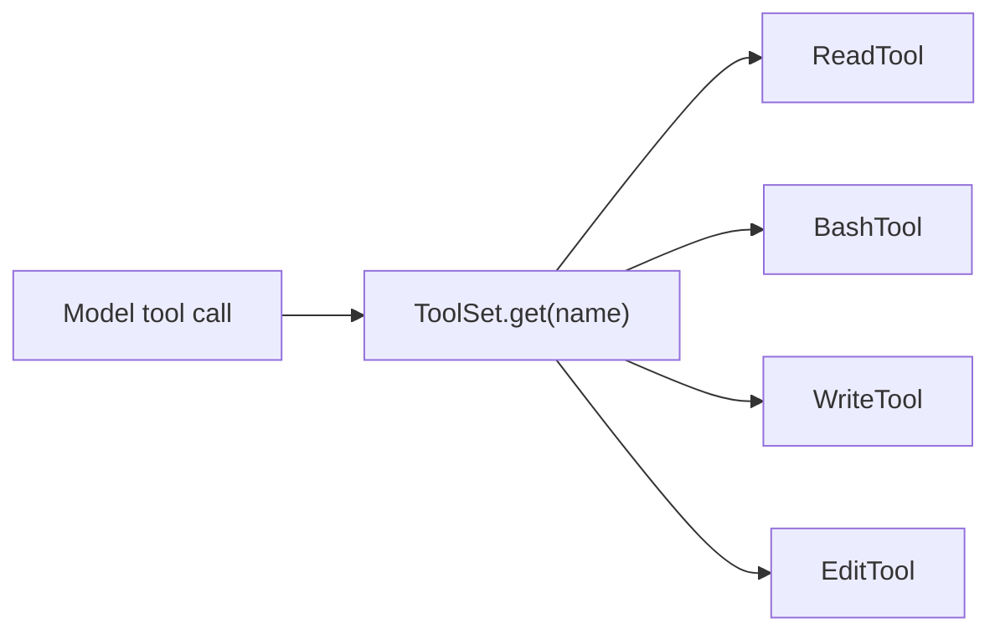

# Chapter 4: More Tools

`ReadTool` was the simplest possible example. Now you will add three tools that
make the agent much more capable:

- `BashTool`
- `WriteTool`
- `EditTool`

Together with `ReadTool`, these are enough for the agent to inspect a project,
change files, and run shell commands.

## Goal

Implement all three tools so that:

1. each exposes the correct schema
2. each validates its arguments
3. each performs the requested action
4. errors are surfaced clearly

## The bigger picture

By the end of this chapter, the tool layer will look like this:



The agent loop still does not change much. It simply gets more capabilities to
invoke.

## Tool 1: `BashTool`

Open `mini-claw-code-starter-ts/src/tools/bash.ts`.

### Schema

The definition should require a single `command` parameter:

```ts
ToolDefinition.new(
  "bash",
  "Run a bash command and return its output.",
).param("command", "string", "The bash command to run", true)
```

### Key concept: child processes

The scaffold imports:

```ts
import { spawn } from "node:child_process"
```

The implementation should run:

```text
bash -lc <command>
```

Why `bash -lc`?

- `bash` gives you shell parsing
- `-l` starts a login shell, which is useful for environment setup in many dev
  machines
- `-c` lets you pass the command as a single string

### Implementation requirements

`call()` should:

1. validate that `args.command` is a string
2. spawn `bash -lc <command>`
3. collect both stdout and stderr
4. return:
   - stdout if present
   - `stderr: ...` if stderr is present
   - `(no output)` if neither stream produced content

The model needs the text result, not the raw child-process object.

## Tool 2: `WriteTool`

Open `mini-claw-code-starter-ts/src/tools/write.ts`.

### Schema

The tool definition should require:

- `path`
- `content`

### Key concept: creating parent directories

If the model wants to write `src/generated/output.ts`, the parent directories
may not exist yet.

That is why the scaffold imports:

```ts
import { mkdir, writeFile } from "node:fs/promises"
```

Implementation outline:

1. validate `path` and `content`
2. compute the parent directory
3. create it recursively
4. write the file
5. return a confirmation string such as `wrote <path>`

## Tool 3: `EditTool`

Open `mini-claw-code-starter-ts/src/tools/edit.ts`.

### Schema

This tool requires:

- `path`
- `oldString`
- `newString`

Notice that the TypeScript starter uses camelCase field names here. The tool
interface itself does not care whether argument names are snake_case or
camelCase; the important thing is that the schema and implementation agree.

### Why exact-string editing?

The tool does not perform a diff or an AST transform. It performs a very small,
safe edit:

> "Find this exact string, replace it once, and fail if that is ambiguous."

That gives you a useful safety property:

- if the old string is missing, something is wrong
- if the old string appears multiple times, the replacement is ambiguous

So `EditTool` should:

1. read the file
2. count how many times `oldString` appears
3. if the count is `0`, throw
4. if the count is greater than `1`, throw
5. replace exactly one occurrence
6. write the file back
7. return a confirmation string

## Why these tools are enough

At this point, the model can:

- inspect files with `read`
- update files with `write` and `edit`
- inspect the environment with `bash`

That is already enough to support many coding-agent tasks:

- read `package.json`
- run tests
- edit a file
- run tests again
- report the result

The agent loop in Chapter 5 will connect these tools to the provider
repeatedly.

## Running the tests

Run the Chapter 4 tests:

```bash
bun test mini-claw-code-starter-ts/tests/ch4.test.ts
```

### What the tests verify

- `BashTool` exposes the `command` parameter
- `WriteTool` exposes `path` and `content`
- `EditTool` exposes `path`, `oldString`, and `newString`

The starter tests focus mainly on the public surface. The completed solution
package contains broader coverage.

## Recap

- `BashTool` turns shell execution into model-readable text
- `WriteTool` creates files and parent directories
- `EditTool` performs exact one-match replacements
- Together with `ReadTool`, these tools form the minimal coding-agent toolkit

In the next chapter, you will use them inside a real agent loop.
