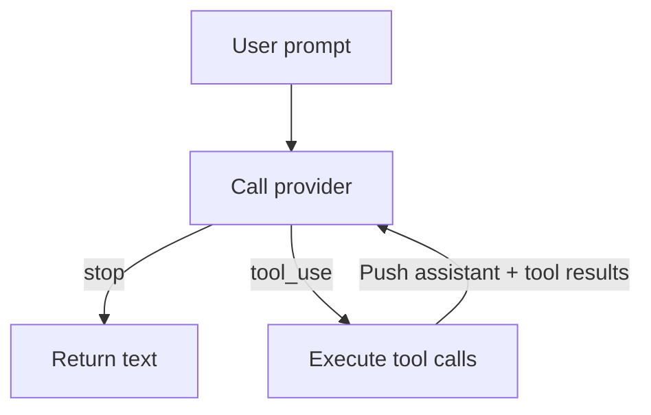

# Chapter 5: Your First Agent SDK!

This is the chapter where everything comes together. You have a provider that
returns `AssistantTurn` responses and four tools that execute actions. Now you
will build `SimpleAgent` -- the loop that connects them.

This is the "aha!" moment of the tutorial. The agent loop is surprisingly
short, but it is the engine that makes an LLM into an agent.

## What is an agent loop?

In Chapter 3 you built `singleTurn()` -- one prompt, one round of tool calls,
one final answer. That is enough when the model knows everything it needs after
reading one file. But real tasks are messier:

> "Find the bug in this project and fix it."

The model might need to:

- read several files
- run tests
- write or edit code
- run tests again
- then report back

Each step depends on the result of the previous one. That is why you need a
**loop**.



1. send messages to the provider
2. if the model is done, return its text
3. if the model wants tools, execute them
4. append the assistant turn and tool results
5. repeat

That is the entire architecture of a coding agent.

The later chapters add streaming, UI, planning, and subagents, but the core
loop remains the same.

## Goal

Implement `SimpleAgent` so that:

1. it holds a provider and a collection of tools
2. you can register tools with a builder pattern (`.tool(ReadTool.new())`)
3. the `run()` method implements the loop:
   prompt -> provider -> tools -> provider -> ... -> final text

## Key TypeScript concepts

### Classes plus interfaces

The starter defines:

```ts
export class SimpleAgent {
  constructor(
    readonly provider: Provider,
    tools?: ToolSet,
  ) { ... }
}
```

This is the TypeScript equivalent of the generic `SimpleAgent<P: Provider>` in
the Rust edition. Because TypeScript is structurally typed, the `provider`
field only needs to satisfy the `Provider` interface.

### `Map<string, Tool>` as a heterogeneous tool registry

`ToolSet` internally stores tools by name. That lets the agent execute:

```ts
const tool = this.tools.get(call.name)
```

without needing one field per tool type.

This is the same architectural idea as the Rust `HashMap<String, Box<dyn Tool>>`
version. The syntax is different, but the design is identical: heterogeneous
tools behind one common interface.

### Builder-style registration

The `.tool()` method should return `this`, which allows:

```ts
const agent = SimpleAgent.new(provider)
  .tool(BashTool.new())
  .tool(ReadTool.new())
  .tool(WriteTool.new())
  .tool(EditTool.new())
```

The builder pattern matters because it keeps the example code compact and makes
the agent configuration read naturally from top to bottom.

## The implementation

Open `mini-claw-code-starter-ts/src/agent.ts`.

### Step 1: Implement `new()`

The constructor already stores the provider. The `new()` factory should simply
create a `SimpleAgent`:

```ts
static new(provider: Provider): SimpleAgent {
  return new SimpleAgent(provider)
}
```

### Step 2: Implement `.tool()`

Register the tool in the `ToolSet`, then return `this`:

```ts
tool(tool: Tool): SimpleAgent {
  this.tools.push(tool)
  return this
}
```

### Step 3: Implement `run()`

This is the heart of the agent.

The structure should be:

1. collect tool definitions
2. create a message history beginning with the user prompt
3. loop forever:
   - call `provider.chat(...)`
   - if `stopReason === "stop"`, return the text
   - if `stopReason === "tool_use"`, execute tools and append results

In outline form:

```ts
const definitions = this.tools.definitions()
const messages: Message[] = [{ kind: "user", text: prompt }]

for (;;) {
  const turn = await this.provider.chat(messages, definitions)

  if (turn.stopReason === "stop") {
    ...
  }

  ...
}
```

### Executing tools

The starter already gives you a helper:

```ts
protected async executeTools(
  turn: AssistantTurn,
): Promise<Array<{ id: string; content: string }>>
```

Use it.

That helper encapsulates the same rule from Chapter 3:

- missing tools become `"error: unknown tool ..."`
- tool failures become `"error: ..."` strings

This keeps the main loop clean.

### Pushing messages

After executing a turn's tool calls, append:

1. the assistant turn
2. the tool-result messages

This is the same protocol rule as Chapter 3, just repeated until stop.

The order matters:

- assistant turn first
- tool results after

That preserves the request -> result relationship in the history.

## Why the loop is the whole game

Once `SimpleAgent` works, the rest of the project stops being mysterious.

Everything later is just a variation on this pattern:

- **streaming** changes how provider output arrives
- **TUI support** changes how events are rendered
- **plan mode** filters which tools are visible in one phase
- **subagents** move the same loop into a tool

But the core idea is still:

> call model -> inspect response -> run tools -> append results -> repeat

That is why this chapter is the conceptual center of the book.

## Running the tests

Run the Chapter 5 tests:

```bash
bun test mini-claw-code-starter-ts/tests/ch5.test.ts
```

### What the tests verify

- the agent returns the provider's text when no tools are needed
- the loop continues until the provider eventually returns `"stop"`
- tool registration works through the builder pattern

## Recap

- `SimpleAgent` is the component that turns model output into agent behavior.
- The loop itself is small: provider call, branch on `stopReason`, execute
  tools, append results, repeat.
- `ToolSet` gives the model a runtime capability registry.
- Once this chapter works, you have the core architecture of a coding agent.

In the next chapter, you will replace `MockProvider` with a real HTTP-backed
provider.
