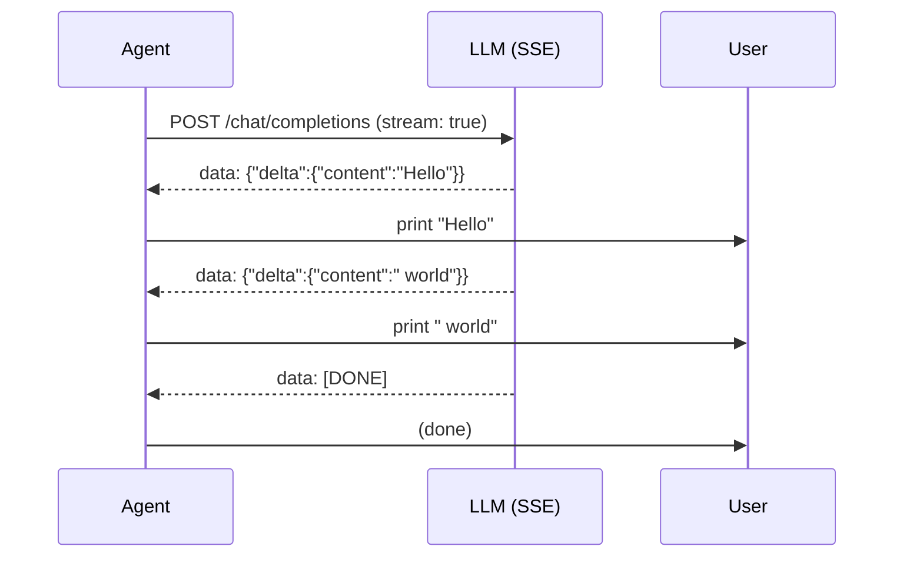

# Chapter 10: Streaming

In Chapter 6 you built `OpenAICompatibleProvider.chat()`, which waits for the
*entire* response before returning. That works, but the user stares at a blank
screen until the model finishes. Real coding agents stream output as it
arrives.

This chapter adds streaming support and a `StreamingAgent` -- the streaming
counterpart to `SimpleAgent`. You will:

1. Define a `StreamEvent` union that represents real-time deltas.
2. Build a `StreamAccumulator` that collects deltas into a complete
   `AssistantTurn`.
3. Write `parseSseLine()` to convert raw Server-Sent Event lines into
   `StreamEvent`s.
4. Define a `StreamProvider` interface.
5. Implement `StreamProvider` for `OpenAICompatibleProvider`.
6. Build a `MockStreamProvider` for testing without HTTP.
7. Build `StreamingAgent<P extends StreamProvider>` -- a full agent loop with
   real-time text streaming.

None of this replaces `Provider` or `SimpleAgent`. Streaming is layered on top
of the architecture you already have.

## Why Streaming?

Without streaming, a long response makes the CLI feel frozen. Streaming fixes
three things:

- **Immediate feedback** -- the user sees the first words quickly instead of
  waiting for the whole answer.
- **Early cancellation** -- if the agent heads in the wrong direction, the
  user can stop it sooner.
- **Progress visibility** -- the user can see that the agent is still working.

That is a big part of why coding agents feel responsive even when the model is
generating a long answer.

## How SSE Works

OpenAI-compatible APIs stream via
[Server-Sent Events (SSE)](https://developer.mozilla.org/en-US/docs/Web/API/Server-sent_events).
You set `stream: true` in the request, and instead of one big JSON response,
the server sends a series of `data:` lines.

Example:

```text
data: {"choices":[{"delta":{"content":"Hello"},"finish_reason":null}]}

data: {"choices":[{"delta":{"content":" world"},"finish_reason":null}]}

data: {"choices":[{"delta":{},"finish_reason":"stop"}]}

data: [DONE]
```

Each line starts with `data: ` followed by a JSON object or the sentinel
`[DONE]`. The important difference from the non-streaming response is that
each chunk has a `delta` field with only the new part. Your code reads those
deltas one by one, prints them immediately, and accumulates them into the
final result.

Here is the flow:



Tool calls stream the same way, but with `tool_calls` deltas instead of
`content` deltas. The tool call's name and arguments arrive in pieces that you
concatenate.

## StreamEvent

Open [`mini-claw-code-ts/src/streaming.ts`](/Users/dzung/mini-claw-code/mini-claw-code-ts/src/streaming.ts).
The `StreamEvent` union is our domain type for streaming deltas:

```ts
export type StreamEvent =
  | { kind: "text_delta"; text: string }
  | { kind: "tool_call_start"; index: number; id: string; name: string }
  | { kind: "tool_call_delta"; index: number; arguments: string }
  | { kind: "done" };
```

This is the interface between the SSE parser and the rest of the application.
The parser produces `StreamEvent`s; the UI consumes them for display; the
accumulator collects them into an `AssistantTurn`.

## StreamAccumulator

The accumulator is a simple state machine. It keeps a running `text` buffer
and a list of partial tool calls. Each `feed()` call appends to the
appropriate place:

```ts
export class StreamAccumulator {
  feed(event: StreamEvent): void
  finish(): AssistantTurn
}
```

The implementation is straightforward:

- `text_delta` appends to `text`
- `tool_call_start` grows the tool-call array if needed and stores the `id`
  and `name` for that index
- `tool_call_delta` appends to the arguments string for that index
- `done` is a no-op; `finish()` does the final conversion

The important detail is that tool-call arguments arrive as fragments. They are
not valid JSON until all the pieces are concatenated, so the accumulator keeps
them as strings until the end.

`finish()` then builds the final `AssistantTurn`:

```ts
const toolCalls = partialToolCalls
  .filter((toolCall) => toolCall.name.length > 0)
  .map((toolCall) => ({
    id: toolCall.id,
    name: toolCall.name,
    arguments: JSON.parse(toolCall.arguments),
  }));

return {
  text: text.length > 0 ? text : undefined,
  toolCalls,
  stopReason: toolCalls.length > 0 ? "tool_use" : "stop",
};
```

That is the same idea as the Rust version: accumulate first, normalize at the
end.

## Parsing SSE Lines

`parseSseLine()` takes one `data:` line and returns zero or more events:

```ts
export function parseSseLine(line: string): StreamEvent[] | undefined
```

The parser handles three cases:

1. Non-`data:` lines are ignored.
2. `data: [DONE]` becomes a `done` event.
3. JSON lines become one or more text/tool-call events.

The JSON shape mirrors the OpenAI delta format:

```ts
type ChunkResponse = {
  choices: Array<{
    delta?: {
      content?: string;
      tool_calls?: Array<{
        index: number;
        id?: string;
        function?: { name?: string; arguments?: string };
      }>;
    };
  }>;
};
```

For tool calls, the first chunk includes `id` and `function.name` and later
chunks only include `function.arguments`. The parser emits
`tool_call_start` when `id` is present and `tool_call_delta` for each argument
fragment.

## StreamProvider

Just as `Provider` defines the non-streaming interface, `StreamProvider`
defines the streaming one:

```ts
export interface StreamProvider {
  streamChat(
    messages: Message[],
    tools: ToolDefinition[],
    onEvent: StreamEventHandler,
  ): Promise<AssistantTurn>;
}
```

The key difference from `Provider.chat()` is the `onEvent` callback. The
implementation sends `StreamEvent`s through that callback as they arrive and
still returns the final accumulated `AssistantTurn`. That gives callers both
real-time events and the complete result.

We keep `StreamProvider` separate from `Provider` rather than adding a method
to the existing interface. That keeps the non-streaming chapters simple and
lets the streaming features layer on later without disturbing the base
architecture.

## OpenAICompatibleProvider

The solution package implements `StreamProvider` for
[`OpenAICompatibleProvider`](/Users/dzung/mini-claw-code/mini-claw-code-ts/src/providers/openai-compatible.ts).
The core idea is the same as the non-streaming `chat()` method:

1. Convert internal messages into API messages.
2. Send a `stream: true` request with `fetch()`.
3. Read the response body incrementally.
4. Split on newlines.
5. Parse each SSE line into `StreamEvent`s.
6. Feed the accumulator and forward events to the caller.

The buffering detail matters. HTTP chunks do not align with SSE lines, so the
implementation carries a text buffer across reads and only processes complete
lines.

The TypeScript version uses the same OpenAI-compatible shape for both OpenAI
and Gemini. The only differences are the `baseUrl`, `apiKey`, and `model`
configuration.

## MockStreamProvider

Tests should not depend on the network. `MockStreamProvider` wraps a normal
`Provider` and synthesizes stream events from its final `AssistantTurn`.

That lets you verify the streaming pipeline without making HTTP requests.

Typical synthetic behavior:

- emit text one character at a time
- emit `tool_call_start` and `tool_call_delta` for each tool call
- emit `done` at the end

This keeps the streaming tests deterministic while still exercising the event
path.

## StreamingAgent

`StreamingAgent` is the streaming version of `SimpleAgent`. The loop is the
same: call the provider, inspect `stopReason`, execute tools if needed,
append messages, and repeat.

The difference is that it also forwards `text_delta` events to the UI as they
arrive. That means the terminal can show text before the whole response is
done.

The structure is:

```ts
export class StreamingAgent<P extends StreamProvider> {
  constructor(provider: P, tools = new ToolSet())
  tool(tool: Tool): this
  run(prompt: string, onEvent?: AgentEventHandler): Promise<string>
  chat(messages: Message[], onEvent?: AgentEventHandler): Promise<string>
}
```

The implementation pattern is the same as `SimpleAgent`, but the event handler
gets called while the provider is still streaming.

## Using Streaming In The TUI

The TUI from Chapter 9 becomes much nicer once it can consume streamed events.
That is what lets it:

- print text as it arrives
- show the spinner while waiting
- collapse tool-call output when the agent is busy

This is why Chapter 10 exists before the richer terminal UI: the UI needs a
streaming boundary to work with.

## Running The Tests

The important streaming tests are the ones that cover the parser and the
accumulator:

```bash
bun test mini-claw-code-ts/src/tests/streaming.test.ts
```

Those tests should verify:

- `parseSseLine()` parses text chunks
- `StreamAccumulator` rebuilds an `AssistantTurn`
- `MockStreamProvider` can drive `StreamingAgent` without HTTP

## Recap

- Streaming is layered on top of the existing provider and agent architecture.
- SSE lines must be buffered and parsed incrementally.
- `StreamAccumulator` rebuilds the final assistant turn.
- `StreamingAgent` gives the UI real-time text while still preserving the
  full agent loop.
- OpenAI and Gemini can both fit behind the same OpenAI-compatible streaming
  boundary.

The next chapters add user input, plan mode, and subagents on top of the same
core runtime.

