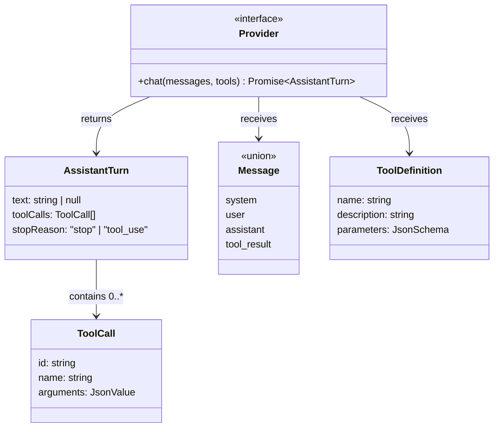

# Chương 1: Các kiểu cốt lõi

Trong chương này, bạn sẽ hiểu các kiểu dữ liệu tạo nên giao thức của agent:
`StopReason`, `AssistantTurn`, `Message`, `ToolDefinition`, và interface
`Provider`. Đây là những khối nền tảng để xây dựng mọi thứ khác.

Để kiểm tra mức độ hiểu của bạn, bạn sẽ hiện thực một helper test nhỏ:
`MockProvider`, một class trả về các phản hồi được cấu hình sẵn để bạn có thể
test các chương sau mà không cần API key.

## Mục tiêu

Hiểu các kiểu cốt lõi, rồi hiện thực `MockProvider` sao cho:

1. Bạn tạo nó với một mảng các phản hồi `AssistantTurn` dựng sẵn.
2. Mỗi lần gọi `chat()` sẽ trả về phản hồi kế tiếp.
3. Nếu đã dùng hết mọi phản hồi, nó ném ra lỗi.

## Các kiểu cốt lõi

Mở `mini-claw-code-starter-ts/src/types.ts`. Những kiểu này định nghĩa giao
thức giữa agent và bất kỳ LLM backend nào.

Chúng liên hệ với nhau như sau:



`Provider` nhận vào messages và tool definitions, rồi trả về một
`AssistantTurn`. `stopReason` của lượt trả lời cho bạn biết phải làm gì tiếp
theo.

### `ToolDefinition` và builder của nó

```ts
export class ToolDefinition {
  readonly parameters: JsonSchema

  static new(name: string, description: string): ToolDefinition
  param(name: string, type: string, description: string, required: boolean): ToolDefinition
}
```

Mỗi tool khai báo một `ToolDefinition` để nói cho LLM biết nó làm được gì.
Trường `parameters` là một object JSON Schema mô tả đối số của tool.

Thay vì tự dựng JSON object bằng tay mỗi lần, `ToolDefinition` cung cấp một
builder API:

```ts
ToolDefinition.new("read", "Read the contents of a file.")
  .param("path", "string", "The file path to read", true)
```

- `new(name, description)` tạo definition với schema rỗng.
- `param(name, type, description, required)` thêm một tham số và trả về
  `this`, nên bạn có thể nối chuỗi lời gọi.

Bạn sẽ dùng builder này trong mọi tool kể từ Chương 2.

### `StopReason` và `AssistantTurn`

```ts
export type StopReason = "stop" | "tool_use"

export interface AssistantTurn {
  text: string | null
  toolCalls: ToolCall[]
  stopReason: StopReason
}
```

`ToolCall` giữ thông tin của một lần gọi tool:

```ts
export interface ToolCall {
  id: string
  name: string
  arguments: JsonValue
}
```

Mỗi tool call có một `id` để đối chiếu kết quả, một `name` để biết phải gọi
tool nào, và `arguments` là giá trị JSON mà tool sẽ parse.

Mỗi phản hồi từ LLM đều đi kèm một `stopReason` cho biết *vì sao* mô hình
dừng:

- **`"stop"`** -- mô hình đã xong. Hãy kiểm tra `text` để lấy phản hồi.
- **`"tool_use"`** -- mô hình muốn gọi tool. Hãy kiểm tra `toolCalls`.

Đây là protocol thô của LLM: mô hình nói cho bạn biết việc tiếp theo. Ở Chương
3, bạn sẽ viết một hàm switch trực tiếp trên `stopReason`. Ở Chương 5, bạn sẽ
bọc logic đó trong một vòng lặp để tạo ra agent hoàn chỉnh.

### Interface `Provider`

```ts
export interface Provider {
  chat(messages: Message[], tools: ToolDefinition[]): Promise<AssistantTurn>
}
```

Điều này có nghĩa là: "Một Provider là thứ có thể nhận một message history và
tool definitions, rồi trả về bất đồng bộ một `AssistantTurn`."

Bản TypeScript đơn giản hơn bản Rust vì nó không cần traits, generic lifetime,
hay `impl Future`. Một `Promise` là đủ. Nhưng kiến trúc thì giống hệt:

- provider giữ phần HTTP / API
- agent giữ vòng lặp
- tools giữ các side effect

Sự tách biệt này làm hệ thống dễ kiểm thử.

### Union `Message`

```ts
export type Message =
  | { kind: "system"; text: string }
  | { kind: "user"; text: string }
  | { kind: "assistant"; turn: AssistantTurn }
  | { kind: "tool_result"; id: string; content: string }
```

Lịch sử hội thoại là một danh sách `Message`:

- **`{ kind: "system", text }`** -- system prompt đặt vai trò và hành vi của
  agent. Thường đây là message đầu tiên trong history.
- **`{ kind: "user", text }`** -- prompt từ người dùng.
- **`{ kind: "assistant", turn }`** -- phản hồi từ LLM.
- **`{ kind: "tool_result", id, content }`** -- kết quả thực thi một tool
  call. `id` khớp với `ToolCall.id` để LLM biết kết quả này thuộc call nào.

Bạn sẽ dùng những biến thể này từ Chương 3 khi xây dựng hàm `singleTurn()`.

### Vì sao discriminated union lại hữu ích?

Đây là một chỗ TypeScript phát huy sức mạnh. Trường `kind` biến `Message`
thành discriminated union, nghĩa là `switch (message.kind)` sẽ tự thu hẹp kiểu
một cách an toàn:

```ts
switch (message.kind) {
  case "user":
    return message.text
  case "assistant":
    return message.turn.text
}
```

Bạn không cần cây kế thừa hay class riêng cho từng biến thể message. Type
system đã biết trường nào tồn tại ở nhánh nào.

### `ToolSet` -- một tập hợp tool

Thêm một kiểu nữa bạn sẽ dùng từ Chương 3: `ToolSet`. Nó bọc một
`Map<string, Tool>` và index tool theo tên, cho phép tra cứu O(1) khi thực
hiện tool call. Bạn tạo nó bằng builder:

```ts
const tools = ToolSet.new()
  .with(ReadTool.new())
```

Bạn chưa cần hiện thực `ToolSet` trong chương này, nhưng nên hiểu nó ngay bây
giờ vì nó sẽ trở thành trung tâm trong hai chương tiếp theo.

## Nhiệm vụ hiện thực

Mở `mini-claw-code-starter-ts/src/mock.ts`. Bạn sẽ thấy một class `MockProvider`
với constructor, helper `new()`, và method `chat()` chưa hiện thực.

Phần hiện thực rất nhỏ, nhưng cần chú ý hành vi:

1. Nó phải trả các phản hồi theo FIFO.
2. Nó phải bỏ qua hoàn toàn tham số `messages` và `tools`.
3. Nó phải ném lỗi khi hết hàng đợi.

Mục đích của `MockProvider` không phải để giống thực tế. Mục đích là để test
deterministic. Nó giúp bạn kiểm tra vòng lặp agent, tools, và provider
protocol mà không phụ thuộc mạng.

### Một cách hiện thực đơn giản

Lưu mảng phản hồi trên instance, rồi lấy phần tử đầu tiên ở mỗi lần gọi:

```ts
const turn = this.responses.shift()
if (!turn) {
  throw new Error("MockProvider: no more responses")
}
return turn
```

Thế là đủ cho Chương 1.

## Chạy test

Chạy test của Chương 1:

```bash
bun test mini-claw-code-starter-ts/tests/ch1.test.ts
```

Những hành vi quan trọng cần có là:

- trả về phản hồi dựng sẵn kế tiếp
- giữ nguyên nội dung phản hồi
- ném lỗi khi hết phản hồi

## Tóm tắt

- **`ToolDefinition`** mô tả một tool có thể làm gì.
- **`AssistantTurn`** là phản hồi thô từ LLM.
- **`Message`** lưu toàn bộ lịch sử hội thoại.
- **`Provider`** là ranh giới trừu tượng giữa runtime của bạn và model.
- **`MockProvider`** cho bạn test deterministic trước khi thêm HTTP thật.

Những kiểu này là nền móng cho mọi chương sau.
