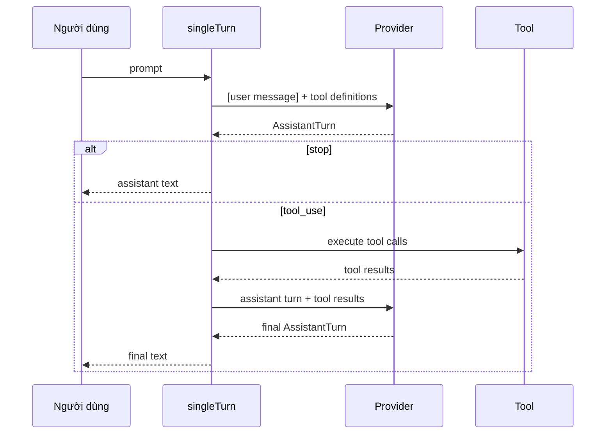

# Chương 3: Một lượt đơn

Ở Chương 2, bạn đã xây dựng một tool. Bây giờ bạn sẽ nối tool với provider lần
đầu tiên.

Chương này hiện thực `singleTurn()` -- một prompt, một lần gọi provider, có thể
một vòng thực thi tool, rồi một câu trả lời cuối.

Đó chưa phải là agent loop hoàn chỉnh, nhưng đây là lần đầu tiên các mảnh ghép
hoạt động giống một agent thay vì các thành phần rời rạc.

## Mục tiêu

Hiện thực `singleTurn()` sao cho:

1. nó gửi prompt của người dùng tới provider
2. nếu provider trả về `"stop"`, nó trả về text của assistant ngay
3. nếu provider trả về `"tool_use"`, nó:
   - thực thi từng tool được yêu cầu
   - nối assistant turn và tool results vào history
   - gọi provider thêm một lần nữa
   - trả về text cuối cùng

## `ToolSet`

Signature của hàm dùng `ToolSet`:

```ts
export async function singleTurn(
  provider: Provider,
  tools: ToolSet,
  prompt: string,
): Promise<string>
```

`ToolSet` bọc một `Map<string, Tool>` và index tool theo tên, cho phép tra cứu
O(1) khi mô hình yêu cầu `"read"` hoặc tool khác.

Các method quan trọng:

- `tools.get(name)` -- tìm tool được yêu cầu
- `tools.definitions()` -- thu thập mọi schema tool để gửi cho provider

## Luồng message

Giao thức một lượt trông như thế này:



Đây vẫn là một hệ thống đủ nhỏ để hiểu trong một lần đọc, nên nó là bước dạy
học rất tốt.

## Các khái niệm TypeScript quan trọng

### Rẽ nhánh theo `stopReason`

Provider trả về:

```ts
type StopReason = "stop" | "tool_use"
```

Vì vậy nhánh cốt lõi chỉ là:

```ts
if (turn.stopReason === "stop") {
  return turn.text ?? ""
}
```

Mọi thứ khác diễn ra trong trường hợp `"tool_use"`.

### Tool lỗi vẫn phải đi tiếp

Khi tool thất bại, bạn không nên làm `singleTurn()` sập.

Thay vào đó, hãy biến lỗi thành string kết quả:

```ts
const content = await tool.call(call.arguments)
  .catch((error) => `error: ${message}`)
```

String này sẽ trở thành một `tool_result`, và mô hình có thể quyết định bước
tiếp theo.

Điều này quan trọng vì các vòng lặp agent sau này phụ thuộc vào khả năng phục
hồi. Một file thiếu hoặc path sai không nên giết toàn bộ cuộc trò chuyện.

## Phần hiện thực

Mở `mini-claw-code-starter-ts/src/agent.ts`.

### Bước 1: Thu thập tool definitions

Ở đầu `singleTurn()`, hãy gom schema của mọi tool đã đăng ký:

```ts
const definitions = tools.definitions()
```

Những schema này sẽ đi cùng messages tới provider.

### Bước 2: Tạo history ban đầu

Với một tương tác một lượt, history bắt đầu bằng một user message:

```ts
const messages: Message[] = [
  { kind: "user", text: prompt },
]
```

### Bước 3: Gọi provider

Hỏi provider lấy assistant turn đầu tiên:

```ts
const turn = await provider.chat(messages, definitions)
```

### Bước 4: Xử lý `"stop"`

Nếu provider trả về câu trả lời cuối ngay lập tức, hãy trả nó:

```ts
if (turn.stopReason === "stop") {
  return turn.text ?? ""
}
```

`?? ""` xử lý trường hợp provider không đưa text trong response stop.

### Bước 5: Thực thi tool call

Nếu provider muốn dùng tool:

1. lặp qua `turn.toolCalls`
2. tìm từng tool trong `ToolSet`
3. thực thi nếu có
4. nếu không có, trả về string lỗi `"unknown tool"`
5. thu thập kết quả `{ id, content }`

Một mẫu điển hình là:

```ts
const results: Array<{ id: string; content: string }> = []

for (const call of turn.toolCalls) {
  const tool = tools.get(call.name)
  const content = tool
    ? await tool.call(call.arguments).catch(...)
    : `error: unknown tool \`${call.name}\``

  results.push({ id: call.id, content })
}
```

### Bước 6: Nối assistant turn và tool results

Provider cần thấy cả:

- những gì nó đã yêu cầu
- kết quả của các tool call đó

Vì vậy hãy thêm:

1. assistant turn dưới dạng `{ kind: "assistant", turn }`
2. mỗi tool result dưới dạng `{ kind: "tool_result", id, content }`

### Bước 7: Gọi provider lại

Giờ hãy hỏi provider thêm một lần với history đã có thêm ngữ cảnh:

```ts
const finalTurn = await provider.chat(messages, definitions)
return finalTurn.text ?? ""
```

Đó là toàn bộ hàm `singleTurn()`.

## Xử lý lỗi: đừng làm vòng lặp sập

Chương này đặt ra một quy tắc rất quan trọng sẽ theo bạn suốt project:

> Lỗi tool phải trở thành tool-result string, không phải exception chưa được
> bắt.

Tại sao?

Bởi vì mô hình có thể phục hồi.

Nếu `read` thất bại với:

```text
error: missing 'path' argument
```

mô hình có thể thử lại với path đúng.

Nếu `singleTurn()` ném lỗi ra ngoài, cuộc tương tác sẽ chết ngay lập tức.

## Chạy test

Chạy test của Chương 3:

```bash
bun test mini-claw-code-starter-ts/tests/ch3.test.ts
```

### Test xác minh gì?

- phản hồi trực tiếp trả text ngay
- tool call được thực thi và theo sau bởi một lần gọi provider thứ hai
- tool không tồn tại không làm sập hàm
- lỗi tool được chuyển thành string thay vì thoát ra ngoài

## Tóm tắt

- `singleTurn()` là một vòng model -> tool -> model hoàn chỉnh đầu tiên.
- `ToolSet` cho bạn tra cứu tool theo tên.
- `stopReason` quyết định việc trả text hay thực thi tool.
- Lỗi tool được xử lý như text có thể phục hồi, không phải exception chí tử.

Ở chương tiếp theo, bạn sẽ thêm nhiều tool hơn để mô hình làm việc hữu ích hơn.
