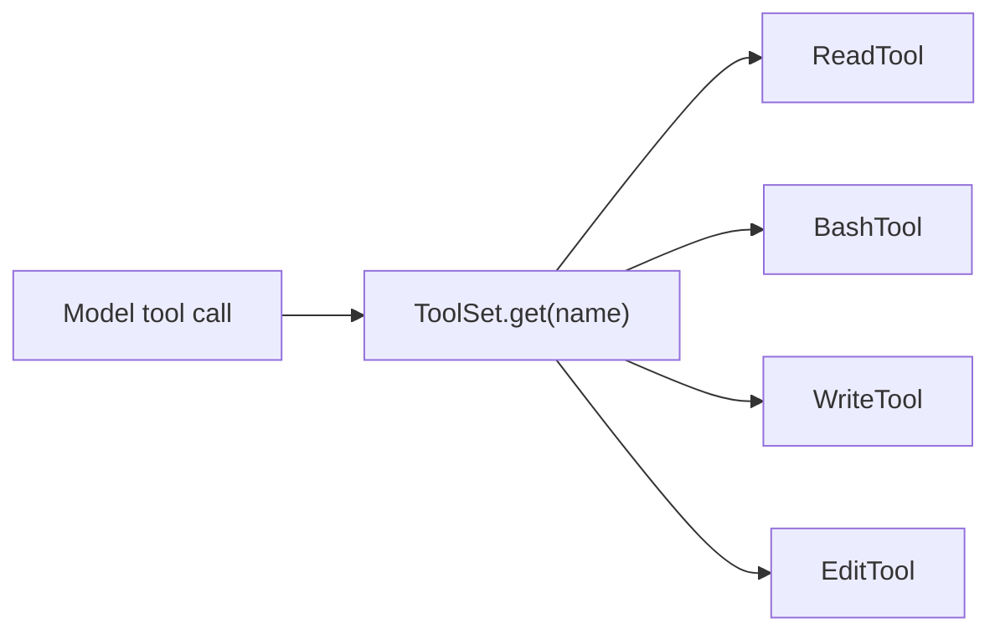

# Chương 4: Thêm công cụ

`ReadTool` chỉ là ví dụ đơn giản nhất. Bây giờ bạn sẽ thêm ba tool giúp agent
mạnh hơn rất nhiều:

- `BashTool`
- `WriteTool`
- `EditTool`

Cùng với `ReadTool`, ba tool này đã đủ để agent kiểm tra một project, thay đổi
file, và chạy lệnh shell.

## Mục tiêu

Hiện thực cả ba tool sao cho:

1. mỗi tool xuất đúng schema
2. mỗi tool validate đối số của nó
3. mỗi tool thực hiện đúng hành động được yêu cầu
4. lỗi được báo rõ ràng

## Bức tranh lớn hơn

Đến cuối chương này, tầng tool sẽ trông như sau:



Vòng lặp agent vẫn gần như không đổi. Nó chỉ đơn giản là có thêm nhiều khả
năng hơn để gọi.

## Tool 1: `BashTool`

Mở `mini-claw-code-starter-ts/src/tools/bash.ts`.

### Schema

Definition nên yêu cầu một tham số `command`:

```ts
ToolDefinition.new(
  "bash",
  "Run a bash command and return its output.",
).param("command", "string", "The bash command to run", true)
```

### Khái niệm quan trọng: child process

Scaffold import:

```ts
import { spawn } from "node:child_process"
```

Implementation nên chạy:

```text
bash -lc <command>
```

Tại sao là `bash -lc`?

- `bash` cho bạn khả năng parse shell
- `-l` mở login shell, hữu ích cho việc set up môi trường dev
- `-c` cho phép truyền lệnh dưới dạng một chuỗi

### Yêu cầu hiện thực

`call()` nên:

1. kiểm tra `args.command` là string
2. spawn `bash -lc <command>`
3. thu stdout và stderr
4. trả về:
   - stdout nếu có
   - `stderr: ...` nếu có stderr
   - `(no output)` nếu cả hai đều rỗng

Mô hình cần text kết quả chứ không phải object child-process thô.

## Tool 2: `WriteTool`

Mở `mini-claw-code-starter-ts/src/tools/write.ts`.

### Schema

Tool này cần:

- `path`
- `content`

### Khái niệm quan trọng: tạo thư mục cha

Nếu mô hình muốn ghi vào `src/generated/output.ts`, các thư mục cha có thể
chưa tồn tại.

Đó là lý do scaffold import:

```ts
import { mkdir, writeFile } from "node:fs/promises"
```

Phác thảo implementation:

1. validate `path` và `content`
2. tính thư mục cha
3. tạo thư mục đó theo kiểu recursive
4. ghi file
5. trả confirmation string như `wrote <path>`

## Tool 3: `EditTool`

Mở `mini-claw-code-starter-ts/src/tools/edit.ts`.

### Schema

Tool này cần:

- `path`
- `oldString`
- `newString`

Lưu ý rằng TS starter dùng tên field camelCase ở đây. Bản thân interface tool
không quan tâm đối số là snake_case hay camelCase; điều quan trọng là schema và
implementation phải khớp nhau.

### Tại sao chỉ sửa exact-string?

Tool này không dùng diff hay AST transform. Nó thực hiện một thao tác nhỏ,
an toàn:

> "Tìm đúng chuỗi này, thay nó đúng một lần, và thất bại nếu điều đó mơ hồ."

Điều đó cho bạn một đặc tính an toàn rất tốt:

- nếu `oldString` không có mặt, có điều gì đó sai
- nếu `oldString` xuất hiện nhiều hơn một lần, việc thay thế là mơ hồ

Vì vậy `EditTool` nên:

1. đọc file
2. đếm số lần `oldString` xuất hiện
3. nếu đếm được `0`, ném lỗi
4. nếu đếm được lớn hơn `1`, ném lỗi
5. thay thế đúng một lần
6. ghi file lại
7. trả confirmation string

## Vì sao bộ tool này đã đủ?

Đến thời điểm này, mô hình có thể:

- kiểm tra file bằng `read`
- cập nhật file bằng `write` và `edit`
- kiểm tra môi trường bằng `bash`

Như vậy đã đủ để hỗ trợ nhiều nhiệm vụ coding-agent:

- đọc `package.json`
- chạy test
- sửa một file
- chạy test lại
- báo kết quả

Agent loop ở Chương 5 sẽ nối các tool này với provider lặp đi lặp lại.

## Chạy test

Chạy test của Chương 4:

```bash
bun test mini-claw-code-starter-ts/tests/ch4.test.ts
```

### Test xác minh gì?

- `BashTool` có tham số `command`
- `WriteTool` có `path` và `content`
- `EditTool` có `path`, `oldString`, và `newString`

Test của starter chủ yếu tập trung vào surface công khai. Bản solution hoàn
chỉnh có coverage rộng hơn.

## Tóm tắt

- `BashTool` biến việc chạy shell thành text mà mô hình đọc được
- `WriteTool` tạo file và thư mục cha
- `EditTool` thực hiện thay thế exact-match một lần
- Cùng với `ReadTool`, các tool này tạo thành bộ công cụ tối thiểu cho coding
  agent

Ở chương tiếp theo, bạn sẽ dùng chúng trong một agent loop thật sự.
